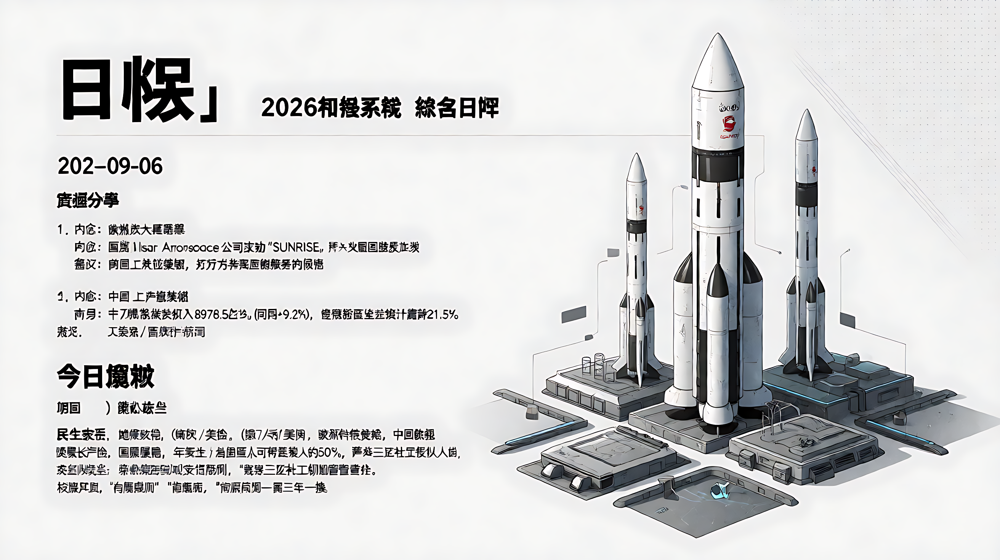
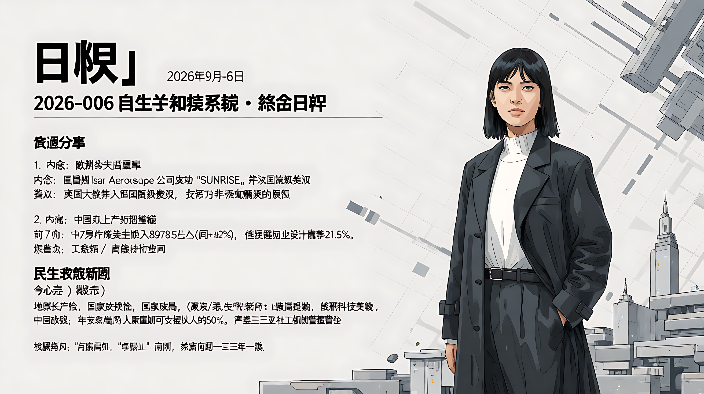

<!-- 748686_IMAGE_START -->

<!-- 748686_IMAGE_END -->

📰 748686 自生长知识系统 · 综合日报 🗓️ 2026年9月6日

### 🗓️ 日期
2026-09-06

### 📚 资源分享

**1. 欧洲航天里程碑**
*   **内容**：德国 Isar Aerospace 公司成功完成“SUNRISE”火箭首次轨道级发射。
*   **意义**：实现欧洲大陆首次私营轨道发射，打破对非欧洲发射服务的依赖。

**2. 中国产业升级数据**
*   **内容**：前7个月中国软件业务收入8978.5亿元（同比+9.2%），集成电路设计业务增长21.5%。
*   **来源**：工信部/国家统计局

**3. 民生政策新规**
*   **医保长护险**：国家医保局发布新规，年度支付上限设定为当地居民人均可支配收入的50%，严禁第三方社工机构管理资金。
*   **校服采购**：教育部明确“自愿购买”原则，采购周期一般三年一换。

---

### 🐉 今日概况

| 项目 | 数据/状态 |
|------|------|
| 核心关注 | 地缘政治（俄乌/美伊）、欧洲科技突破、中国政策 |
| 风险预警 | 霍尔木兹海峡能源风险、德国社会动荡 |
| 数据清洗 | 已剔除因源文章错配导致无法验证的巴西、哥伦比亚、以色列等事件 |

---

### 🔥 精选事件

#### [外交] 美俄启动俄乌和谈高层接触

*   **时间**：2026年9月6日
*   **参与人**：美国特使蒂莫西·维特科夫 (Timothy Witkoff)、贾里德·库什纳 (Jared Kushner)；俄罗斯总统普京
*   **地点**：莫斯科
*   **内容**：美方特使抵达莫斯科与普京会谈，讨论乌克兰战争解决方案。克里姆林宫形容对话为“建设性的”，但未透露具体突破。普京此前曾暂停对基辅的打击。
*   **💬 点评**：标志俄乌冲突出现高层外交破冰迹象，是全球地缘政治最大变量，但实质成果仍待观察。

#### [军事/能源] 美伊军事冲突升级

*   **时间**：2026年9月6日
*   **参与人**：美国军方、伊朗“影子网络”
*   **内容**：美军打击并击沉三艘与伊朗相关的石油运输船，作为对伊朗袭击的报复。美伊在波斯湾发生直接交火。特朗普政府同时施压韩国在霍尔木兹海峡部署军队。
*   **💬 点评**：中东局势从外交摩擦转向直接军事接触，全球能源供应链面临实质性中断风险，日韩等依赖国需重新评估安全策略。

#### [外交] 中俄深化投资与能源合作

*   **时间**：2026年9月6日
*   **参与人**：丁薛祥、普京
*   **地点**：符拉迪沃斯托克
*   **内容**：丁薛祥会见普京，主持中俄投资与能源合作委员会会议。
*   **💬 点评**：同日美俄特使会晤，显示大国博弈中多国力量交织，中国继续稳固俄罗斯能源伙伴关系。

#### [体育] 皮埃尔·加斯利终结法国F1杆位荒

*   **时间**：2026年9月6日
*   **事件**：F1意大利大奖赛排位赛
*   **内容**：法国车手皮埃尔·加斯利 (Pierre Gasly) 夺得杆位。
*   **💬 点评**：这是自1997年以来法国车手首次获得F1杆位，终结了近30年的空白。

#### [政治/社会] 德国右翼势力扩张与社会抗议

*   **时间**：2026年9月6日
*   **内容**：
    1. 右翼民粹政党 AfD（德国选择党）在萨克森-安哈尔特州州议会选举中获胜。
    2. 柏林爆发数千人规模抗议，主要诉求为可负担住房。
*   **💬 点评**：德国东部政治版图持续右转，传统政党面临重组压力，住房危机引发社会张力。

#### [国际组织] 联合国通过“等大地图”投影标准

*   **时间**：2026年9月6日
*   **内容**：联合国投票通过“Equal Earth”地图投影。
*   **结果**：164票赞成，美国投下唯一反对票。
*   **💬 点评**：反映了在国际标准制定中关于地理表征的政治分歧。

#### [企业] Uber 撤出部分非洲市场

*   **时间**：2026年9月6日
*   **内容**：Uber 宣布立即从尼日利亚和乌干达撤出运营。
*   **💬 点评**：标志着Uber在非洲市场的战略收缩。

---

### 📊 今日总结

*   **最突破时刻**：德国 Isar Aerospace 实现欧洲首次私营轨道发射，打破技术垄断。
*   **最大风险点**：美伊在波斯湾直接交火，三艘油轮被击沉，霍尔木兹海峡航运安全告急。
*   **最佳政策落地**：中国教育部明确校服“自愿购买”，医保局规范长护险支付上限，切实回应民生关切。

共 9 条核心记录，9月6日完。🐉
