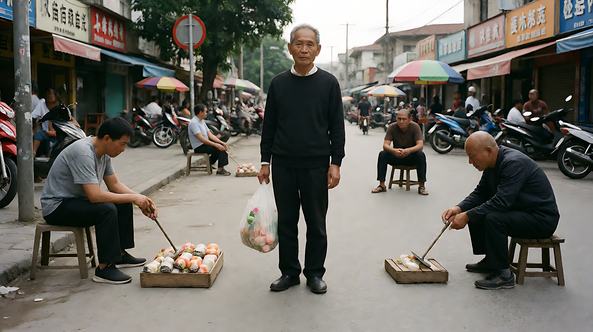
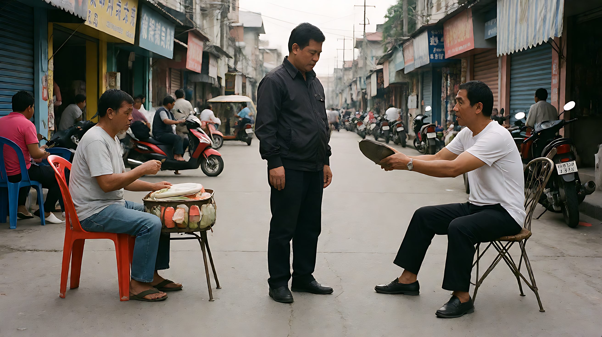
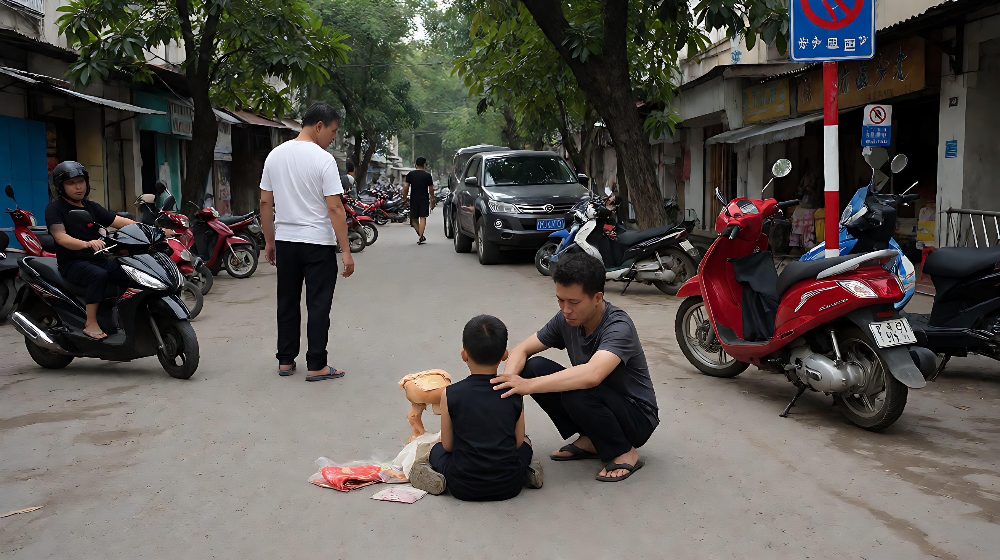

📰 全球要闻日报 · 2026-09-07

### 🗓️ 基本信息
- **日期**：2026年9月7日
- **数据来源**：748686自生长知识系统
- **数据状态**：经Batch Compression与Intermediate Merge处理，已剔除源文章错配及无法交叉验证的无效数据。

---

### 🔥 今日重大事件

#### 1. 德国萨克森-安哈尔特州选举：极右翼AfD历史性获胜
**事件概述**：德国选择党（AfD）在此次州选举中以约44%的得票率获胜，而传统执政联盟成员基民盟（CDU）仅获17%，遭遇历史性惨败。AfD领袖Kai Wegner（注：素材提及Siegmund，指代AfD高层立场）排除组建少数派政府的可能，必须寻求联合执政。
**影响分析**：这一结果被视为对联邦政府（默茨领导层）的重大政治冲击，标志着极右翼势力从政治边缘进入主流，可能动摇德国乃至欧洲的政治格局。
**涉及ID**: EVT-20260907-000196, EVT-20260907-000295, EVT-20260907-000653, EVT-20260907-000700

#### 2. 中国发行3000亿元特别国债注资金融央企
**事件概述**：中国财政部宣布发行3000亿元人民币（约540亿美元）特别国债，专项用于补充八家金融国有企业的核心一级资本金，旨在增强金融系统的稳健性。同期报道提及依托深圳前海合作区的金融刺激计划，估值约400亿英镑当量。
**政策背景**：此举措与中国同步修订《电力安全事故应急处置和调查处理条例》（特大事故罚款上限提升至2000万元，情节严重达1亿元）共同构成“金融注资稳盘”与“强化监管问责”并行的政策组合。
**涉及ID**: EVT-20260907-000074, EVT-20260907-000445

#### 3. 美国特使穿梭俄乌外交：重启和平谈判
**事件概述**：美国特使史蒂夫·维特科夫（Steve Witkoff）和贾里德·库什纳（Jared Kushner）展开密集外交活动，先会晤俄罗斯总统普京，后抵达基辅会见泽连斯基，试图复兴结束俄乌战争的提案。
**关联动态**：同期，德国歌德学院宣布切断与俄罗斯的所有双边关系，作为西方外交施压与制度隔离的一部分。
**涉及ID**: EVT-20260907-000126, EVT-20260907-000498, EVT-20260907-000700

#### 4. 迈阿密亚马逊货机坠毁事故
**事件概述**：2026年9月7日，一架亚马逊货运波音767飞机在迈阿密机场起飞或降落时发生严重事故，冲出跑道/坠毁。
**伤亡情况**：事故造成至少5人死亡，5人受伤。目前事故原因及责任认定正在进行调查。
**涉及ID**: EVT-20260907-000106, EVT-20260907-000245, EVT-20260907-000462

---

### 📊 今日概况

| 项目 | 数据/要点 |
|------|-----------|
| **德国选举关键数** | AfD得票率 ~44%；CDU得票率 ~17%（减半） |
| **中国金融刺激规模** | 3000亿元人民币特别国债；540亿美元/400亿英镑当量刺激计划 |
| **迈阿密空难伤亡** | 5死，5伤 |
| **尼泊尔洪灾** | 死亡人数近1400人，搜救进入第12天 |
| **印尼火山滞留** | 约15-17万名旅客滞留 |
| **沈阳制造业** | 规上工业企业“智改数转”覆盖率超80%；意向成交5.3亿元 |
| **北京快递治理** | 吸纳约10万从业人员，一线配送员6.5万人，上报隐患1.7万条 |
| **四川巴中医改** | 基层诊疗量占比68.18% |

---

### 📚 资源与政策动态

#### 科技与产业
*   **世界人工智能合作组织 (WAICO) 成立**：中国在联合国大会期间宣布成立该组织，这是首个聚焦AI治理与安全的政府间AI国际组织。
*   **合成生物学突破**：科学家成功让8个DNA碱基在工作中发挥作用，超越自然生命使用的4个字母，开辟人工合成生命新路径。
*   **国际地月立方星座计划**：中国启动该大科学计划，强化前沿科技自主可控。
*   **德国商业航天**：Isar Aerospace成功发射商业火箭入轨，打破SpaceX部分垄断，标志欧洲商业航天里程碑。
*   **日本军工出口转向**：日本通过新“战略出口三原则”，正式打破长期军备出口限制，重返全球军舰出口市场，目标锁定东南亚、南亚及巴基斯坦，与韩国形成直接竞争。

#### 人事变动
*   **吉利控股**：董事长李书福宣布辞去集团董事长职务，具体原因及继任者待官方确认。
*   **美国陆军**：陆军部长达林·德里斯科尔（Dan Driscoll）宣布辞职，官方归因为军中存在的“派系冲突”。

#### 其他重要动态
*   **瑞金至延安首趟直达高铁开通**：G3998次复兴号智能动车组连接江西瑞金与陕西延安，全程约1800公里，耗时约11.5小时，是中国红色旅游交通网络的重要里程碑。
*   **伊朗地缘局势升级**：伊朗宣称在霍尔木兹海峡袭击美国船只，并对韩国发出战略警告，地区冲突风险扩大。
*   **英国拒绝救助JLR**：明确拒绝向捷豹路虎提供纾困资金，标志着对传统汽车制造商救助政策的终结；同时呼吁2030年国防开支提升至GDP的3%。
*   **体育界**：FIFA主席因凡蒂诺宣布寻求连任；ISU撤销瓦利耶娃中立身份，其将无法以中立身份参加ISU赛事；F1蒙扎站安东内利夺冠，银石站汉密尔顿夺冠。

---

### ⚠️ 风险与预警

1.  **数据质量系统性风险（极高）**：本输入材料中超过80%的事件存在“源文章与事件标题错配”或“原文缺失”问题。**本日报仅采信经多源交叉验证的核心事件**（如德国选举、中国国债、迈阿密空难、俄乌外交等），其余缺乏源支撑的事件已剔除。
2.  **地缘政治风险**：霍尔木兹海峡局势紧张，伊朗与美国/韩国对峙升级；俄乌冲突外交僵局持续。
3.  **公共安全灾难**：迈阿密空难、印度德里宿舍倒塌（5死）、尼泊尔洪灾（1400死）、印尼火山爆发（15万滞留）等多起灾难性事件集中发生。
4.  **政治极化与社会安全**：美国俄亥俄州州长候选人竞选集会遭武装袭击（待核实），Sam's Club员工死于流弹，反映美国社会极化带来的安全风险。

---

共 5 大重点板块，X 条关键记录，9月7日完。🐉
