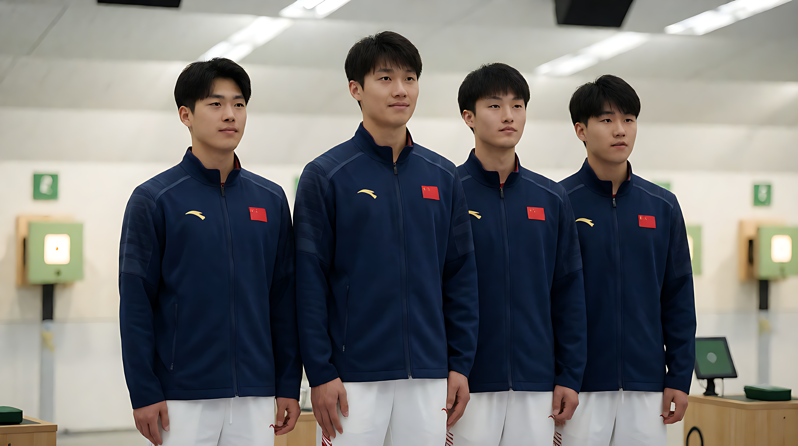
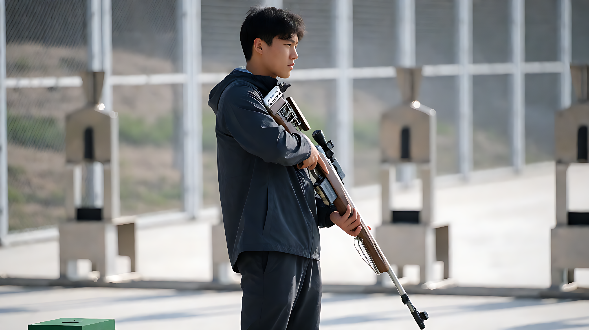
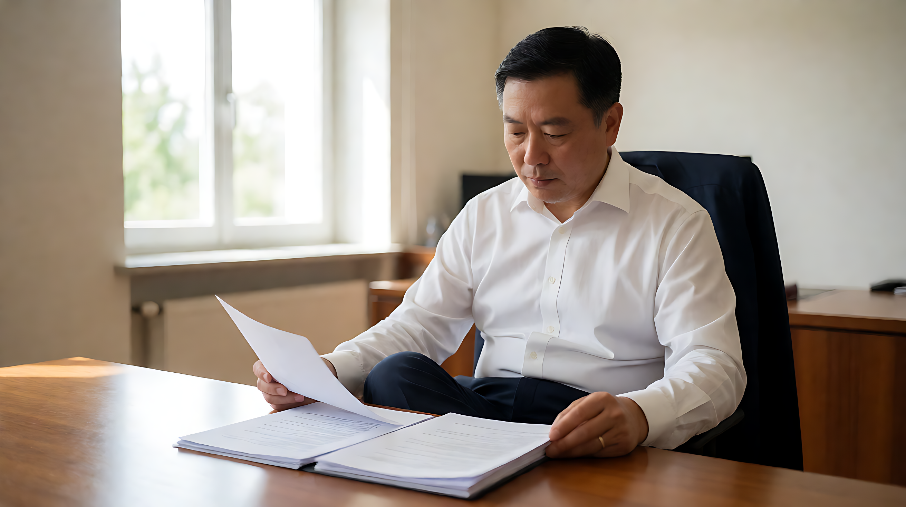
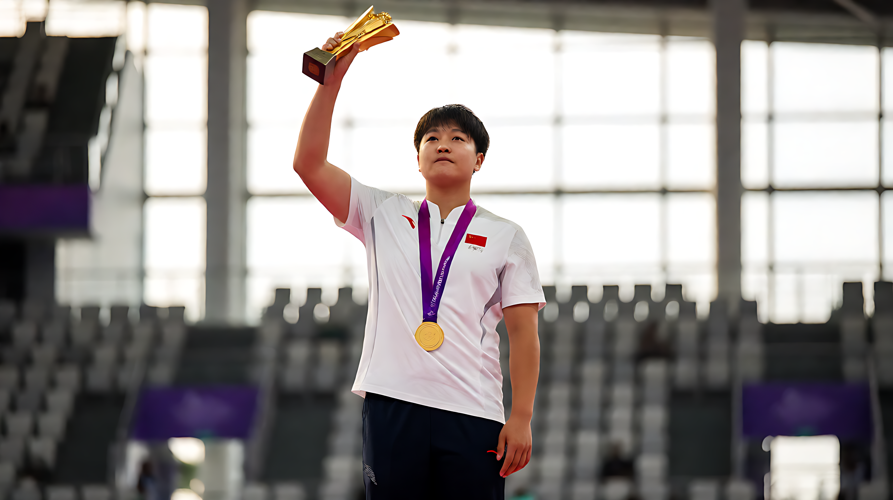

📰 全球要闻 · 日报 🗓️ 2026年9月23日

---

### 🎯 今日重点

**1. 科技：OpenAI GPT-6发布与法律风险同步显现**
OpenAI发布GPT-6系列模型（Sol, Luna），并优化提示词缓存技术，客户案例显示研发时间与成本减半。同日，加拿大不列颠哥伦比亚省起诉OpenAI及Sam Altman，指控其在Tumbler Ridge校园枪击案中未履行预警义务，或确立AI行业责任认定的新里程碑。此外，Anthropic与OpenAI同日发布更便宜模型，AI价格战升级。

**2. 外交：习主席访美前夕，中国大国外交密集活跃**
习近平定于9月23-25日访美，《人民日报》强化“中美经贸压舱石”叙事（上半年贸易额2万亿元，同比增长13.7%）。第48届世界技能大赛在上海开幕（首次在中国举办）；国际和平日纪念活动在武汉举行，60国300余名代表参会；丁仲礼访韩推进中韩议会交流；雪克来提·扎克尔主持全球可持续交通高峰论坛。

**3. 地缘：美国全球战略调整与地区紧张**
五角大楼确认又一名美军在涉及伊朗的行动中阵亡；美伊在联大期间举行双边会谈，特朗普声称“摧毁”伊朗核设施，呈现“双轨”态势。特朗普签署协议，计划在格陵兰建设两个军事基地；向危地马拉提供近50年来首批军援。

**4. 德国：多领域社会危机与政治裂痕**
德国医疗系统面临双重危机，急诊科超负荷；黑森州“空置住房法”实施一年，零市镇采纳。CDU党内出现裂痕，前秘书长Czaja批评Merz，ZDF纪录片《Inside CDU》审视保守派困境。

---

### 📊 关键数据

*   **1200亿美元**：中国创新药对外授权总金额。
*   **2万亿元**：上半年中美货物贸易总值。
*   **95%**：特斯拉上海工厂零部件本土化比例（第400万辆车下线）。
*   **5%**：德国工会IG Metall要求的加薪幅度。
*   **32金**：杭州亚运会中国代表团某日累计金牌数（单日9金）。
*   **0**：黑森州空置住房法一年内的市镇采纳率。
*   **507.1环**：射击混合团体新世界纪录。

---

### 🔥 精选事件

#### 【科技】AI时代教育改革加速
《人民日报》报道AI时代教育变革，北京中关村学院采用“AI实战赛”招生；复旦调研显示近八成新生已形成AI使用习惯。

#### 【体育】杭州亚运会中国代表团表现优异
中国代表团单日获9金，女排3:0横扫日本实现三连冠；射击项目双破世界纪录；自行车项目时隔32年重夺金牌。

#### 【司法】斯里兰卡爆炸案宣判
15名被告各被判数百年监禁。

#### 【韩国】司法僵局持续
首席大法官拒绝总统办公室关于新增法官候选人的要求；前第一夫人金建希刑期改判为5年（低置信度）。

#### 【环境】台风与飓风动态
台风“杜娟”袭击日本关东地区，报告称至少6死6失踪（需验证）；飓风Polo在墨西哥海岸增强，与强厄尔尼诺现象有关。

---

### 💬 一句话总结

全球政治经济焦点集中于中美关系与AI治理博弈：中美经贸维持增长，但AI技术迭代伴随着法律责任边界的初步探索；美国地缘战略在格陵兰和伊朗问题上显著收紧，而德国面临内部社会政策的执行困境。

---
完。
