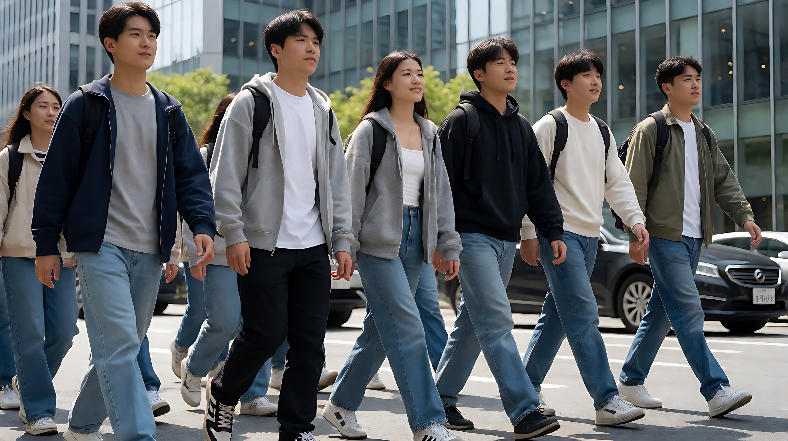
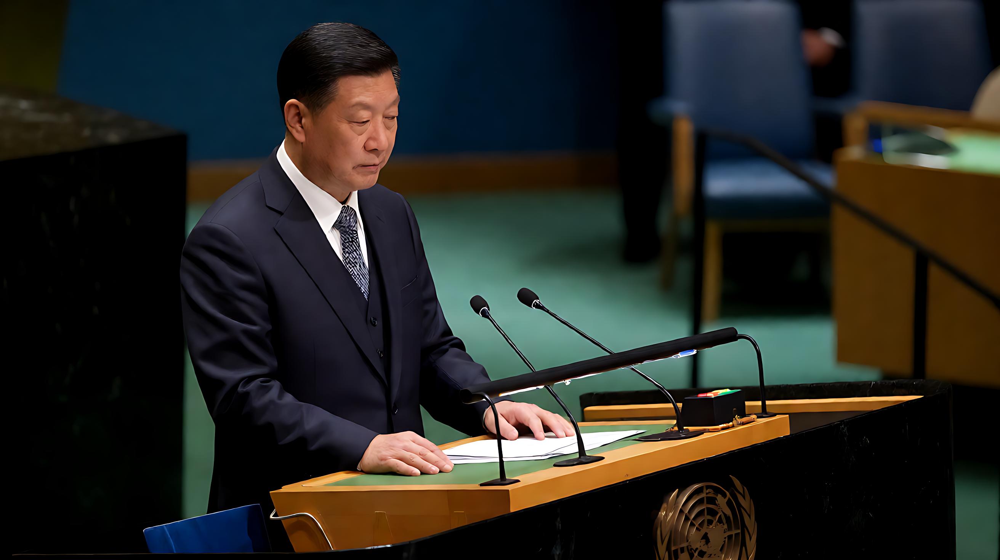

📰 国际政经·综合日报 🗓️ 2026年9月25日

### 🗓️ 日期
2026-09-25

### 📚 资源分享
- **中美关系**：构建“中美建设性战略稳定关系”框架；AI治理共同承诺；10万美国青少年来华交流计划。
- **地缘政治**：联合国期间以色列遭遇大规模外交抗议与退场；德国萨克森州禁止“绊脚石”铺设。
- **国内政策**：《审计法实施条例》修订，12月1日起施行；“十五五”文旅发展规划发布。

---

### 🐉 今日概况

| 项目 | 数据/状态 |
|------|-----------|
| 核心大事件 | 习近平主席访美、联合国安理会/联大外交冲突 |
| 重要立法动态 | 中国审计法、德国历史记忆政策、美国州级AI监管 |
| 风险提示 | 源数据存在系统性错配风险，部分非主流信源已剔除 |

---

### 🔥 精选事件

#### [优先] 习近平主席对美国进行国事访问及中美关系框架确立

*   **外交核心**：9月23-24日，习近平应特朗普邀请访美。双方重申构建**“中美建设性战略稳定关系”**，否定“修昔底德陷阱”，主张“良性且受控的竞争”。
*   **三大方向**：加强沟通、真诚合作、和平共处。
*   **AI治理共识**：双方承认均为“人工智能大国”，承诺共同管理AI发展，确保其处于人类控制之下。
*   **人文交流亮点**：
    *   宣布未来5年邀请**10万名**美国青少年来华交流学习。
    *   大熊猫“平平”、“福双”将移居亚特兰大动物园。

💬 **点评**：此次访问确立了双边关系的底线与框架，特别是在AI治理领域达成“共同责任”共识，同时通过青年交流与动物外交软化关系氛围。

#### [关注] 联合国期间以色列遭遇大规模外交孤立与抗议

*   **现场情况**：以色列总理内塔尼亚胡在联合国演讲前，遭遇多国代表**大规模退场（Mass Walkout）**抗议。
*   **双方回应**：内塔尼亚胡做出“激烈”回应，称“别无选择，只能取胜”；巴勒斯坦总统阿巴斯同日在联大讲话，立场对立。
*   **场外联动**：纽约曼哈顿发生反战抗议集会，包括Susan Sarandon等参与者被捕。

💬 **点评**：以色列在联合国外交空间进一步收窄，国内军事行动引发的全球舆论反弹达到新高点。

#### [动态] 美国媒体自由与行政权张力

*   **司法介入**：联邦法官裁决阻止白宫对CNN、MSNBC、Politico的常规媒体禁令。
*   **执行博弈**：尽管法院支持媒体准入，白宫仍拒绝CNN及MSNBC Now记者进入国宴现场。最终白宫恢复常规采访权限，但国宴环节保持非直播/受限状态。

💬 **点评**：体现了美国行政分支在特定敏感场合规避司法裁决、维持信息管控能力的现实，司法权与行政权的边界博弈持续。

#### [观察] 德国历史记忆政治右转具象化

*   **政策变动**：萨克森州Heidenau市议会（CDU与AfD联合）通过决议，**禁止铺设“绊脚石”（Stolpersteine）**——这是一种纪念纳粹受害者的地面艺术装置。
*   **政治影响**：萨克森-安哈尔特州AfD胜选后，CDU放弃联邦委员会（MPK）轮值主席职位，显示极右翼势力对地方历史政策及州际协调机制的实质性影响。

💬 **点评**：从符号层面的“禁止纪念”可见欧洲右翼民粹主义正在重构历史叙事，此举预计将引发法律挑战及社会争议。

#### [国内] 中国立法与政策推进

*   **审计改革**：李强签署国务院令，修订《中华人民共和国审计法实施条例》，明确坚持党的领导，扩大审计范围至国有资源及重大民生工程，**12月1日起施行**。
*   **文旅规划**：国务院发布“十五五”文旅发展规划，聚焦艺术创作（戏剧振兴三年行动）、文化遗产保护及入境游便利化。
*   **执法检查**：李鸿忠主持《粮食安全保障法》执法；王东明主持《无障碍环境建设法》执法；肖捷赴新疆检查《旅游法》实施。

💬 **点评**：国内治理侧重法治化与民生保障，审计范围扩大体现对国家资产监管的强化，文旅规划响应内需提振。

---

### 📊 今日总结

- **最重大外交进展**：中美确立“建设性战略稳定关系”，开启AI治理合作新篇章。
- **最大国际争议**：以色列在联合国面临前所未有的集体外交抵制。
- **最值得警惕趋势**：欧美内部政治极化，德国历史修正主义抬头，美国行政权对媒体限制的司法拉锯。
- **关键数字**：**10万**（未来5年美青少年来华交流目标）；**23**（敦促联邦AI立法的美国州数量）。

共 5 条核心记录，9 月 25 日完。🐉
