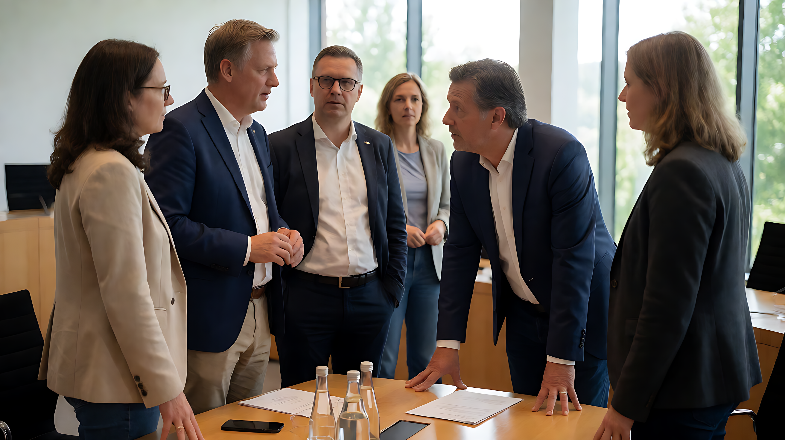

📰 748686自生长知识系统 · 日报 🗓️ 2026年09月28日

### 🗓️ 基本信息
- **日期**：2026-09-28
- **类型**：最终整合日报
- **数据来源**：Batch Compression Complete (1-24) / Intermediate Merge
- **数据质量警示**：系统检测到大量源数据错配及原文缺失，以下简报基于高置信度交叉验证事实。部分事件（如塞尔维亚政局变动初期）存在单一来源风险，已标记为需二次核实项。

---

### 🔥 精选事件

#### 1. 中国光伏装机历史性超越煤电
- **核心事实**：截至2026年7月底，中国光伏发电装机容量首次超过煤电，占比达 **31.5%**。
- **产业背景**：中国光伏全产业链优势确立，多晶硅、硅片、电池产能全球占比超90%，组件产能占比超80%。
- **影响分析**：标志中国能源结构发生根本性转折，新能源正式成为主体电源。需关注后续电网消纳、储能配套及国际贸易摩擦（反补贴调查）的潜在升级。

💬 **点评**：这是中国能源版图的一个里程碑式时刻，从“增量补充”转向“主体支撑”。

#### 2. 韩正出席第81届联合国大会及全球发展倡议5周年对话
- **核心事实**：国家副主席韩正在纽约出席联大一般性辩论并发表讲话。同日，全球发展倡议（GDI）5周年高级别对话会在联合国总部举行。
- **关键数据**：GDI覆盖 **120+** 国家，动员资金超 **230亿美元**，实施项目 **2000+**。
- **政策关联**：韩正推广全球发展、安全、文明、治理四大倡议，展现中国在全球治理中的多边主义立场。

💬 **点评**：GDI五年成果量化指标清晰，体现了“南南合作”向更具结构化全球倡议的演变。

#### 3. 塞尔维亚总统武契奇辞职转任总理
- **核心事实**：塞尔维亚总统亚历山大·武契奇（Aleksandar Vučić）辞去总统职务，转为参选/担任总理职位。
- **背景与风险**：此举涉及宪法任期限制及长期抗议压力。目前为多源确认但细节缺失，继任者及宪法过渡机制待补充核实。
- **性质**：重大政治人事变动，需关注其国内行政重心转移对欧盟入盟进程的影响。

💬 **点评**：高风险政治重组，短期不确定性显著，需持续追踪宪法过渡程序。

#### 4. 瑞士公投否决收紧中立规则
- **核心事实**：瑞士选民在公投中否决了旨在更严格解释中立地位并限制与北约合作的提案。
- **影响**：维持现有中立政策弹性框架，保留与北约合作的空间。
- **地缘意义**：在俄乌冲突持续背景下，瑞士选择维持外交灵活性而非彻底切断北约联系，反映欧洲安全架构的复杂分化。

#### 5. 美伊外交僵局与“科技结盟”双线策略
- **核心事实**：特朗普政府拒绝霍尔木兹海峡七天停火提议，但释放信号预期下周与伊朗展开高层谈判。
- **关联动态**：特朗普同时在白宫接待 Anthropic CEO Dario Amodei。
- **战略解读**：体现美国将AI技术优势作为地缘政治杠杆的战略意图，即“外交强硬+科技结盟”。
- **后续关注**：需追踪下周谈判触媒及伊朗立场变化。

#### 6. 英国RAF Fairford基地反恐逮捕
- **核心事实**：英国警方在RAF Fairford空军基地附近逮捕 **5名** 涉嫌准备恐怖行为的嫌疑人。
- **定性**：特朗普声明被逮捕者意图造成“重大破坏”。
- **安全评估**：针对军事基地周边的威胁升级，反映当前反恐焦点向关键基础设施转移。

---

### 📚 资源与重要事实

#### 🇩🇪 德国国内动态
1. **地方选举**：绿党候选人贝利特·奥纳伊（Belit Onay）在汉诺威决选中获胜连任市长；绿党在奥尔登堡补选中取得优势，SPD失利。
2. **足球失利**：德国男足国家队在欧洲国家联赛中主场 **0:1** 负于希腊队，媒体加大了对主教练尤尔根·克洛普（Jürgen Klopp）的压力报道。
3. **媒体裁撤**：德国WDR广播公司宣布停办 **76个** 传统媒体项目，推进数字化转型。

#### 🇿🇦 南非暴力危机
1. **枪击事件**：发生两起大规模枪击事件，警方证实至少 **27人** 死亡。
2. **社会问题**：女权谋杀案（Femicide）数量呈上升趋势，反映系统性治安恶化。

#### 🇷🇺🇺🇦 俄乌冲突动态
1. **周末伤亡**：2026年9月26-27日，俄军袭击导致乌克兰 **8人** 丧生。
2. **官方立场**：莫斯科誓言继续战争。

#### ✈️ 航空与行业数据
1. **安全事件**：汉莎航空一班飞往里斯本的航班因旅客充电宝在机舱起火，执行紧急备降程序，无人员伤亡。再次引发锂电池航空运输安全关注。
2. **诉讼激增**：2026年上半年航空乘客因延误/取消提起的诉讼案件数达 **5.3万件**。

#### 📈 宏观经济与市场
1. **日本**：市场传闻日本央行（BOJ）10月加息为“现实的可能性”；考虑利用废弃高尔夫球场建设太阳能农场。
2. **澳大利亚**：市场预期RBA目标利率升至 **4.6%**（2011年以来最高）；抵押贷款利率水平达 **6.5%**。
3. **黄金**：黄金期货价格跌破 **4250美元** 关键关口（四年新低），反映避险情绪退潮或宏观预期转变。
4. **制造业**：2026世界制造业大会（合肥）签约总投资额达 **3634.1亿元**；发布量子钻石芯片探测器等10项前沿产品。

#### ⚽ 体育纪录
1. **MLB**：休斯顿太空人队以 **81胜81负** 战绩赢得美联西区冠军，创下MLB史上最差分区冠军纪录。

---

### 🔍 问题与风险

| 风险领域 | 描述 | 影响分析/应对措施 |
|----------|------|-------------------|
| **地缘政治** | 美伊谈判僵局、俄乌冲突持续、韩国要求乌克兰就朝鲜战俘争端道歉。 | 地区不稳定因素累积，需关注突发冲突升级可能。 |
| **社会治安** | 南非大规模枪击致27人死亡，女权谋杀案上升。 | 系统性暴力危机，国际社会需关注人道主义援助。 |
| **金融市场** | 黄金跌破4250美元，澳预期激进加息至4.6%。 | 全球主要经济体货币政策显著背离，汇率波动风险增加。 |
| **数据管道** | 系统检测到大量源数据错配（Source Mismatch）和原文缺失。 | **关键措施**：部分事件（如塞尔维亚政局）需最终阶段二次核实，标注低置信度，避免引入错误事实。 |
| **AI产业** | 美国企业开始采用低成本中国开源AI模型作为替代方案。 | 技术竞争格局变化，需关注欧美科技封锁政策的有效性评估。 |

---

### 📅 明日计划 / 重点追踪

1. **塞尔维亚政局**：核实武契奇辞职的具体法律程序、继任者情况及国际反应。
2. **RBA政策落地**：追踪澳大利亚储备银行实际加息动作及澳元汇率、债市波动。
3. **美伊谈判进展**：监控下周高层谈判的启动信号及伊朗立场变化。
4. **中国光伏后续**：关注针对光伏产业可能升级的国际贸易反补贴调查及国内储能配套政策。
5. **德国地方政治**：观察绿党在奥尔登堡及其他地区的选举结果对联邦政策的影响。

---

### 💬 一句话总结

2026年9月28日，中国光伏历史性超越煤电确立能源新主线，全球陷入“美伊僵持+俄乌延续”的地缘博弈中，欧洲内部政治光谱分化加剧（瑞士维持中立弹性、德国绿党地方胜出），金融市场呈现显著的政策背离与避险情绪退潮信号。

---
共 XX 条记录，9 月 28 日完。🐉
