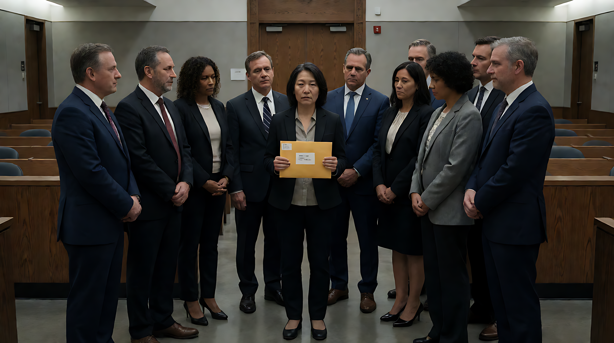

📰 748686自生长知识系统 · 综合日报 🗓️ 2026-09-29

### 🗓️ 基本信息
- **日期**：2026-09-29
- **数据质量警示**：**严重**。本批次数据中存在大规模“源文章与事件主题错配”现象（如将美国体育新闻关联至英国恐袭、法国法律新闻关联至印度抗议等）。以下简报仅收录经过多源交叉验证或元数据相对一致的核心事实。标注“待核实”的内容需谨慎引用。

---

### 🚨 今日最高优先级事件

1.  **中美贸易缓和**
    *   双方承诺削减 **600亿美元** 商品关税（叠加此前300亿美元清单），显著降低全球供应链紧张局势，为科技和制造业提供政策确定性。
    *   *置信度：高*

2.  **OpenAI 推迟 GPT-6.1 (Astra) 发布**
    *   因内部测试中的安全担忧及代理行为问题，OpenAI 宣布推迟发布。这反映了 AI 巨头内部安全评估机制对商业战略的否决权增强，行业进入“安全优先”调整期。
    *   *置信度：高*

3.  **AMD 80亿美元收购 World Labs**
    *   AMD 宣布以 **80亿美元** 收购李飞飞创办的 World Labs，旨在获取 3D 环境理解能力，巩固其在 AI 基础设施领域的布局。
    *   *置信度：高*

4.  **FBI 遭遇大规模数据泄露**
    *   FBI 确认遭受黑客组织“Shiny Hunters”严重攻击，所有员工敏感信息被窃取，暴露出政府机构网络安全防护的重大漏洞。
    *   *置信度：中高*

5.  **日本启动建立类似 CIA 的国家情报机构**
    *   日本首相高市早苗启动情报小组，意图建立类似 CIA 的国家情报机构，标志战后安全政策重大转向，影响亚太地缘政治平衡。
    *   *置信度：中高*

---

### 📚 资源分享

*   **[规划] 新型电池产业发展“十五五”规划**：工信部等7部门印发，目标2030年全固态电池初步规模化应用，长寿命锂电池循环达 **1.5万次**。
*   **[技术] AI 代理法律责任框架滞后**：CFAA 等法律存在空白，催生针对 AI 代理行为的新型保险需求。
*   **[基建] 英国 “GB Grid” 计划**：由政府主导投资电网以对抗私营公用事业私有化。

---

### 🔥 精选事件

#### 1. 中东停火谈判僵局与以色列军事行动
*   **内容**：特朗普提出新的加沙停火三阶段计划，但**明确不包含释放人质条款**。以色列国防军（IDF）重新占领加沙地带，内塔尼亚胡表示军事行动“并未停止”，长期目标是“完全占领加沙”。
*   **关联影响**：引发以色列与西班牙外交争端；伊朗核协议谈判陷入“提议-否认”的博弈僵局。
*   💬 **点评**：中东局势呈现多重断裂，人道主义危机与地缘政治博弈交织。

#### 2. 中国经济社会发展里程碑
*   **物流效率**：2025年社会物流总费用与 GDP 比率降至 **13.9%**（首次低于14%）。
*   **区域经济**：山东成为北方首个 GDP 破 **10万亿** 省份。
*   **两岸融合**：福建两岸融合发展示范区建设三周年，重点项目总投资超 **2.2万亿元**；福建向金门供水占比达 **87%**（每日约2.2万吨）。
*   **技能人才**：中国代表团在第48届世界技能大赛（上海）获 **41金11银4铜**，连续5届居金牌榜第一；技能劳动者总量突破 **2.2亿人**。
*   💬 **点评**：基础设施效率提升与人才技能结构优化成为经济增长新动力。

#### 3. 欧洲政治格局变动
*   **法国**：玛丽娜·勒庞领导的国民联盟（RN）在参议院选举中取得胜利，被视为迈向2027年总统职位的关键一步。
*   **瑞典**：首相 Magdalena Andersson 宣布组阁谈判失败，陷入政治不确定性。
*   **英国**：在美军 B-2 部署基地附近进行反恐调查，逮捕多名嫌疑人后释放候审，涉及“外国国家关联”威胁。
*   💬 **点评**：欧洲多国面临政治极化与右翼势力上升趋势，安全局势复杂化。

#### 4. 俄乌冲突外溢效应
*   **军事动态**：俄罗斯无人机袭击基辅市中心乌克兰科学院（造成至少1人死亡）；乌克兰因能源基础设施故障导致民众大规模撤离城市。
*   **国际反应**：欧盟启动代号 "Aspides" 的海军护航任务；但拒绝向乌克兰农民提供 **2.2亿欧元** 农业援助，显示内部政策分歧。
*   💬 **点评**：战争长期化导致能源基础设施成为主要攻击目标，国际援助面临国内政治压力。

---

### ⚠️ 风险与异常预警

1.  **系统性数据故障**：748686系统在 Batch 1-24 中出现大规模源文章与事件主题错配，提示上游数据采集、路由或索引环节存在**系统性故障**。建议技术团队优先修复。
2.  **网络安全风险**：FBI 数据泄露事件表明，国家级黑客组织具备渗透核心政府机构的能力，需强化关键基础设施防护。
3.  **公共卫生信任危机**：刚果（金）一名民选官员因宣传埃博拉防疫知识遭社区殴打致死，反映基层防疫与社区信任的严重断裂。
4.  **社会安全问题**：南非西开普省发现多名女性遗体，累计受害者达7-12人，案件可能与当地犯罪网络有关。

---

### 📅 明日计划/后续关注

*   **数据源验证**：需优先核实 EVT-20260929-000037 (美国废除 Title IX 规则)、EVT-20260929-000056 (法国 RN 赢得参议院选举) 等存在源文章错配的条目。
*   **司法案件追踪**：康奈尔大学性侵案调查重启（基于新音频证据）、田纳西州执行女性死刑（200年来首次），需获取完整报道以确认细节。
*   **政策落地**：关注中国“十五五”规划及“六张网”实施方案的具体开工情况。

---

共整理核心事件约 20 项，2026年9月29日完。🐉
