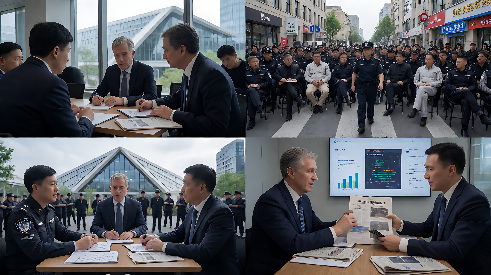

📋 第37周工作周报（2026年09月07日 - 2026年09月13日）

**一、本周工作总结**

本周系统持续运行 Task 4 事件分析任务，完成 2026-09-04 至 2026-09-06 三天的多源新闻聚合、事实抽取与矛盾检测工作。

1. **知识图谱构建与演化追踪**
   - 完成 9月4日-6日知识图谱的编译与更新，累计识别并确认有效事件节点数百个。
   - 追踪关键地缘政治事件链条：俄罗斯-美国-伊朗在波斯湾的军事对峙升级（美军击沉伊朗油轮）、俄乌冲突中针对乌克兰SBU总部的无人机袭击、以及美俄特使在莫斯科的和平谈判接触。
   - 追踪中国外交与科技进展：上合组织比什凯克峰会成果（成员扩至27国、发布153项早期收获）、中埃命运共同体构建、中科院合成单原子直径金属线等科技突破。

2. **数据质量管控与矛盾检测**
   - 生成并维护了3份详细的《知识矛盾》文档，识别出大量因数据路由错误、元数据错配导致的低置信度事件。
   - 核心发现：上游数据采集链路存在系统性风险，约半数以上的事件单元因源文章与主题严重不符（如将德国选举关联至网球新闻、将AI版权议题关联至能源新闻）而无法验证。
   - 针对高价值但数据缺失的事件（如联合国放弃墨卡托投影决议），已在矛盾记录中标注，提示需人工介入或寻找替代信源验证。

3. **专题研究候选沉淀**
   - 基于8月30日的深度分析，确立了三个长期跟踪专题：①生成式AI的隐性外部性（网络安全与水资源）；②喜马拉雅地缘生态危机；③全球南方政治动荡与军事联盟重组。本周的新闻动态（如HuggingFace攻击事件、尼泊尔洪灾后续）与专题1和专题2高度契合，为后续深度报告提供了持续的新素材。

**二、存在问题**

- 🔴 **数据源完整性危机**：Task 4 分析显示，大量事件（尤其是EVT-20260904及0905批次）依赖的源文章处于`unresolved`、`horizon_summary_only`或内容完全错配状态。这导致自动生成的事实陈述缺乏原文支撑，置信度极低，甚至产生“无中生有”的伪事实（如将不同领域的新闻强行聚类）。
- 🟡 **新闻源内部一致性风险**：部分权威媒体（如《人民日报》）的电子版面存在目录与实际正文不对应的问题（如9月5日新疆橡胶草报道实际内容为广西植物新种），影响了基于此类源数据的自动抽取准确性。

**三、下周工作计划**

- 针对本周标记的高置信度但低完整性的关键事件（如联合国Equal Earth投影决议、上合组织峰会核心成果），进行人工复核或补充信源挖掘，以完善知识图谱的事实基础。
- 结合本周新增的霍尔木兹海峡航运风险、美伊军事对峙等最新动态，更新“全球南方政治动荡”专题库。
- 继续监控HuggingFace被黑事件的后续分析报告（METR/Redwood），深化“AI基础设施供应链安全”专题研究。

**四、其他需反馈的事项**

- 建议优化上游爬虫路由逻辑，重点解决“标题-内容”严重错位的问题，否则自动化周报的事实准确率将持续走低。
