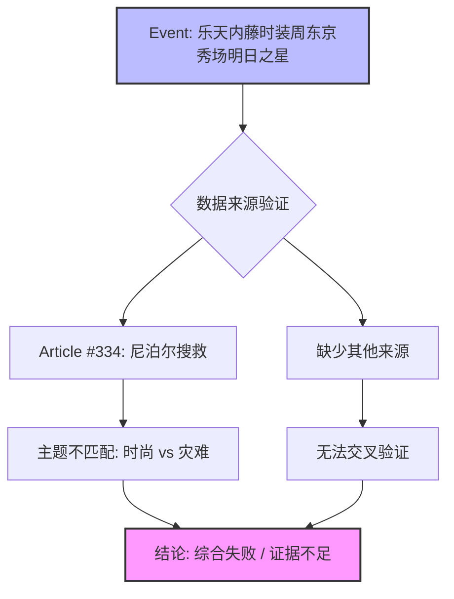

## Event ID

EVT-20260904-000239

## Selected Skills

- 总结文章.md

- 金字塔原理.md

---

## 最终事件分析 (Final Event Analysis)

### 标题
乐天内藤时装周东京秀场明日之星：数据源与事件主题严重错配分析

### 作者
748686 自生长知识系统 Event Analysis Engine

### 标签
#事件分析 #数据质量 #时尚娱乐 #Nepal #错误关联 #验证失败

### 一句话总结
EVT-20260904-000239 号事件标题指向“乐天内藤时装周东京秀场明日之星”，但唯一提供的来源文章（Article #334）内容涉及“尼泊尔失踪韩国人搜救行动”，两者主题完全无关，导致无法进行有效的事实综合。

### 摘要
本事件报告涉及一个标题与内容严重不匹配的数据异常案例。事件元数据及标题明确指向时尚娱乐领域，具体为“乐天内藤时装周”（Lotte Fujiwara Fashion Week）在东京的“明日之星”活动。然而，作为该事件唯一依据的来源文章（Article #334）是一篇关于尼泊尔山区搜救9名失踪韩国公民的新闻报道，且因天气原因直升机搜救暂停。由于来源内容与事件主题无任何事实关联，本次综合无法提取任何关于时装周的有效信息、参与者或地点细节。这表明数据链路中存在严重的分类错误或信息丢失问题。

### 详细大纲
根据金字塔原理与总结文章技能，详细拆解如下：

**1. 事件核心定义与状态（顶层结论）**
   - **事件ID**: EVT-20260904-000239
   - **事件标题**: 乐天内藤时装周东京秀场明日之星
   - **事件状态**: 综合分析失败 / 证据不足 (Synthesis Incomplete / Insufficient Evidence)
   - **核心判定**: 这是一个典型的“元数据与内容脱节”事件，无法生成有效的知识条目。

**2. 内容事实核查（中层论点一：来源内容分析）**
   - **唯一来源**: Article #334
   - **来源主题**: 国际人道主义/灾难新闻
   - **具体内容**: 尼泊尔发现9名失踪韩国人，因恶劣天气导致直升机搜救暂停。
   - **关联性判断**: 与“时尚”、“娱乐”、“乐天”、“内藤”、“东京”、“时装周”等关键词无事实联系。

**3. 数据完整性与验证困境（中层论点二：交叉验证失败）**
   - **验证状态**: 无法验证 (Unable to verify)
   - **缺失信息**:
     - 时尚界的具体人物（如设计师 Hanae Fujiwara 或相关品牌代表）。
     - 活动具体地点（东京某秀场）。
     - 活动具体时间安排。
   - **错误来源假设**:
     - Article #334 可能是被错误归类到此 Event Unit 的噪音数据。
     - 真正的时尚类源文章可能在预处理阶段丢失或未成功抓取。

**4. 影响评估与结论（底层支撑）**
   - **当前影响**: 无法确定任何时尚事件的实际影响，因为基础事实不存在。
   - **系统建议**: 需要重新审视 Router 的分类逻辑或源数据抓取链，确保事件标题与源文章内容的一致性。
   - **原始来源映射**:
     - Article #334 (Unknown Source) - 仅包含喜马拉雅山区搜救摘要，无全文。

### 金字塔结构图示

