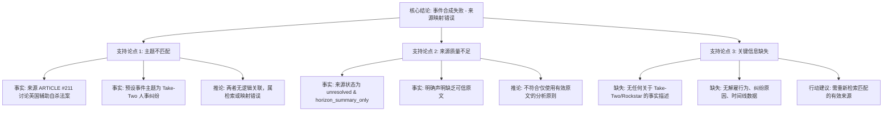

## Event ID

EVT-20260912-000569

## Selected Skills

- 总结文章.md
- 金字塔原理.md

# Event Analysis: Take-Two 员工被解雇争议 (EVT-20260912-000569)

## 核心结论
**事件合成失败：来源映射错误。** 提供的唯一来源（ARTICLE #211）与预设事件主题“Take-Two 员工被解雇争议”完全无关。该来源实际内容为“英国下议院否决辅助自杀法案”，且状态为未解析的摘要（horizon_summary_only），缺乏可信原文。因此，**无法基于现有材料生成关于 Take-Two 内部人事纠纷的事实性结论**。建议系统标记此事件为“来源映射错误”，并重新检索有效来源。

## 详细分析

### 1. 事件概述与来源不匹配
*   **预设主题**：Rockstar Games/Take-Two 内部人事纠纷（员工被解雇）。
*   **实际来源内容**：ARTICLE #211 来自 AP，标题为 *MPs reject assisted dying bill after tense debate – as it happened*，内容涉及英国议会关于辅助自杀法案的辩论。
*   **关键冲突**：来源文章的主题（英国法律/政治）与事件标题（游戏公司人事）属于完全不同的领域，存在根本性数据映射错误。

### 2. 来源质量评估
*   **状态标记**：`unresolved`（来源未解析成功），`horizon_summary_only`（仅有摘要）。
*   **可信度**：低。来源明确标注“未提供该条目的完整正文”及“当前没有找到可信的原始文章”。
*   **信息缺失**：在提供的材料中，没有任何文字提及 Take-Two Interactive、Rockstar Games、相关员工、解雇行为或具体纠纷细节。

### 3. 跨源验证与信息真空
*   **验证能力**：由于仅有一个来源且其内容不相关，无法执行有效的跨源验证。
*   **事实基础缺失**：
    *   无法确认是否发生解雇争议。
    *   无法确定纠纷原因、涉及人员、时间线。
    *   无法评估对公司的影响（士气、运营、法律风险）。
    *   无法分析不同国家/地区的视角。

## 结构化逻辑框架（基于金字塔原理）

为了清晰呈现这一“否定性”结论，以下采用金字塔原理对当前事件状态进行层级化梳理：

## 建议行动

1.  **标记状态**：将 EventUnit `EVT-20260912-000569` 的状态更新为 **“合成失败”** 或 **“来源映射错误”**。
2.  **隔离无效来源**：移除 ARTICLE #211 与该事件 ID 的关联，因其内容（英国政治）与事件主题（游戏公司人事）无关。
3.  **重新检索**：启动新的检索流程，寻找明确报道“Take-Two”或“Rockstar Games”员工解雇争议的有效新闻来源。
4.  **人工复核**：在重新获取来源前，该事件不应进入最终知识库，以免引入错误事实。
