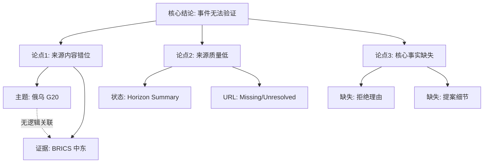

## Event ID

EVT-20260913-000187

## Selected Skills

- 总结文章.md
- 金字塔原理.md
- 四维价值模型.md

## 事件总结 (基于 "总结文章.md")

**标题**：克里姆林宫拒绝迈阿密G20普京-泽连斯基会晤提议
**作者**：系统综合（来源：ARTICLE #241，状态未决）
**标签**：国际政治、G20、BRICS、地缘冲突、信息缺失
**一句话总结**：针对关于克里姆林宫拒绝迈阿密G20普京-泽连斯基会晤的事件，现有单一低质量来源未能提供核心证据，且内容严重偏离主题（仅涉及BRICS对中东局势的表态），导致事件核心事实无法得到验证。
**摘要**：
本事件单元旨在分析“克里姆林宫拒绝迈阿密G20普京-泽绿斯基会晤提议”。然而，经过对唯一提供的来源（ARTICLE #241）的严格审视，发现该来源主要报道BRICS国家呼吁在中东战争保持“最大克制”，并未包含任何关于俄罗斯、乌克兰、G20迈阿密会晤或克里姆林宫拒绝会晤的信息。
来源状态标记为“Horizon Summary Only”且“Unresolved”，缺乏原始URL和完整正文。由于存在严重的“元数据与内容不匹配”（Metadata vs. Content Conflict），即事件标题指向俄乌外交，而证据指向中东/BRICS外交，该事件的核心主张（拒绝会晤）目前处于“未验证”状态。因此，无法基于现有材料生成关于该会晤本身的有效分析，仅能记录这一信息来源的断裂与错位。
**大纲**：
1.  **事件定义与来源偏差**
    *   事件目标：分析普京-泽连斯基G20会晤被拒。
    *   来源实际内容：BRICS呼吁中东克制。
    *   偏差判定：完全无重叠，无法互证。
2.  **证据有效性评估**
    *   来源类型：摘要级（Digest/Horizon），非原文。
    *   可追溯性：低（无原始链接，状态Unresolved）。
    *   核心事实验证：失败（文中无普京、泽连斯基、G20、迈阿密字样）。
3.  **不同视角分析**
    *   BRICS视角：支持中东克制（唯一有文本支撑的视角）。
    *   克里姆林宫视角：未知（无文本支撑）。
    *   美国/东道国视角：未知（无文本支撑）。
4.  **结论与建议**
    *   结论：证据不足（Insufficient Evidence）。
    *   建议：寻找关于克里姆林宫声明或G20外交提案的具体来源，而非依赖当前的BRICS中东摘要。

## 结构化分析 (基于 "金字塔原理.md")

**核心结论（塔尖）**
**当前证据体系无法支持“克里姆林宫拒绝迈阿密G20会晤”这一事实陈述，该事件单元处于“证据失败/不匹配”状态，不具备发布为已验证事实的条件。**

**关键支持论点（塔身）**
1.  **来源内容与事件主题严重错位（相关性失败）**
    *   事件主题是俄乌外交（普京-泽连斯基）。
    *   来源内容是中东外交（BRICS-中东战争）。
    *   逻辑断点：两者之间在提供的文本中不存在因果或关联链条，属于典型的“南辕北辙”式证据匹配错误。
2.  **证据来源质量低于置信阈值（可靠性失败）**
    *   来源状态为“Horizon Summary Only”（仅视野摘要）。
    *   原始URL缺失，且状态为“Unresolved”（未决）。
    *   根据金字塔原理中的证据层级，摘要级信息无法作为高层级结论的坚实基础，尤其当摘要内容与核心论点无关时。
3.  **核心事实缺失（完整性失败）**
    *   关于“拒绝”的具体理由、措辞、时间点均无记录。
    *   关于“迈阿密G20会晤提案”是否存在无记录。
    *   MECE原则检查：在“验证事件真实性”这一层级下，缺少了“主体（Kremlin）”、“客体（Zelensky/G20 Proposal）”、“行为（Rejection）”的所有底层数据支撑。

**底层证据与细节（塔基）**
*   **来源 ARTICLE #241 细节**：
    *   标题：[BRICS nations urge 'maximum restraint' in Middle East war]
    *   关键语句：BRICS nations urged "maximum restraint".
    *   缺失项：无 "Putin", 无 "Zelensky", 无 "G20", 无 "Miami", 无 "Kremlin".
*   **冲突记录**：
    *   元数据声称事件为 E2E-20260913-000187。
    *   实际文本内容指向 BRICS/Middle East 语境。
    *   判定：Source Integrity Conflict（来源完整性冲突）。

**逻辑路径图**

## 价值评估 (基于 "四维价值模型.md")

**1. 信息价值 (Information Value)**
*   **当前状态：极低 / 负向**
*   **分析**：对于希望了解“俄乌G20会晤”进展的用户，此Event Unit几乎不提供任何新知识，反而提供了“信息真空”和“来源错位”的警示。
*   **潜在价值**：唯一的信息点在于揭示了BRICS国家在特定时刻对中东局势呼吁“最大克制”，但这与事件标题承诺的价值严重不符，导致用户产生“货不对板”的认知落差。

**2. 情绪价值 (Emotional Value)**
*   **当前状态：低 / 焦虑感**
*   **分析**：阅读此分析会产生一种“不确定性焦虑”（Uncertainty Anxiety）。用户原本期待明确的外交动态（拒绝会晤），结果得到的是一份“无法验证”的技术性报告。
*   **共鸣点**：对于关注信息准确性的读者，这种严格标记“FAILED / INSUFFICIENT EVIDENCE”的态度可能带来一种“严谨”的信任感，但缺乏积极的情绪共鸣（如豁然开朗或振奋）。

**3. 趣味价值 (Fun Value)**
*   **当前状态：无**
*   **分析**：内容完全是干瘪的元数据冲突和技术性报错，没有任何叙事、比喻或幽默元素。这像是一份枯燥的系统日志，而非可读的新闻分析。

**4. 独特价值 (Unique Value)**
*   **当前状态：低**
*   **分析**：该分析的独特性不在于观点，而在于其“失败”的透明度。它诚实地展示了系统在面对“错误匹配来源”时的处理逻辑（即拒绝强行解释，而是标记为不匹配）。这种“负空间”的透明化是系统工程层面的独特属性，而非内容创作层面的独特视角。

## 最终建议与行动项

1.  **状态标记**：保持 `FAILED / INSUFFICIENT EVIDENCE` 状态，禁止直接推送给用户作为新闻事实。
2.  **来源更正**：
    *   移除 ARTICLE #241 与该 Event ID 的关联。
    *   检索关键词："Kremlin rejects G20 meeting", "Putin Zelensky Miami G20", "G20 diplomatic proposal Russia Ukraine"。
3.  **语境补充**：若需保留 BRICS 中东表态作为背景，需新建独立事件单元（如 EVT-BRICS-ME-RESTRAINT），不得混入俄乌外交事件。
4.  **用户提示**：若必须展示此条目，需添加显著警告标签：“⚠️ 来源不匹配：现有证据仅涉及BRICS与中东，无法证实俄乌G20会晤细节。”
