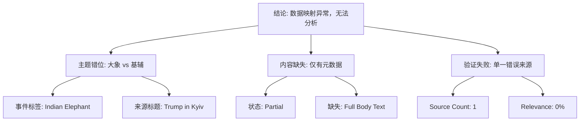

## Event ID

EVT-20260913-000283

## Selected Skills

- 总结文章.md
- 金字塔原理.md

### 1. 总结文章

**标题**：印度大象事件数据映射异常报告 (Indian Elephant Data Mismatch Report)

**作者**：748686 自生长知识系统 Event Analysis Engine

**标签**：`#数据完整性`, `#事件映射错误`, `#新闻摘要处理`, `#元数据异常`

**一句话总结**：事件 EVT-20260913-000283 被标记为“印度大象”，但其唯一关联源文章 #340 内容实为“特朗普特使抵达基辅”且正文缺失，导致无法提取与“印度大象”相关的事实信息，确认为数据检索映射错误。

**摘要**：
本事件分析针对 Event ID EVT-20260913-000283，原定主题为“印度大象”的动物照片说明。然而，系统加载的唯一来源 ARTICLE #340 指向 news.google.com 的一篇关于“特朗普特使抵达基辅推动结束俄罗斯战争”的新闻摘要。该文章状态标记为“部分获取（Partial）”，且明确注明原始摘要系统未提供完整正文，仅包含元数据和占位符。因此，现有材料中不存在任何关于“印度大象”的事实依据、背景或影响。经比对，事件标题与来源内容严重不匹配，表明在数据抓取或路由阶段发生了 ID 映射错误。当前无法对该事件进行实质性事实构建，建议标记为无效数据或重新检索来源。

**文章大纲**：

1.  **事件背景与预期**
    *   事件标识：EVT-20260913-000283
    *   预期主题：印度大象（Indian Elephant）
    *   预期内容：独立的动物照片说明
    *   来源数量：1 (ARTICLE #340)

2.  **实际来源内容分析**
    *   来源 URL：news.google.com
    *   实际标题：[Trump envoys arrive in Kyiv in new push to end Russia’s war]
    *   内容状态：Fetched / Partial Content
    *   内容缺失情况：
        *   Horizon 摘要系统未提供完整正文。
        *   仅提供元数据、状态指示器及处理确认信息。
        *   包含未评分占位符 “⭐️ ?/10”。

3.  **一致性验证结果**
    *   标题匹配度：不匹配（印度大象 vs. 基辅外交动态）
    *   事实提取能力：无法提取任何关于印度大象的信息。
    *   冲突点：事件路由指向“动物照片”，但实际数据为“国际政治新闻摘要”。
    *   跨境视角：不适用（单一来源且内容无关）。

4.  **确定性与未知项**
    *   已知事实：
        *   事件日期为 2026-09-13。
        *   来源文章 #340 指向无关新闻。
        *   数据获取状态为部分缺失。
    *   无法确定的信息：
        *   印度大象的具体照片信息（地点、时间、摄影师）。
        *   基辅外交事件的后续进展（因原文缺失）。

5.  **结论与建议**
    *   判定：数据检索映射错误或路由配置失误。
    *   影响：该事件单元无法用于知识增长。
    *   后续动作：需人工介入或重新触发数据抓取以修正映射关系。

### 2. 金字塔原理分析

**核心结论（塔尖）**
事件 EVT-20260913-000283 因来源数据与主题严重错位及正文缺失，无法支持“印度大象”这一主题的事实构建，属于数据映射异常，建议标记为无效或重试。

**支持论点（塔身）**

1.  **主题与内容不匹配（逻辑关系：冲突/矛盾）**
    *   *事件定义*：系统路由将该事件标识为“印度大象”（动物/静态图片说明）。
    *   *实际内容*：唯一来源 ARTICLE #340 指向“特朗普特使抵达基辅”（政治/动态新闻）。
    *   *推论*：两者在语义、领域和实体上均无交集，表明数据抓取阶段的 ID 映射错误。

2.  **关键信息缺失（逻辑关系：证据不足）**
    *   *状态标记*：来源文章标记为 “Partial Content” 且注明 “Horizon digest did not provide a full body”。
    *   *数据现状*：仅存元数据、URL 及状态占位符，缺乏正文事实。
    *   *推论*：即使忽略主题错位，当前数据量也不足以支撑任何关于该新闻条目（无论是大象还是基辅）的事实性分析。

3.  **缺乏交叉验证基础（逻辑关系：单一来源风险）**
    *   *来源数量*：仅 1 个来源 (ARTICLE #340)。
    *   *验证能力*：无法进行多源交叉验证（Cross-Source Verification）。
    *   *推论*：在单一且内容错误的来源下，知识系统的置信度为零，无法生成可靠的知识节点。

**底层证据（塔基）**

*   **事实 A (事件元数据)**：Event ID EVT-20260913-000283, Date 2026-09-13, Type event_unit, Status completed.
*   **事实 B (来源元数据)**：ARTICLE #340, Source news.google.com, Title "Trump envoys arrive in Kyiv...", Status Fetched/Partial.
*   **事实 C (内容空缺)**：Source notes explicitly state full body text was not provided by the digest system.
*   **事实 D (比对结果)**：String match between "Indian Elephant" and "Trump envoys in Kyiv" yields 0 relevance.

**逻辑结构图示**

