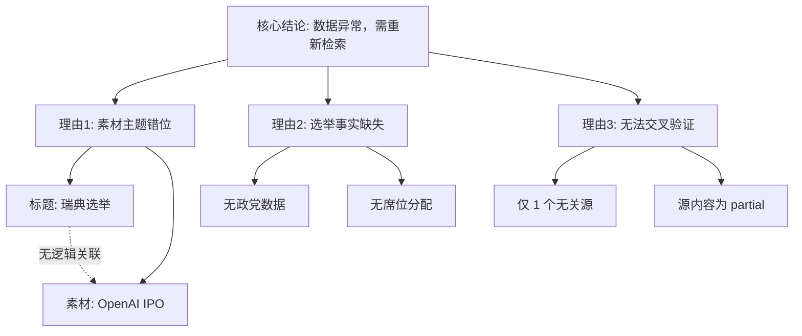

## Event ID

EVT-20260913-000485

## Selected Skills

- 总结文章.md

- 金字塔原理.md

- 四维价值模型.md

## 一、 文章总结 (基于《总结文章.md》)

基于 EventUnit 中提供的唯一素材 ARTICLE #194，进行如下总结与结构化提取：

*   **标题**：OpenAI IPO will not happen in 2026 amid AI safety fears, Sam Altman says
*   **作者/来源**：AP (美联社) / news.google.com (聚合源)
*   **标签**：`#科技/AI` `#OpenAI` `#IPO` `#企业融资` `#AI安全` `#数据异常`
*   **一句话总结**：OpenAI 首席执行官 Sam Altman 声明，因 AI 安全方面的担忧，OpenAI 在 2026 年不会进行 IPO。
*   **摘要**：
    本素材源自美联社报道，主要包含关于 OpenAI 融资计划的事实陈述。核心信息是 Sam Altman 明确表示 OpenAI 在 2026 年不会上市（IPO），理由主要归结于对 AI 安全的顾虑。
    **重要注记**：该素材被错误地关联至“瑞典选举结果”事件（EVT-20260913-000485）。素材内容本身并不完整（状态为 partial），且缺乏关于瑞典选举的任何实质性数据。
*   **文章大纲**：
    1.  **核心声明**：Sam Altman 确认 OpenAI 2026 年不 IPO。
    2.  **归因分析**：指出原因为“AI 安全担忧” (AI safety fears)。
    3.  **数据质量警告**：
        *   素材来源：AP 通稿。
        *   完整性：仅有片段，缺失正文。
        *   相关性：与事件标题“瑞典选举”完全无关，属于检索/合并错误。

## 二、 金字塔原理结构化分析 (基于《金字塔原理.md》)

运用金字塔原理对当前事件状态及已知信息进行结构化梳理，以澄清逻辑关系并明确结论。

### 1. 顶层结论 (Central Thought)
**事件 EVT-20260913-000485 存在数据错配异常，当前无法生成有效的“瑞典选举结果”知识单元，需标记为“检索错误”并重新触发检索。**

### 2. 中层关键论点 (Key Supporting Arguments)
*   **论点 A：素材与标题逻辑冲突**
    *   标题指向：瑞典政治选举结果。
    *   素材指向：OpenAI 科技巨头融资计划。
    *   逻辑判定：二者无因果或背景关联，属于 MECE（相互独立）原则下的错误归类。
*   **论点 B：核心信息缺失**
    *   关于瑞典选举的获胜者、席位、投票率等关键事实（Facts）均为空。
    *   现有素材 ARTICLE #194 仅为部分正文（partial），无法支撑完整事实构建。
*   **论点 C：单一来源且无效验证**
    *   仅有一个来源（AP via Google News）。
    *   由于来源内容与主题不符，无法通过“交叉验证”确认瑞典选举的真实情况。

### 3. 底层证据与细节 (Evidence & Details)
*   **来源细节**：
    *   Source: AP
    *   URL: news.google.com 链接
    *   Headline: "OpenAI IPO will not happen in 2026..."
*   **事实碎片 (关于 OpenAI，与本事件无关但存在)**：
    *   Sam Altman 言论：2026 不 IPO。
    *   理由：AI Safety concerns。
*   **系统状态**：
    *   Event Status: Completed (系统标记，但逻辑上应回滚)
    *   Data Quality: Mismatch / Low Relevance

### 4. 逻辑结构图示

## 三、 四维价值模型评估 (基于《四维价值模型.md》)

基于当前素材 ARTICLE #194 及其与事件标题的错位关系，评估该 EventUnit 当前输出内容的价值维度：

| 价值维度 | 评估分析 | 用户潜在感受 | 评分/状态 |
| :--- | :--- | :--- | :--- |
| **信息价值** | **极低/负值**。用户期望获取“瑞典选举结果”，但得到的是“OpenAI IPO 声明”。不仅未满足信息需求，且引入了噪音信息。若强行混合，则产生误导性信息。 | “这是什么？我问的是选举，你给我看 AI 新闻？” | ❌ 失效 |
| **情绪价值** | **低/困惑**。由于上下文错位，读者会产生被愚弄或系统不可靠的负面情绪，无法产生共鸣或信任感。 | “这个系统出 bug 了吧？” | ⚠️ 负面 |
| **趣味价值** | **无**。素材本身是枯燥的新闻事实陈述，且处于错误语境下，无叙事趣味或比喻亮点。 | “无聊且错误。” | ❌ 无 |
| **独特价值** | **无**。这是通用的新闻聚合内容，缺乏针对“瑞典选举”的独特视角或分析，且因数据错误，无法形成任何独特的知识签名。 | “随处可见的碎片信息。” | ❌ 无 |

**综合判定**：
当前 EventUnit 在四个价值维度上均未达标。主要原因并非素材本身缺乏价值（OpenAI IPO 本身具备信息价值），而是**错配导致价值归零**。

## 四、 最终结论与建议操作

根据上述分析，严格遵循“不编造事实”原则，对 EVT-20260913-000485 的处理结论如下：

1.  **状态变更**：将事件状态由 `completed` 修正为 `error_retrieval_mismatch` 或 `pending_valid_source`。
2.  **隔离处理**：
    *   **瑞典选举部分**：因无有效素材，禁止生成任何关于选举结果的内容。
    *   **OpenAI 部分**：ARTICLE #194 应被解耦，重新索引至科技/金融类事件（如 `EVT-Tech-2026-OpenAI-IPO`），其单独存在时具备正常的信息价值。
3.  **后续行动**：
    *   触发搜索引擎，使用关键词 `Sweden election results 2026` 获取新素材。
    *   对 ARTICLE #194 执行重新分类操作。
    *   在本事件下保留“数据异常”记录，作为系统自我修正的日志，而非生成虚假的新闻摘要。

**Event Analysis 结论**：
本事件当前仅包含一条与标题无关的、状态为 partial 的科技新闻素材。无法完成“瑞典选举结果”的分析与总结。输出结果标记为**无效**，建议执行数据清洗与重新检索流程。
