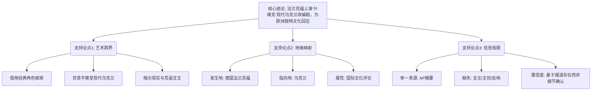

## Event ID

EVT-20260914-000146

## Selected Skills

- 总结文章.md
- 四维价值模型.md
- 金字塔原理.md

# Event Analysis: 弗兰克福剧院上演“什维克”角色现代乌克兰改编

## 1. 文章总结 (Summary)

**标题：** 弗兰克福剧院上演“什维克”角色现代乌克兰改编
**来源：** AP (美联社) | Horizon Summary #180
**标签：** 文化艺术, 戏剧, 乌克兰, 德国, 文化跨界
**一句话总结：** 德国法兰克福的一家剧院正在上演一部将经典文学角色“什维克”（Švejk）背景改编为现代乌克兰局势的戏剧作品。

**内容摘要：**
2026年9月14日，新闻报道指出，德国法兰克福剧院正在上演一部基于“什维克”角色的戏剧改编作品。该作品在叙事背景上进行了现代化处理，将其置于“现代乌克兰”的语境下，以此作为探讨或反映当前局势的艺术媒介。目前该事件仅通过单一来源（AP的Horizon摘要）记录，原始文章全文及URL未能检索到，因此关于制作团队、具体剧目名称、演职员表及观众反响等详细事实尚未得到多方证实。核心信息在于这一“历史角色+现代乌克兰语境+德国场馆”的文化跨界现象。

**详细大纲：**
1.  **事件核心事实**
    *   **类型：** 戏剧/文化表演。
    *   **地点：** 德国法兰克福剧院。
    *   **主体：** “什维克”角色的戏剧改编。
    *   **背景修改：** 故事设定更新为“现代乌克兰”。
    *   **时间：** 新闻报道日期为2026年9月14日。
2.  **信息状态与局限性**
    *   **来源单一：** 仅有一条AP来源（Horizon Summary #180）。
    *   **数据缺失：** 原始URL未找到，全文未获取，事实基于头条和摘要而非全文核实。
    *   **无法确定项：** 具体剧目名、确切演出日期区间、创意团队（编剧/导演/演员）、观众评价、是否明确指代哈塞克的《好兵帅克》（虽语境暗示但未明示）。
3.  **多维度视角**
    *   **德国/全球视角：** 事件发生在法兰克福，代表欧洲主流文化场域的回应。
    *   **乌克兰视角：** 内容直接关联现代乌克兰，暗示通过戏剧进行跨国界的政治或文化评论。
    *   **缺乏区域反应：** 当前材料中无乌克兰当地媒体或特定国际媒体的具体反应记录。
4.  **影响评估**
    *   **文化/艺术层面：** 作为讨论现代乌克兰的媒介，利用历史角色的讽刺或荒诞性质映射现实。
    *   **信息传播层面：** 主要作为一条文化新闻被分发，无详细的政治、经济或社会次级影响数据。

## 2. 四维价值模型分析 (Four-Dimensional Value Model)

基于现有摘要信息，对该事件内容的潜在价值维度进行分析：

*   **信息价值 (Information Value)**
    *   **分析：** 中等偏低。由于原文缺失，该事件仅提供了“谁在哪里做了什么”的基本事实（法兰克福剧院+什维克角色+现代乌克兰背景）。它提供了一个文化界关注乌克兰问题的新切口（通过经典角色改编），但未提供深层的数据、方法论或具体的剧情细节。
    *   **用户感受：** “得知了德国有一部戏在演乌克兰主题”、“了解了‘什维克’角色在当代的再利用”。

*   **情绪价值 (Emotional Value)**
    *   **分析：** 潜在较高，但依赖观众背景。将经典的、带有荒诞和黑色幽默色彩的“什维克”置于残酷或复杂的“现代乌克兰”语境中，可能引发一种复杂的共鸣感——既是对历史的致敬，也是对现实的讽刺或哀悼。对于关心乌克兰局势的受众，这种艺术表达可能带来一种“被理解”或“有创意应对”的情绪触动。
    *   **用户感受：** “用这样的方式讨论乌克兰，很有巧思”、“让人深思”、“感到一种荒诞的现实感”。

*   **趣味价值 (Entertainment Value)**
    *   **分析：** 高。核心看点在于“经典文学角色”与“现代地缘政治热点”的跨界组合。这种意想不到的搭配本身具有新闻性和话题性。如果剧目本身保留了“什维克”的喜剧或讽刺特质，其表演可能极具趣味性。
    *   **用户感受：** “这个组合太有意思了”、“好奇这部剧是怎么把老角色套进新背景的”、“脑洞很大”。

*   **独特价值 (Unique Value)**
    *   **分析：** 极高。这一特定组合（法兰克福剧院+什维克+现代乌克兰）是高度独特的文化签名。它代表了特定时刻（2026年）特定地域（欧洲核心）对特定议题（乌克兰）的独特艺术回应。这种跨界改编本身构成了该事件的独特性，区别于普通的战争报道或常规话剧。
    *   **用户感受：** “这个视角只有这一部剧提出来”、“独特的文化符号借用”。

## 3. 金字塔原理结构化分析 (Pyramid Principle Analysis)

基于金字塔原理，对该事件进行结构化梳理，确保逻辑清晰、结论先行。

### 顶层结论 (Core Conclusion)
**德国法兰克福剧院通过改编经典角色“什维克”至现代乌克兰背景，进行了一场具有强烈文化评论性质的戏剧表演，这是当前欧洲文化界对乌克兰局势的一种独特艺术回应。**

### 中层支持论点 (Supporting Arguments)

1.  **艺术形式的跨界与重构**
    *   该表演并非传统新闻式表达，而是借用文学经典“什维克”的角色框架。
    *   将角色的时空背景从历史（通常指一战/二战间期）平移或映射至“现代乌克兰”。
    *   这种重构暗示了现实与文学荒诞性的某种互文关系。

2.  **地缘政治的文化映射**
    *   事件发生在德国法兰克福，处于欧洲政治与文化中心地带。
    *   内容直接指向乌克兰，表明欧洲主流文化场域正在通过艺术媒介持续关注和评论乌克兰局势。
    *   缺乏乌克兰本土视角的直接记录，强化了“他者凝视”或“国际评论”的属性。

3.  **信息置信度的局限性**
    *   该事件目前仅基于单一摘要来源（AP），缺乏全文和多源交叉验证。
    *   具体的剧目名称、主创团队及观众反馈未知，限制了对其实际社会影响力的精确评估。
    *   结论建立在“报道存在”而非“细节确认”的基础上。

### 底层证据与细节 (Evidence & Details)

*   **具体事实 (Facts):**
    *   地点：Frankfurt Theater, Germany.
    *   主体：Schwejk Character Adaptation.
    *   语境：Modern Ukraine.
    *   日期：Reported 2026-09-14.
    *   来源：AP Horizon Summary #180.
*   **未知变量 (Unknowns):**
    *   Play Title: Unknown.
    *   Creative Team: Unknown.
    *   Reception: Unknown.
    *   Full Text: Unavailable.
*   **逻辑关系：**
    *   **归纳关系：** 单一的戏剧事件 + 特定的角色选择 + 特定的背景设定 $\rightarrow$ 表明这是一种特定的文化评论行为。
    *   **演绎关系：** 如果某事件在法兰克福上演且背景为现代乌克兰 $\rightarrow$ 那么它构成了欧洲对乌克兰议题的艺术回应（前提是假设其意图为评论性，这基于“什维克”角色的讽刺属性推断，但原文未明示，故为基于语境的推断）。

### 结构化总结图表

