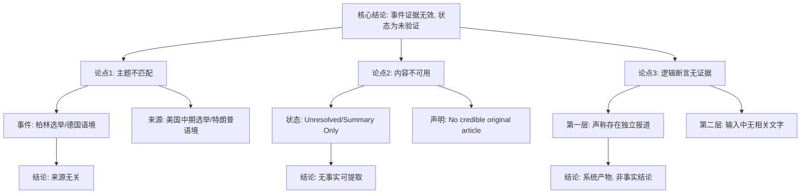

## Event ID

EVT-20260914-000260

## Selected Skills

- 总结文章.md
- 金字塔原理.md

# Event Analysis: Berlin Election Framing

## 1. 总结文章.md 执行结果

### 标题
Berlin Election Framing

### 作者
N/A (748686 Self-Growing Knowledge System / AI Synthesis)

### 标签
#柏林选举 #政治框架 #国家抱负缺口 #数据完整性 #未验证事件

### 一句话总结
该事件记录声称柏林选举被独立报道框架化为“全国抱负缺口”的症状，但因提供的唯一来源（ARTICLE #296）主题不匹配（美国中期选举）且缺乏原文，导致核心事实无法验证，事件处于证据不足状态。

### 摘要
本分析基于 EventUnit EVT-20260914-000260。系统第一层合并逻辑指出存在关于柏林选举的独立报道，将其视为“全国抱负缺口”的象征。然而，第二层综合分析显示，仅有一个来源（ARTICLE #296）可用，其标题为“特朗普在美国中期选举前的政治定位”，状态为“未解决”且仅包含地平线摘要，无可信原文。该来源在主题上与“柏林选举”完全无关，且在内容上明确表示“未找到可信原始文章”。因此，无法从现有输入中建立关于柏林选举框架化的可验证事实。事件结论为：该叙事框架是一个未经验证的系统产物，因缺乏支撑证据而保持“待获取来源”或“未验证”状态。

### 文章大纲

1.  **事件背景与定义**
    *   事件ID：EVT-20260914-000260
    *   核心主张：柏林选举被框架化为“全国抱负缺口”（National Ambition Gap）。
    *   来源性质：声称的“独立报道”。
2.  **数据完整性审查**
    *   **来源映射**：仅一个来源 ARTICLE #296。
    *   **状态检查**：Source Status 为 "unresolved"，Content Status 为 "horizon_summary_only"。
    *   **主题一致性**：来源主题（美国政治/特朗普）与事件主题（柏林/德国政治）存在根本性错配。
3.  **事实验证结果**
    *   **缺失内容**：无柏林选举的具体细节（候选人、日期、结果、公众反应）。
    *   **缺失定义**：“全国抱负缺口”的具体内涵未知。
    *   **验证失败**：由于原文缺失且主题错误，无法确认报道的存在性或具体论点。
4.  **冲突与差异**
    *   **标题与内容冲突**：事件标题指向德国语境，来源指向美国语境。
    *   **系统断言与证据冲突**：系统声称存在独立报道，但提供的证据明确表示“未找到可信文章”。
5.  **结论与建议**
    *   当前状态：未验证（Unverified）。
    *   行动建议：保持“待获取来源”状态，需获取关于柏林选举的可信原始报道后再进行分析。

---

## 2. 金字塔原理.md 执行结果

### 核心结论（塔尖）
**事件 EVT-20260914-000260 目前处于“证据无效”状态，因唯一的提供来源在主题和内容上均无法支持“柏林选举框架化”的假设，该叙事框架应被视为未经验证的系统噪声，直至获取有效来源。**

### 关键论点（中层）

#### 论点 1：来源与事件的主题严重不匹配
*   **事实 A**：事件标题明确为“Berlin Election Framing”（柏林选举框架化），暗示德国政治语境。
*   **事实 B**：唯一提供的来源 ARTICLE #296 标题为“Trump&’s political positioning ahead of US midterms”（特朗普在美国中期选举前的政治定位），属于美国政治语境。
*   **推论**：来源在地理和政治主体上与事件核心对象完全脱节，无法作为该事件的直接证据。

#### 论点 2：来源状态导致内容不可用
*   **事实 A**：ARTICLE #296 的状态标记为 "unresolved" 和 "horizon_summary_only"。
*   **事实 B**：该来源明确注明 “No credible original article was found”（未找到可信原始文章）。
*   **推论**：由于缺乏原始全文，即使主题匹配，也无法从该来源提取可验证的具体事实（如报道的具体论点、数据或引用）。

#### 论点 3：系统第一层逻辑缺乏第二层证据支撑
*   **事实 A**：第一层合并理由声称存在“关于柏林选举被框架化的独立报道”。
*   **事实 B**：第二层提供的输入材料中，没有任何内容提及柏林、德国或“全国抱负缺口”。
*   **推论**：第一层的结论在当前输入下是孤立的断言（Unsubstantiated Claim），属于系统内部生成的假设，而非基于证据的综合结论。

### 详细证据与支撑（底层）

*   **针对论点 1 的详细证据**：
    *   来源 ARTICLE #296 的 URL 缺失，Source 标记为 "Unknown"。
    *   来源内容仅保留元数据，无正文。
    *   事件分析中明确标注 “Thematic mismatch between the event identifier and the provided evidence”。

*   **针对论点 2 的详细证据**：
    *   根据 “Unique Information by Source” 部分，ARTICLE #296 提供的是关于特朗普政治定位的元数据，而非柏林选举信息。
    *   “Cross-Source Verification” 部分指出，由于只有一个来源且该来源未解决，无法进行多源交叉验证。

*   **针对论点 3 的详细证据**：
    *   “What Cannot Currently Be Determined” 部分列出了无法确定的项目，包括“National Ambition Gap 的定义”和“柏林选举的细节”。
    *   “Event Conclusion” 部分明确判定：“The claim that the Berlin election is framed as a 'national ambition gap' remains an unverified system artifact... without supporting evidence”。

### 逻辑结构图示

### 表达优化与建议

1.  **清晰化状态标签**：在知识系统中，该事件应从“已处理”或“综合中”移至“待获取来源（Pending Source Acquisition）”队列，避免被误读为已有定论。
2.  **明确证据缺口**：在后续分析中，应强制要求提供与“Berlin Election”关键词匹配的可信原文，剔除当前错误映射的美国政治来源。
3.  **定义隔离**：由于“National Ambition Gap”是一个未定义的概念，建议在获取新来源前，不将该术语作为既定事实录入知识库，仅作为“待验证假设”存储。
