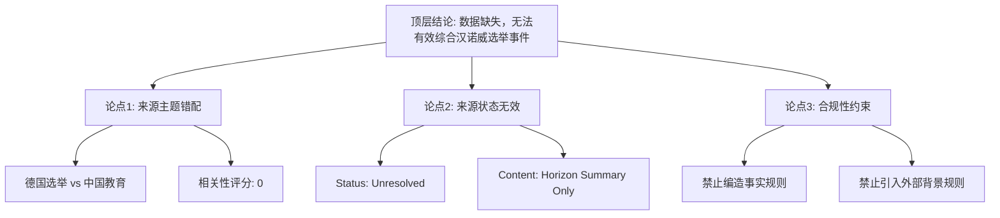

## Event ID

EVT-20260914-000453

## Selected Skills

- 总结文章.md
- 金字塔原理.md

## Event Analysis

### 1. 总结文章.md 执行结果

#### 标题
汉诺威市长领跑第二轮决选：数据缺失与来源错配报告

#### 作者
748686 Self-Growing Knowledge System Event Analysis Engine

#### 标签
新闻、德国政治、数据缺失、来源不匹配、汉诺威、选举分析

#### 一句话总结
由于唯一提供的参考来源与事件主题完全无关且处于未解决状态，当前无法基于事实生成关于“汉诺威市长领跑第二轮决选”的有效新闻摘要，仅能记录数据缺失状态。

#### 文章内容摘要
本事件单元旨在分析德国汉诺威市长选举的第二轮决选结果。然而，系统提供的唯一来源（ARTICLE #206）为关于中国教育部“中国教师”小程序升级及“第三期惠师行动”的教育科技新闻，且其状态标记为“unresolved”和“horizon_summary_only”（无可信原文）。鉴于该来源在主题、地域和领域上与目标事件（德国地方选举）存在根本性错配，根据自生长知识系统的严格规则，禁止引入外部背景知识或编造事实。因此，本分析无法提供选举的具体候选人、得票率或最终结果，仅能确认当前输入数据不支持该事件的有效综合。

#### 文章大纲（基于现有数据的状态描述）
1.  **事件背景**：目标事件为2026年9月14日的汉诺威市长第二轮决选。
2.  **数据输入检查**：
    *   来源数量：1篇。
    *   来源内容：ARTICLE #206（中国教育部教育科技新闻）。
    *   来源状态：Unresolved / Horizon Summary Only。
3.  **相关性验证**：
    *   主题匹配度：0%（德国政治 vs 中国教育）。
    *   结论：来源与事件完全不相关。
4.  **缺失信息列表**：
    *   候选人姓名及党派。
    *   第二轮决选的具体得票比例。
    *   选举最终获胜者。
    *   第一轮决选的回顾数据。
    *   选举的政治背景及影响。
5.  **最终结论**：因缺乏有效相关来源，事件状态标记为“数据缺失/来源不匹配”，无法生成实质性新闻分析。

---

### 2. 金字塔原理.md 执行结果

#### 顶层结论（核心信息）
**当前输入数据不支持“汉诺威市长领跑第二轮决选”的有效事实综合，事件状态应判定为“数据缺失”或“来源无效”。**

#### 中层支持论点（逻辑支撑）
为了支持上述顶层结论，分析遵循以下三个主要逻辑分支（MECE原则：相互独立，完全穷尽）：

**论点一：来源与主题存在根本性错配（相关性缺失）**
*   *底层证据*：
    *   事件目标地域：德国汉诺威。
    *   事件目标领域：地方政治选举。
    *   提供来源（ARTICLE #206）地域：中国。
    *   提供来源领域：教育/科技（教育部小程序）。
    *   *逻辑关系*：地域和领域完全背离，无法建立任何逻辑连接。

**论点二：来源状态未满足可信度要求（有效性缺失）**
*   *底层证据*：
    *   ARTICLE #206 的状态标记为 `source_status: unresolved`。
    *   ARTICLE #206 的内容状态标记为 `content_status: horizon_summary_only`。
    *   规则约束：系统明确规定 Horizon 摘要不视为原文，且必须尊重来源状态。
    *   *逻辑关系*：即使主题匹配，该来源本身也被标记为“未找到可信原文”，不具备作为事实基础的法律或新闻效力。

**论点三：禁止编造事实的规则约束（合规性要求）**
*   *底层证据*：
    *   规则第10条：信息不足时必须明确说明无法确定。
    *   规则第15条：不得引入无关背景信息。
    *   规则第11条：必须尊重 source_status。
    *   *逻辑关系*：基于前两点（无相关来源、无有效原文），系统被强制禁止使用外部知识填补空白，因此只能输出“无法确定”的状态记录。

#### 逻辑关系说明
*   **归纳关系**：上述三个论点（主题错配、状态无效、规则约束）共同归纳出顶层结论（数据缺失，无法综合）。
*   **演绎关系**：
    *   大前提：知识系统必须基于可信且相关的原文进行综合，否则必须声明数据缺失。
    *   小前提：当前输入仅包含一个主题错配且状态无效的摘要。
    *   结论：因此，本事件无法生成有效综合，只能记录数据缺失。

#### 视觉呈现建议（结构图）

