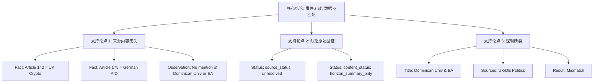

## Event ID

EVT-20260915-000125

## Selected Skills

- 总结文章.md

- 金字塔原理.md

============================================================

# Event Analysis: EVT-20260915-000125

## 1. 元数据与标签 (基于 总结文章.md)

- **标题**：Dominican University and Effective Altruism (EA) Event Partnership
- **作者/来源**：系统生成的 EventUnit（基于 ARTICLE #142 和 ARTICLE #175 的综合）
- **标签**：
  - 领域：学术合作 / 有效利他主义 (Effective Altruism)
  - 状态：数据异常 / 来源不匹配 / 信息不足
  - 关键词：Dominican University, EA, UK Crypto Donation, German AfD

## 2. 核心结论 (基于 金字塔原理.md - 结论先行)

**该事件单元（EVT-20260915-000125）存在严重的数据关联错误，无法生成有效的知识摘要。**

尽管 EventUnit 标题指向“多明尼加大学与有效利他主义（EA）的活动合作”，但底层支持该事件的来源数据（ARTICLE #142 和 ARTICLE #175）分别涉及英国加密货币捐赠和德国政治辩论，与标题完全无关。因此，**不存在可验证的关于“多明尼加大学EA合作”的事实依据**。建议立即撤回该 Event ID 下的所有源文章关联，并重新检索正确数据源。

## 3. 详细分析与摘要 (基于 总结文章.md)

### 3.1 事件背景与数据冲突
根据金字塔原理中的“逻辑关系明确”原则，我们需要检查前提与结论之间的逻辑连贯性。在本事件单元中，逻辑链条断裂：
- **事件标题主张**：多明尼加大学（Dominican University）与有效利他主义（EA）组织建立了合作或共同举办了活动。
- **实际来源内容**：
  1. **ARTICLE #142**：报道了英国政党 Reform UK 收到 7200 万英镑加密货币捐赠，引发了关于影响力政治的辩论。
  2. **ARTICLE #175**：报道了德国政治中关于“德国选择党”（AfD）获得秘密国防计划访问权限的辩论。

**结论**：两个来源均未提及多明尼加大学、EA、或任何相关学术活动。来源状态标记为 `source_status: unresolved` 和 `content_status: horizon_summary_only`，表明缺乏原始文本验证。

### 3.2 文章大纲（基于可用信息的结构化梳理）

#### A. 事件判定逻辑（第一层 Global Merge）
- **判定过程**：系统识别出 Cluster 5（多明尼加大学EA活动）与 Cluster 30（塞维利亚大学EA聚会）虽同属EA领域，但因地点不同（多明尼加 vs 西班牙）且无法确认为同一具体事件，遵循“宁可分开”原则，未合并。
- **结果**：独立生成 EVT-20260915-000125。

#### B. 来源数据审查（第二层 AI 多来源综合）
- **相关性检查**：
  - ARTICLE #142 与事件标题相关性：**无 (None)**
  - ARTICLE #175 与事件标题相关性：**无 (None)**
- **信息提取**：
  - 无法提取关于 EA 合作的事实。
  - 仅能提取无关的政治新闻事实（英国加密货币捐赠、德国国防辩论）。

#### C. 信息缺口分析
- **不可确定事项**：
  1. 多明尼加大学是否真的与 EA 组织建立了合作？
  2. 合作的具体形式（讲座、工作坊、捐赠）？
  3. 活动发生的具体日期和地点（美国加州的多明尼加大学 vs 多米尼加共和国）？
  4. 公众反应或后续影响？

### 3.3 最终建议
1. **拒绝当前数据关联**：标记此 Event Unit 为“数据污染”或“匹配错误”。
2. **重新检索**：针对关键词 "Dominican University" AND "Effective Altruism" 重新执行新闻抓取。
3. **验证合并逻辑**：检查第一层合并算法是否错误地将无关新闻聚类到了该 Event ID 下。

## 4. 金字塔结构可视化

## 5. 行动项

| 优先级 | 行动 | 理由 |
| :--- | :--- | :--- |
| **P0** | 隔离/标记 EventUnit | 防止无效知识进入自生长系统 |
| **P1** | 重新抓取正确来源 | 获取真实的 EA 活动数据 |
| **P2** | 审计合并逻辑 | 确认是否因聚类错误导致无关文章被关联 |
