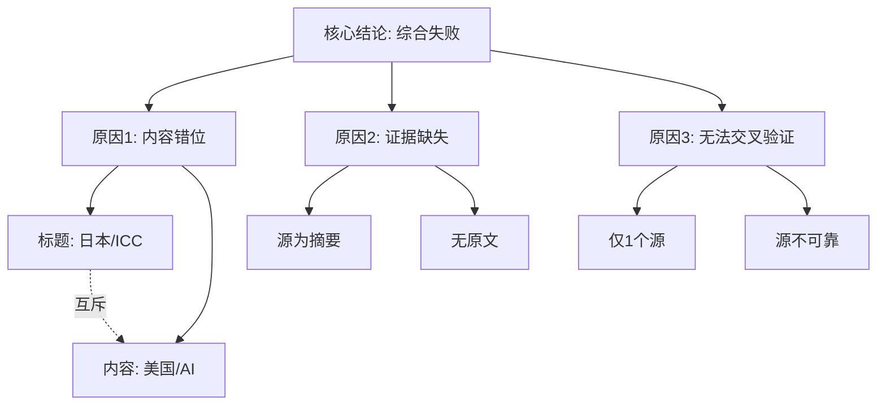

## Event ID

EVT-20260916-000065

## Selected Skills

- 总结文章.md
- 金字塔原理.md
- 四维价值模型.md

## 总结文章

### 标题
日本议员敦促支持ICC并解除制裁（数据缺失报告）

### 作者
748686 自生长知识系统 Event Analysis Engine

### 标签
#数据异常 #国际法 #ICC #日本政治 #数据治理

### 一句话总结
该事件单元因源数据严重错位（标题涉及日本ICC立场，源内容涉及美国AI政治争议）导致无法合成有效事实，当前状态为合成失败。

### 文章内容摘要
本次分析针对事件 EVT-20260916-000065 进行综合。原定事件主题涉及日本议员呼吁支持国际刑事法院（ICC）并解除制裁，但提供的唯一来源文章（ARTICLE #103）内容完全无关，主要讨论美国政治人物史蒂夫·班农（Steve Bannon）和伯尼·桑德斯（Bernie Sanders）对科技寡头及AI改革的看法。由于源文章未提供可信原文（标记为 horizon_summary_only），且内容与事件标题零重合，导致无法提取关于日本、ICC或相关制裁的任何事实信息。因此，系统判定该事件无法完成综合，建议重新核对事件ID与源数据的映射关系。

### 文章大纲
1. **事件元数据确认**
   - 事件ID：EVT-20260916-000065
   - 日期：2026-09-16
   - 原始新闻数量：1
   - 源状态：unresolved / horizon_summary_only
2. **数据错位诊断**
   - **事件标题**：日本议员敦促支持ICC并解除制裁
   - **实际源内容**：Steve Bannon and Bernie Sanders Condemn Tech ‘Oligarchs’ and Demand A.I. Reforms
   - **一致性检查**：内容互斥，无日本、ICC、制裁相关词汇
3. **核心事实缺失清单**
   - 日本议员具体身份未知
   - 涉及的具体制裁内容未知
   - ICC的反应未知
   - 呼吁的具体平台/日期未知
4. **来源评估**
   - ARTICLE #103：不可靠，无完整正文，主题偏离
5. **结论与建议**
   - 合成失败
   - 建议：修正事件标题以匹配源内容，或替换为正确的ICC相关源数据

## 金字塔原理

### 核心结论
**事件 EVT-20260916-000065 综合失败，根本原因为源数据与事件标题存在实质性错位，导致缺乏支持核心事实的证据链。**

### 关键支持论点
1. **来源内容不匹配（MECE：相关性）**
   - 事件标题指向“日本/ICC/制裁”。
   - 源文章指向“美国/AI政策/班农与桑德斯”。
   - 两者在地理、领域、主体上完全独立，无交集。
2. **证据链断裂（MECE：逻辑连贯）**
   - 唯一来源标记为 `horizon_summary_only`，缺乏可验证的原始文本。
   - 无法从现有数据中推导出口头禅或行动细节，导致事实构建基础缺失。
3. **数据治理失效（MECE：独立性）**
   - 单一来源且内容错误，无法进行交叉验证（Cross-Source Verification）。
   - 系统自动路由或抓取环节出现“张冠李戴”错误。

### 底层证据与细节
- **Fact 1**：Event ID EVT-20260916-000065 对应的源文件 ARTICLE #103 状态为 `unresolved`。
- **Fact 2**：ARTICLE #103 标题明确提及 "Steve Bannon" 和 "Bernie Sanders"，属于美国国内政治议题。
- **Fact 3**：Event Overview 中明确指出 "data mismatch"，且 "no verified facts" related to the title exist。
- **Fact 4**：建议操作包括 "Verify the Event ID and Title" 和 "Retrieve the correct source articles"。

### 逻辑结构图示

## 四维价值模型

### 信息价值
- **评估等级：低**
- **解析**：由于源数据错误，未能提供关于“日本ICC立场”或“制裁解除”的任何新知识、新数据或新视角。唯一的信息价值在于揭示了数据管道中的“错位”现象，这对知识系统的元数据治理具有警示意义，但对公众了解国际法动态无直接贡献。

### 情绪价值
- **评估等级：极低/负面**
- **解析**：内容主要为技术性错误报告，缺乏情感共鸣点。对于关注国际政治的用户而言，看到“数据不匹配”可能导致挫败感或困惑，而非激励、治愈或希望。

### 趣味价值
- **评估等级：低**
- **解析**：缺乏生动叙事或巧妙比喻。虽然“美国国会人物谈论AI”与“日本议员谈论ICC”的错位本身具有某种荒诞感，但文中以严谨的工程报告形式呈现，未转化为娱乐性内容。

### 独特价值
- **评估等级：中**
- **解析**：该事件的独特性在于其作为“748686自生长知识系统”的一个**负样本案例**。它记录了系统在数据摄入层的鲁棒性检查过程（识别出不匹配并拒绝强行合成），这体现了知识系统自我纠错和严格事实依据的独特工程价值。对于系统内部而言，这是宝贵的质量监控数据；对于外部读者，其独特性有限。
