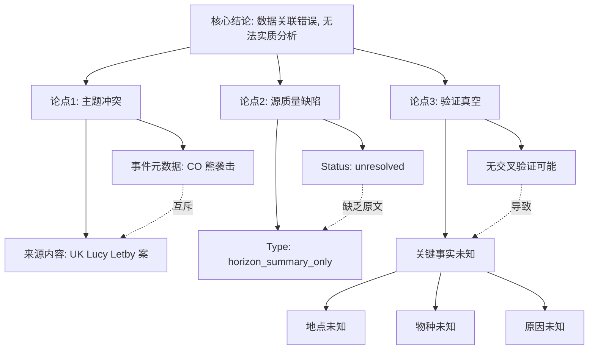

## Event ID

EVT-20260916-000228

## Selected Skills

- 总结文章.md
- 金字塔原理.md

## Event Analysis

### 1. 核心结论 (Conclusion First)

**EVT-20260916-000228（科罗拉多州熊袭击事件）目前处于“数据关联错误”状态，无法进行实质性事实分析。**

*   **关键判断**：事件元数据描述为“科罗拉多州熊袭击熟睡人员”，但唯一关联的来源文章（ARTICLE #278）内容为“英国露西·莱特比案法律调查”，两者主题完全不一致。
*   **行动指向**：必须重新检索并关联包含科罗拉多州熊袭击详细报道的正确源文章，在此之前，任何关于袭击地点、原因、伤亡情况的陈述均无事实依据。

### 2. 支持论点 (Supporting Arguments - MECE Grouping)

依据**金字塔原理**，将当前状态拆解为三个相互独立且完全穷尽的逻辑维度：

#### 维度一：元数据与来源的实质性冲突 (Thematic Conflict)
*   **事实 A (事件侧)**：EventUnit 第一层合并判断明确指向“Incidents of bears attacking sleeping people in Colorado”（科罗拉多州熊袭击熟睡人员事件）。
*   **事实 B (来源侧)**：ARTICLE #278 标题为 "Thirlwall inquiry leaves Lucy Letby conviction questions unanswered"，涉及英国法律体系与特定个人案件。
*   **逻辑推论**：来源 B 不包含任何关于“科罗拉多”、“熊”或“袭击”的数据点。二者在地理区域（US vs UK）、主体（Bear vs Legal Inquiry）和性质（Wildlife Incident vs Legal Case）上完全互斥。

#### 维度二：数据源的质量状态 (Source Integrity)
*   **状态标识**：ARTICLE #278 被标记为 `unresolved` 和 `horizon_summary_only`。
*   **内容缺失**：系统提示“当前没有找到可信的原始文章”且“Horizon 摘要不会被视为原文”。
*   **逻辑推论**：即使忽略主题不匹配，该来源本身也缺乏足够的原文实证支持进行详细的事实提取（如具体地点、受伤人数、物种识别）。

#### 维度三：信息验证的真空 (Verification Vacuum)
*   **交叉验证失败**：由于只有 1 个来源且该来源无效，无法进行多源交叉验证。
*   **未知项清单**：
    *   无法确定科罗拉多州内的具体袭击地点。
    *   无法确定涉及的熊的物种（黑熊/灰熊等）。
    *   无法确定袭击原因（食物吸引/栖息地丧失等）。
    *   无法确定官方野生动物管理部门的回应。

### 3. 详细摘要 (Detailed Summary - Based on 总结文章.md)

根据**总结文章**技能要求，对当前 EventUnit 的状态进行结构化摘要：

*   **标题**：EVT-20260916-000228 状态分析：科罗拉多熊袭击事件的数据完整性缺失
*   **作者**：748686 自生长知识系统 Event Analysis Engine
*   **标签**：`#数据异常` `#来源不匹配` `#科罗拉多` `#野生动物事件` `#事实核查`
*   **一句话总结**：由于唯一关联源文章主题错误且状态未解决，科罗拉多熊袭击事件（EVT-20260916-000228）目前无法生成有效的事实描述，需重新关联正确源数据。

**摘要正文：**

本 EventUnit 旨在记录 2026 年 9 月 16 日在科罗拉多州发生的熊袭击熟睡人员事件。然而，经过对关联来源 ARTICLE #278 的深度分析，发现存在严重的元数据关联错误。

1.  **来源内容错位**：ARTICLE #278 的内容完全聚焦于英国的“Thirlwall 调查”及“Lucy Letby 案”，与美国科罗拉多州的野生动物事件无任何交集。
2.  **证据链断裂**：由于源文章状态为 `unresolved` 且缺乏原文 URL，无法提取任何关于“熊”、“科罗拉多”或“袭击”的具体事实（如时间、地点、后果）。
3.  **分析局限**：在当前的数据配置下，所有关于袭击细节的假设均不被支持。例如，“熟睡人员”这一描述仅存在于事件合并元数据中，未在有效来源中得到证实。

**结论**：当前事件记录处于“待验证”状态。建议系统触发重新检索机制，寻找包含“Colorado bear attack”关键词的有效新闻源，以填补事实空白。

### 4. 逻辑结构图示 (Pyramid Structure Visualization)

### 5. 后续建议 (Next Steps)

1.  **数据清洗**：将 ARTICLE #278 从 EVT-20260916-000228 的关联列表中移除，标记为“无效关联”。
2.  **重新检索**：针对关键词 "Colorado", "bear", "attack", "2026-09" 执行新一轮新闻源爬取与匹配。
3.  **人工复核**：在自动检索无果时，引入人工标注流程以确认该事件是否真实发生及其基本轮廓。
