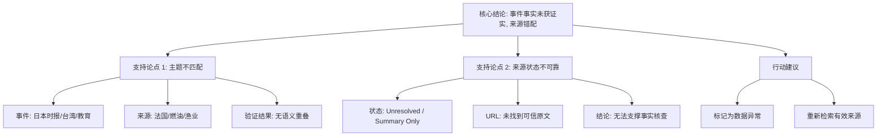

## Event ID

EVT-20260918-000298

## Selected Skills

- 总结文章.md
- 金字塔原理.md

## 事件分析

### 标题
Japan Times School Fair in Taiwan (日本时报在台湾举办的学校博览会)

### 作者/来源
Unknown (基于 Article #302 元数据缺失及内容不匹配)

### 标签
[教育, 新闻, 数据异常, 来源验证失败]

### 一句话总结
该事件声称《日本时报》在台湾首次举办学校博览会，但提供的唯一来源文章（Article #302）实为关于法国政府承诺稳定燃油价格以平息渔民愤怒的新闻，导致事件核心事实无法通过现有证据链验证，判定为数据来源错配。

### 摘要
本事件单元（EVT-20260918-000298）旨在分析《日本时报》在台湾举办的学校博览会。然而，综合验证环节发现严重的逻辑断裂：事件标题指向日本/台湾地区的教育领域活动，而唯一关联的原始来源（Article #302）内容为法国政府针对渔民抗议采取的燃油价格应对措施。由于来源文章与事件主题完全无关（Topic Mismatch），且来源状态标记为“未解决/仅摘要”，导致事件中的核心事实（如举办方、地点、性质、首次举办）均缺乏事实依据。本分析指出该事件记录存在数据摄取错误，无法基于现有材料生成可信的事实合成结论。

### 大纲

**1. 核心结论**
*   事件 **EVT-20260918-000298** 中的“日本时报台湾学校博览会”事实 **未获证实**。
*   主要原因为 **来源数据错配**：提供的来源文章与事件主题无语义重叠。
*   建议判定该事件为 **数据异常** 或 **孤立事实**，需重新检索有效来源。

**2. 支持论点：来源验证失败分析**
*   **论点 A：主题不匹配**
    *   **事件主题**：教育、学校博览会、日本时报、台湾。
    *   **来源主题**：法国、渔业、燃油价格、政府承诺。
    *   **验证结果**：完全不一致，无任何交集。
*   **论点 B：来源状态不可靠**
    *   **状态标记**：`source_status: unresolved`（未解决），`content_status: horizon_summary_only`（仅摘要）。
    *   **URL 缺失**：原始可信 URL 标记为“未找到”。
    *   **结论**：即使主题相关，现有来源也不足以支撑详细事实核查。

**3. 详细证据与事实拆解**
*   **3.1 事件声称的事实（基于第一层合并，未经证实）**
    *   主办方：The Japan Times。
    *   地点：台湾。
    *   活动类型：学校博览会（Showcase boarding and international schools）。
    *   频率：首次举办（First school fair）。
*   **3.2 来源文章实际内容（Article #302）**
    *   标题：*Pour calmer la colère des pêcheurs, le gouvernement prend des engagements sur les prix des carburants*（为平息渔民愤怒，政府就燃油价格做出承诺）。
    *   关键声明：法国政府承诺控制燃油价格。
    *   目标受众/对象：愤怒的渔民。
    *   状态：仅存在摘要，无全文支持。

**4. 冲突与差异**
*   **地理/政治实体冲突**：事件涉及日本/台湾，来源涉及法国。
*   **领域冲突**：事件属于教育/媒体领域，来源属于能源/农业/政治领域。
*   **性质冲突**：事件为商业/教育活动，来源为政府政策回应。

**5. 当前影响与不确定性**
*   **事件影响**：无法确定（因事件真实性存疑）。
*   **来源影响**：法国政府试图平息渔业抗议，但具体承诺条款及效果因缺乏全文而无法详述。
*   **系统影响**：748686 知识系统中该事件 ID 下的来源关联错误，可能导致后续知识图谱构建出现错误链接。

**6. 未知项（What Cannot Be Determined）**
*   该博览会是否实际发生？
*   博览会的具体日期、参与学校名单。
*   法国燃油承诺的具体条款。
*   Article #302 的原始可信来源链接。

## 金字塔结构图解

