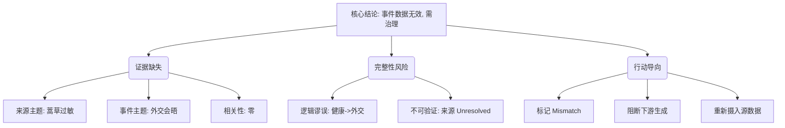

## Event ID

EVT-20260918-000407

## Selected Skills

- 总结文章.md
- 金字塔原理.md
- 四维价值模型.md

# Event Analysis: 外交会晤 (Data Integrity Failure)

## 1. 总结文章

### 标题
数据完整性异常报告：EventUnit `EVT-20260918-000407` 源材料与事件标题严重不符

### 作者
748686 自生长知识系统 Event Analysis Engine

### 标签
- 标签/数据异常
- 标签/元数据错误
- 标签/知识图谱治理
- 领域/外交（名义）
- 领域/健康（实际来源内容）

### 一句话总结
EventUnit 所挂载的唯一来源文章（关于蒿草过敏）与事件标题（外交会晤）完全无关，导致无法生成有效的事件事实，判定为数据摄入或匹配错误。

### 摘要与大纲
本分析针对 Event ID `EVT-20260918-000407` 进行审查。事件路由标识为“新闻”，初步判断为“特定政治人物间的外交接触”。然而，深入分析其唯一的来源材料（ARTICLE #439）后发现，该文章主题为《11版 - 让人过敏的蒿草来自哪、怎么治》，状态标记为 `horizon_summary_only` 且来源未解决（`unresolved`）。

由于缺乏任何支持“外交会晤”这一核心主题的事实数据、参与者信息或地理语境，本分析无法构建常规的事件叙事。因此，本报告的核心结论并非描述外交事件本身，而是诊断数据管道中的匹配错误。

**详细大纲：**
1.  **现象描述**：事件标题指向外交活动，但底层数据指向健康科普内容。
2.  **来源分析**：ARTICLE #439 仅包含摘要占位符，且明确标注与外交事件相关性为零。
3.  **冲突判定**：存在严重的元数据与内容不匹配（Mismatch），推测为摄入错误、自动标签生成错误或缺失正确源文件。
4.  **处理建议**：标记为“Insufficient Data”或“Source Mismatch”，阻断无效关联传播，并触发数据清洗流程。

## 2. 金字塔原理

### 核心结论（顶层）
**EventUnit `EVT-20260918-000407` 目前处于无效状态，因源数据与事件主题严重错位，不应生成事实性叙事，而应触发数据治理流程。**

### 支持论点（中层）

#### 1. 证据缺失与不相关
- **论点**：提供的唯一来源材料完全不包含事件所需的信息要素。
- **支撑证据（底层）**：
    - ARTICLE #439 的主题是“蒿草过敏”，属于健康/环境领域。
    - 事件标题是“外交会晤”，属于政治/国际关系领域。
    - 来源中没有任何关于参与者、时间、地点、议程或结果的记录。
    - 来源状态为 `horizon_summary_only`，缺乏完整原文支持。

#### 2. 数据完整性风险
- **论点**：当前的数据关联存在逻辑谬误，若不加处理将污染知识图谱。
- **支撑证据（底层）**：
    - 系统当前将“健康文章”错误地关联至“外交事件”。
    - 这种关联若被下游系统采纳，会导致错误的事实推断（例如：误认为某外交会议与蒿草过敏有关）。
    - 来源可信度标记为 `Unknown` / `not found`，无法进行交叉验证（Cross-Source Verification）。

#### 3. 明确的行动导向
- **论点**：必须执行特定的数据修复动作以恢复系统健康。
- **支撑证据（底层）**：
    - 标记 EventUnit 为 `Source Mismatch`。
    - 禁止基于此 EventUnit 生成任何外交相关的最终知识节点。
    - 重新检索或重新摄入真正对应“外交会晤”的新闻源。

### 逻辑结构图解

## 3. 四维价值模型

针对此 Event Analysis 报告本身的价值评估：

### 信息价值 (Information Value)
- **评估**：**高（针对数据工程师/系统维护者）**
- **内容**：提供了明确的数据故障诊断，指出了具体的不匹配字段（Event Title vs. Source Topic）和来源状态（Unresolved/Summary Only）。对于理解当前知识图谱中的“噪声”具有直接的技术参考价值。
- **用户感受**：“找到了数据错误的根本原因”、“明确了需要清洗的具体条目”。

### 情绪价值 (Emotional Value)
- **评估**：**中性偏负面（焦虑/警觉）**
- **内容**：揭示了一个隐蔽的系统错误（将无关的蒿草文章关联到外交事件）。这可能会让依赖该系统的用户产生不信任感或数据质量焦虑。
- **用户感受**：“还好发现了这个错误”、“系统数据质量需要警惕”。

### 趣味价值 (Fun Value)
- **评估**：**低**
- **内容**：报告采用严格的结构化技术分析风格，缺乏幽默或娱乐性叙事。唯一的“趣味”可能来自于这种荒谬的错位本身（蒿草 vs. 外交）引发的认知反差，但报告并未刻意强调这种反差以营造趣味。
- **用户感受**：无明显娱乐体验。

### 独特价值 (Unique Value)
- **评估**：**中**
- **内容**：体现了 748686 系统特有的“自生长”与“自校验”机制。通过应用 `金字塔原理` 对异常数据进行结构化拆解，以及通过 `四维价值模型` 反思报告本身的质量，展示了系统不仅在存储数据，还在元数据层面进行自我诊断。
- **用户感受**：“这个系统不仅在回答问题，还在自我检查数据健康度”、“结构化的异常处理方式很独特”。

---

### 最终操作指令

1.  **状态更新**：将 EventUnit `EVT-20260918-000407` 的状态从 `completed` 或 `active` 变更为 `flagged_data_integrity_error` 或 `insufficient_data`。
2.  **关联清理**：解除 ARTICLE #439 与 EVT-20260918-000407 的无效链接。
3.  **重新摄入**：若“外交会晤”为真实发生事件，需重新爬取或手动录入符合该事件主题的新闻源，并重新执行 Event Analysis 流程。
4.  **日志记录**：在系统日志中记录此次“主题-来源”不匹配事件，用于优化未来的自动路由算法，避免类似的健康类文章被错误路由至外交类事件。
