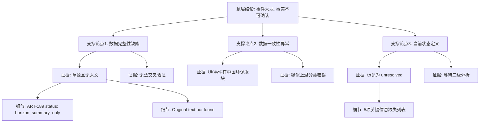

## Event ID

EVT-20260919-000171

## Selected Skills

- 总结文章.md
- 金字塔原理.md

## Event Analysis

### 1. 总结文章

**标题**：Reform UK Donor and Defamation Case (EVT-20260919-000171)

**作者**：Unknown (Source: ART-189, Original Text Unavailable)

**标签**：#英国政治 #ReformUK #法律诉讼 #政治捐款 #诽谤案件 #数据缺失 #未决事件

**一句话总结**：
该事件记录了一个涉及 Reform UK 的法律诉讼与政治捐款纠纷，但因唯一来源仅为缺失正文的摘要（Horizon Summary）且无法获取原文，导致具体案情、当事人及结果均无法核实，事件处于未决状态。

**总结文章内容并写成摘要**：
本事件单元（EVT-20260919-000171）识别出一项涉及英国政党 Reform UK 的法律及政治资金争议，核心议题包括捐款问题与诽谤指控。然而，当前数据基础极为薄弱：系统仅获取到一个来源（Article #189），且该来源被标记为 `horizon_summary_only`，明确注明“未找到可信原文”且“未从 Horizon 日报中找到完整正文”。因此，无法进行多源交叉验证。现有元数据中还存在一个显著矛盾：该英国法律事件被归类在中文环保主题版块（“绿水青山、冰天雪地都是金山银山”）下，这可能源于上游系统的分类错误或关联异常。由于缺乏原始报道文本，关于具体捐款违规细节、诽谤言论内容、法院判决结果以及涉及的具体个人姓名均不可知。目前该事件被标记为 `unresolved`，需待后续获取原文或完成二级分析后方可确认事实细节。

**文章大纲**：

1.  **事件判定**
    *   具体类别：法律与政治资金争议。
    *   核心主体：Reform UK。
    *   争议性质：涉及捐款事项与诽谤指控。

2.  **数据源状态评估**
    *   来源数量：仅 1 个来源（ART-189）。
    *   来源状态：`unresolved` / `horizon_summary_only`。
    *   内容缺失：原文明确缺失，URL 未知，无法验证具体细节。
    *   验证限制：因缺乏第二来源，无法进行交叉验证。

3.  **异常与矛盾记录**
    *   主题不匹配：UK 法律事件出现在中国环保主题（“绿水青山...”）版块下。
    *   推测原因：上游系统分类错误或标题关联错误。
    *   处理状态：记录差异，暂无法解决。

4.  **信息缺口**
    *   具体纠纷细节：未知。
    *   法律结果：未知（是否判决、和解或进行中）。
    *   涉事人员：未知。
    *   原文信息：未知。

5.  **当前结论**
    *   事件性质：未决（Unresolved）。
    *   后续动作：等待原文获取或“27 Skills”二级分析完成。
    *   当前事实确认度：极低，仅有事件标题层面的识别。

---

### 2. 金字塔原理

**顶层结论（核心观点）**：
事件 EVT-20260919-000171 涉及 Reform UK 的法律与捐款纠纷，但因源数据严重缺失（无原文、单源且为摘要状态），当前**无法确认任何具体事实细节**，事件维持“未决”状态，需依赖后续数据补充方可分析。

**支撑论点（中层逻辑）**：

1.  **数据完整性缺陷**
    *   *MECE 分组*：来源状态分析
    *   *逻辑关系*：归纳（多个状态标签共同指向数据缺失）
    *   *证据*：
        *   唯一来源 ART-189 标记为 `horizon_summary_only`。
        *   系统明确记录“Original text not found”（未找到原文）。
        *   无法执行交叉验证（Cross-Source Verification）。
        *   缺乏具体案情、当事人、法院结果等关键事实。

2.  **数据一致性异常**
    *   *MECE 分组*：分类逻辑检查
    *   *逻辑关系*：矛盾分析
    *   *证据*：
        *   事件内容为“英国政治法律纠纷”。
        *   所属版块标题为“中国环保经济口号”（绿水青山...）。
        *   *推论*：存在上游分类错误或元数据关联错误，但这不影响对数据缺失事实的判断，仅作为数据质量备注。

3.  **当前状态定义**
    *   *MECE 分组*：事件状态判定
    *   *逻辑关系*：演绎（如果数据缺失，则无法确认事实）
    *   *证据*：
        *   基于上述数据缺陷，所有具体事实（捐款违规细节、诽谤内容、判决结果）均处于“Unknown”状态。
        *   事件状态正式标记为 `unresolved`。
        *   后续依赖“27 Skills”二级分析或原文获取来解除未决状态。

**底层证据与细节（底层支撑）**：

*   **关于来源 ART-189 的具体元数据**：
    *   Source ID: ART-189
    *   Title Header: [01版 - 绿水青山、冰天雪地都是金山银山](#item-tech-news-189)
    *   Status Flags: `unresolved`, `horizon_summary_only`
    *   Missing Elements: URL, Full Body Text, Original Publication Date.
*   **关于无法确定的具体事项列表**：
    *   捐款违规的具体性质。
    *   诽谤指控的具体言论。
    *   原告/被告/相关捐赠人姓名。
    *   案件的法律程序阶段（起诉中/判决/和解）。
*   **关于“主题不匹配”的细节**：
    *   该异常仅记录在案，未尝试强行解释，因为缺乏原文来证明是否真的是分类错误还是内容混淆。

**逻辑结构可视化**：

**应用技巧说明**：
*   **结论先行**：在顶层直接指出“无法确认事实”和“未决”的核心状态，避免读者在详细的数据缺失描述中迷失重点。
*   **自上而下**：从宏观的事件状态，深入到具体的数据来源标签，最后到具体的缺失字段。
*   **MECE 分组**：将数据问题分为“完整性”（缺东西）和“一致性”（东西放错位置）两个独立且穷尽的维度，确保分析结构清晰。
*   **逻辑关系**：使用演绎逻辑（如果缺原文，则无法确认事实）来连接底层证据与顶层结论，确保逻辑严密。
