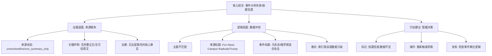

## Event ID

EVT-20260919-000180

## Selected Skills

- 总结文章.md

- 金字塔原理.md

---

# 事件深度分析：马克龙下令制定计划反击俄罗斯混合攻击

## 1. 核心结论（顶层）

**当前事件分析无法成立，置信度极低。**

虽然事件标题指向法国总统马克龙下达的具体军事/安全指令，但唯一支撑该标题的来源（ARTICLE #215）处于**内容缺失状态**（`horizon_summary_only`），且来源元数据与事件主题存在严重不匹配。基于现有材料，**任何关于事件具体细节、真实性及影响的陈述均为未证实的推测**。

## 2. 摘要与大纲

### 文章/事件标题
马克龙下令制定计划反击俄罗斯混合攻击

### 作者
未知（来源标记为 Fox News，但正文缺失）

### 标签
#地缘政治 #法国安全政策 #俄罗斯混合战争 #马克龙 #数据质量警告 #信息不足

### 一句话总结
由于唯一来源缺乏实质内容且主题存疑，本事件目前无法进行有效的事实提取与分析，仅能作为低置信度的待核实假设存在。

### 详细内容摘要

#### 一、 来源证据链断裂分析
**1. 来源状态异常**
*   **来源编号**：ARTICLE #215
*   **来源媒体**：Fox News
*   **当前状态**：`unresolved` / `horizon_summary_only`
*   **关键声明**：系统明确记录“Horizon 日报中未提供该条目的完整正文”以及“当前没有找到可信的原始文章”。

**2. 内容缺失导致的后果**
*   根据规则11和12，由于来源内容仅为占位符，无法提取马克龙的具体指令内容、俄罗斯混合攻击的具体性质（网络、经济或军事）、反击计划的具体措施或相关时间线。
*   无法验证“混合攻击”的定义或背景。

#### 二、 数据相关性与逻辑冲突
**1. 主题不匹配（高疑点）**
*   **事件标题**：马克龙/法国/俄罗斯混合攻击
*   **来源实际标题**："Fox News Campus Radicals Newsletter: Trump bashing, chilled speech and a major saga renewed"
*   **冲突分析**：来源标题涉及美国政治（特朗普、校园激进派），与事件核心主题（法俄安全关系）无逻辑关联。这表明存在以下两种可能之一：
    *   **索引错误**：事件聚合引擎错误地将无关新闻项关联到了此事件ID。
    *   **数据污染**：该事件ID下挂载了错误的源数据。

**2. 内部一致性崩溃**
*   事件声称发生了一个具体的国家安全行动，但支撑材料却显示“没有可信原文”。这构成了**证据链断裂**，违反了信息合成的基本前提。

#### 三、 验证与影响评估
**1. 多源验证结果**
*   **状态**：不适用
*   **原因**：仅提供单一来源，且该来源本身无效。无法进行跨来源交叉验证。

**2. 潜在影响评估（未知）**
*   由于缺乏事实基础，无法评估该事件对法俄关系、欧洲安全局势或全球地缘政治的实际影响。
*   若该事件属实，其影响可能涉及北约战略调整或欧盟防务自主化进程，但目前仅为假设。

#### 四、 无法确定的事项
1.  **事件真实性**：马克龙是否真的下令？俄罗斯是否真的进行了“混合攻击”？
2.  **行动细节**：反击计划包含哪些具体措施？涉及哪些机构？
3.  **来源可靠性**：原始报道是否存在？是否被错误归类？
4.  **日期背景**：2026-09-19这一日期的具体语境为何？

## 3. 金字塔结构可视化

## 4. 详细大纲与要点列举

### 第一层级：核心结论
*   事件无法完成有效合成。
*   所有细节视为未证实的推测。

### 第二层级：关键支持论点
1.  **证据缺失**：唯一来源无正文。
2.  **逻辑冲突**：来源主题与事件主题不符。
3.  **验证失败**：无法进行多源或内部验证。
4.  **行动建议**：标记为低置信度，需重新采集数据。

### 第三层级：具体证据与细节
*   **来源详情**：
    *   ID: ARTICLE #215
    *   媒体: Fox News
    *   状态: 未解决
    *   备注: 仅为元数据，无实质内容。
*   **冲突详情**：
    *   来源提及: "Trump bashing, chilled speech"
    *   事件涉及: 法国总统、俄罗斯混合战争
    *   关联性: 无
*   **规则引用**：
    *   规则11/12: 来源状态为`unresolved`不得视为事实。
    *   规则10/14: 事件标题不能作为确认事实。
    *   规则15: 不引入额外背景，仅陈述材料缺失。

## 5. 引用来源列表

*   **ARTICLE #215**:
    *   **来源媒体**: Fox News
    *   **原始URL**: 未提供 / 未找到
    *   **状态**: `unresolved` / `horizon_summary_only`
    *   **备注**: 该条目仅包含元数据和对内容缺失的说明，不包含可分析的正文信息。标题内容涉及美国政治话题，与事件主题严重不符。

## 6. 最终判定

**建议行动**：
1.  将此事件标记为 **“数据不足” (Insufficient Data)**。
2.  **禁止**将此事件纳入任何基于事实的决策模型或风险评估。
3.  触发**重新抓取机制**，寻找关于“马克龙反击俄罗斯混合攻击”的独立、完整、可追溯的原始新闻源。
4.  审查事件聚合算法，排查 ARTICLE #215 是否被错误关联。

**结论**：在获得至少一个状态为 `resolved` 且内容完整的来源之前，本事件分析终止。
