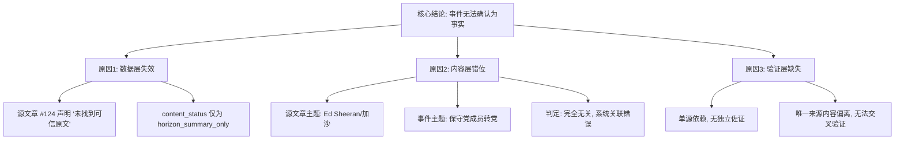

## Event ID

EVT-20260921-000117

## Selected Skills

- 总结文章.md
- 金字塔原理.md

---

# 英国年轻保守党成员转向自由民主党

**事件日期**：2026年9月21日  
**事件类型**：政治党派转换（未证实）  
**核心状态**：**证据不足且源数据严重错位**

---

## 一、一句话总结

系统识别出“英国年轻保守党成员转向自由民主党”的政治事件主张，但唯一关联的源文章实际内容为关于歌手 Ed Sheeran 评论加沙局势，存在严重的内容不匹配和数据缺失，导致该事件当前无法确认为事实。

---

## 二、核心结论（结论先行）

**结论：当前无法确认“英国年轻保守党成员转向自由民主党”这一事件为已知事实。**

**支持理由（三层结构）**：
1. **数据层失效**：唯一关联的源文章（Article #124）明确声明“未找到可信原文”，仅包含 Horizon 摘要，不构成有效证据。
2. **内容层错位**：源文章主题（Ed Sheeran/加沙局势）与事件标题（保守党成员转党）完全无关，存在系统关联错误。
3. **验证层缺失**：无任何独立来源交叉印证，无法排除数据录入或合并逻辑错误的可能性。

---

## 三、事件大纲与详细分析

### 1. 事件主张与系统分类
- **系统识别**：第一层 Global Merge 引擎将本条目归类为“单独报道英国政治人物党派转换事件”。
- **事件标题**：英国年轻保守党成员转向自由民主党。
- **预期内容**：关于英国政界人士从保守党转入自由民主党的政治动态报道。

### 2. 源文章内容核实
- **实际源文章**：Article #124
- **实际标题**：*Ed Sheeran calls Gaza situation 'unjustifiable' after tour controversy*
- **实际内容**：关于歌手 Ed Sheeran 在巡演争议后对加沙局势发表评论。
- **关联性判定**：**无**。音乐明星的中东局势评论与英国保守党成员党派转换毫无逻辑或事实关联。

### 3. 源文章可信度评估
根据源文章元数据，存在以下关键缺陷：
| 检查项 | 状态 | 说明 |
| :--- | :--- | :--- |
| `source_status` | unresolved | 状态未解决，未被系统认可为有效源 |
| `content_status` | horizon_summary_only | 仅有摘要，无完整正文 |
| 原文URL | 未找到 | 系统声明“Original URL: 未从 Horizon 日报中找到” |
| 可信度声明 | 否定 | 明确声明“Horizon 摘要不会被视为原文”及“没有找到可信的原始文章” |

**结论**：该源文章本身即被标记为不可信，更遑论其与事件主题的不相关性。

### 4. 交叉来源验证
- **验证结果**：**无法验证**。
- **原因分析**：
    - 单源依赖：仅有一篇源文章被分配至该事件。
    - 独立性缺失：无第二篇独立来源佐证党派转换事件。
    - 主题偏离：唯一来源甚至未讨论英国政治，导致交叉验证基础不存在。

### 5. 信息差异与冲突分析
- **主要冲突**：内容不匹配冲突。
    - **系统预期**：英国政治人物党派转换。
    - **实际数据**：国际娱乐明星地缘政治评论。
    - **性质**：严重的数据关联错误，可能源于自动化合并流程中的标签误匹配。
- **次要冲突**：可信度冲突。
    - 系统试图基于一个被自己标记为“未解决”、“无原文”且“内容无关”的来源构建事件事实。

### 6. 未知事项列表
由于证据链断裂，以下关键信息目前无法确定：
1. **事件真实性**：该党派转换是否真实发生？
2. **人物身份**：涉及的“年轻保守党成员”具体是谁？
3. **转换细节**：转换发生的时间、地点、动机及政治后果？
4. **原文缺失影响**：即便 Article #124 内容相关，因原文缺失，Ed Sheeran 言论的完整语境也无法确认（此点进一步佐证了当前数据质量低下的问题）。

### 7. 影响与后续建议
- **当前影响**：无已确认的直接影响，事件条目处于“待调查”状态。
- **知识系统建议**：
    1. **标记处理**：将此事件标记为“证据不足”，暂不纳入已知事实库。
    2. **逻辑审查**：审查 Global Merge 引擎的关联逻辑，防止不相关源文章被错误绑定。
    3. **补充搜索**：如需确认该政治事件，需重新检索针对“英国年轻保守党成员”及“自由民主党”的可信原始报道。

---

## 四、来源映射

| 文章编号 | 标题 | 来源 | 状态 | 与事件关联度 |
| :--- | :--- | :--- | :--- | :--- |
| #124 | Ed Sheeran calls Gaza situation 'unjustifiable' after tour controversy | Unknown | unresolved / horizon_summary_only | **无关联** |

---

## 五、金字塔结构可视化

