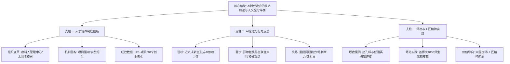

## Event ID

EVT-20260923-000419

## Selected Skills

- 总结文章.md
- 金字塔原理.md

---

## 最终事件分析

### 标题
人民日报教育版：AI时代的人才培养改革、学术伦理反思与师德建设

### 作者
《人民日报》第14版教育组（核心作者包括邓剑洋、丁雅诵等）

### 标签
人工智能教育、人才培养模式、师德师风、职业教育、学术伦理、北京中关村学院

### 一句话总结
《人民日报》2026年9月23日教育版通过五篇文章，构建了从“顶尖AI人才培养改革”到“学生AI使用伦理反思”再到“师德师风与工匠精神传承”的完整教育叙事，展现了中国教育在AI时代追求技术创新与人文价值平衡的政策导向。

### 内容摘要

2026年9月23日，《人民日报》第14版教育版面围绕“AI时代的教育变革”这一核心主题，通过深聚焦、教育时评、师说、在一线四种文体，系统呈现了中国在教育现代化进程中的多重探索。

**宏观层面**，以北京中关村学院为样本，报道了教育部与北京市共建的“教育-科技-人才”一体化发展试验田。该院打破传统培养模式，实行项目驱动与产学研融合，成立两年已孵化40个创业项目，体现了国家层面对AI领军人才的战略布局。

**中观层面**，版面关注“AI原生一代”的学习行为异化问题。复旦大学的调研显示近八成新生已形成AI使用习惯，教育界领袖（北大高松、西湖大学施一公、复旦金力）及国际学术界（25位菲尔兹奖得主）发出警示：需防止学生陷入“遇事不决问AI”的依赖困境，强调独立判断力与好奇心不可替代。

**微观层面**，通过职业教育与师范教育的生动案例，重申了人的主体性价值。江苏航运职业技术学院教师赵孔标以焊接技艺诠释工匠精神，首都师范大学师生通过暑期社会实践践行“大国良师”使命，共同构成了AI时代师德建设与价值坚守的底色。

该版面反映了当前中国教育政策的核心张力与平衡智慧：一方面积极拥抱技术，通过制度创新加速人才培养；另一方面坚守人文底线，警惕技术依赖带来的认知退化与价值虚无。

### 详细大纲

**一、 核心结论：技术加速与人文坚守的辩证统一**
*   顶层设计：建立AI时代人才培养的新范式
*   风险预警：警惕工具理性对主体性的侵蚀
*   价值锚点：以师德与工匠精神夯实教育根基

**二、 第一支柱：人才培养模式的制度创新（基于文章#549）**
*   **1. 组织架构变革**
    *   成立“教科人管理中心”，统筹招生、培养与科研
    *   打造无围墙校园，实现学院与创业社区物理空间融合
    *   建立产学研创投一体化平台，设立AI创投基金与AI商学院
*   **2. 培养机制重构**
    *   推行“项目驱动”学习：学生优先选择科研项目，按需修读课程
    *   改革招生选拔：采用“AI实战赛”“黑客马拉松”，侧重考查提出问题与解决复杂问题的能力
    *   师资结构优化：产业背景导师占比约30%
*   **3. 实践成效数据**
    *   成立两年开展120余项有组织科研项目
    *   发布20多项重大科研进展
    *   孵化创业项目40个（半数为学生项目）
    *   典型人物案例：张博雅（AI+医疗）、吕丁阳（AI+材料）、白丰硕（创业者）

**三、 第二支柱：AI使用行为的伦理反思（基于文章#550）**
*   **1. 现状调查：高频依赖成为常态**
    *   复旦大学2026级新生调研：几乎所有学生使用过AI，近八成形成习惯
    *   应用场景泛化：从润色、翻译扩展到文献综述生成乃至情感陪伴
*   **2. 专家警示：独立判断力的不可替代性**
    *   高校校长共识：AI无法替代人类的好奇心、独立判断和价值构建（引用高松、施一公、金力观点）
    *   哲学层面的回归：施一公引用“君子不器”，强调人不应沦为工具
*   **3. 学术共同体警告：基础研究的“错位”风险**
    *   25位菲尔兹奖得主联合声明：AI快速解题可能导致发展目标与研究目标错位
    *   潜在后果：压缩成果验证与学术交流时间
*   **4. 应对策略：重构学习逻辑**
    *   从“知识存储”转向“逻辑体系搭建”与“思辨能力训练”
    *   警惕信息茧房与算法舒适区
    *   提出“AI时代三件事”：提好问题、练判断力、敢担责

**四、 第三支柱：师德师风与工匠精神的当代实践（基于文章#551、#552）**
*   **1. 职业教育：工匠精神的技艺传承**
    *   典型案例：赵孔标（焊工出身教师）带领学生攻克低温高强钢焊接难题
    *   社会价值：近5年职业教育提供70%以上新增高素质技能人才
    *   精神内核：从“学技术”到“传技艺”的身份跃迁，强调专注与卓越
*   **2. 师范教育：立德树人的一体化实践**
    *   规模与范围：首都师范大学4000余名师生暑期社会实践
    *   实践形式：“艺启黔行”美育帮扶（贵州毕节）、红色研学（山西石楼、新疆喀什）
    *   核心理念：将思政育人融入社会实践，培养心系国家大局的“大国良师”
    *   时代背景：纪念中国工农红军长征胜利90周年

**五、 结论与展望**
*   政策示范效应：北京中关村学院模式可能为全国教育改革提供借鉴
*   社会共识构建：通过媒体叙事强化“职教前途广阔”与“师德重要”的社会认知
*   长期挑战：如何在AI技术加速迭代中，持续保持对学术规范与人文精神的坚守，仍需实证数据与长期追踪研究支持。

### 信息来源
1.  **《给青年学子种下敢闯敢为的种子》（深聚焦）** - 详细报道北京中关村学院的体制改革与人才培养成果，包含具体数据与人物案例。
2.  **《别被“遇事不决问AI”困住》（教育时评）** - 阐述高校学生对AI的使用现状，引用多位校长及菲尔兹奖得主的观点进行伦理反思。
3.  **《焊花落处，皆是星光》（师说）** - 以第一人称叙述职业教育教师的工匠精神传承故事。
4.  **《在实践中淬炼师者初心》（在一线）** - 报道首都师范大学暑期社会实践的具体活动与育人理念。
5.  **《本版责编：丁雅诵》** - 版面编辑信息，无实质新闻内容。

---

### 金字塔结构图示

