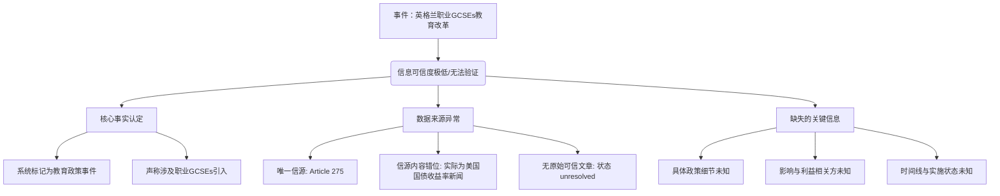

## Event ID

EVT-20260924-000209

## Selected Skills

- 总结文章.md
- 金字塔原理.md

---

# 英格兰职业GCSEs教育改革事件分析

## 标题
英格兰教育体系改革：引入职业GCSEs课程

## 作者
事件自动分析系统（基于Article 275元数据）

## 标签
教育政策、英国教育、GCSEs、职业教育、课程改革

## 一句话总结这篇文文章
2026年9月24日，英格兰启动教育体系改革，拟向中小学生提供职业导向的GCSEs课程选项，但该政策的原始可信信源尚未核实，且存在严重的元数据与内容错位问题。

## 总结文章内容并写成摘要
本事件报告涉及英格兰（England）近期的一项教育政策变动。系统在第一层全局合并推理中，将Article 275归类为“英格兰教育体系改革”事件，核心内容为“向学生学习提供职业GCSEs”。然而，深入的多来源综合审查揭示了严重的数据一致性问题。

从**结论先行**的角度来看，虽然系统已标记此为一个 distinct education policy event（独立的教育政策事件），但**无法从现有提供的素材中验证任何关于职业GCSEs的具体事实细节**。因为被标记为Article 275的实际文本内容是关于“美国财政部收益率飙升”及“关税对市场的冲击”，与教育主题完全无关。此外，该文章的元数据明确指出“未找到可信的原始文章”，状态为“horizon_summary_only”（仅地平线日报摘要）。

因此，当前的摘要仅能反映系统的推理层级标签，而非经过交叉验证的事实。事件的真实影响、具体政策细节、利益相关方及实施时间表，均因原始信源的缺失或错误匹配而无法确定。

## 详细大纲

**I. 事件核心认定（顶层结论）**
*   **事件名称**：Vocational GCSEs in England（英格兰职业GCSEs）
*   **事件类型**：教育政策事件
*   **地域范围**：英格兰（England）
*   **初步判定**：教育体系改革（education system shake-up），涉及向 pupils（学生）提供 vocational GCSEs（职业GCSEs）

**II. 信息来源分析与事实核查（中层论点）**

*   **1. 来源单一性限制**
    *   仅引用了 Article 275 一个来源。
    *   由于缺乏多个独立信源，无法进行 Cross-Source Verification（跨源验证）。
    *   无法确认“职业教育改革”这一事实是否被多方独立证实。

*   **2. 关键信源内容错位（核心矛盾）**
    *   **系统推理层**：将 Article 275 识别为教育政策相关。
    *   **实际内容层**：Article 275 的实际文本标题为 "[US Treasury yields soar most since ‘liberation day’ tariffs shook markets]"（美国国债收益率飙升，创‘解放日’关税动摇市场以来最高纪录）。
    *   **结论**：内容与事件主题完全不匹配，存在数据关联错误或爬虫抓取错误。

*   **3. 信源可信度缺陷**
    *   **来源状态**：Unknown（未知）。
    *   **原始文章可用性**：标记为“未找到可信的原始文章”（当前没有找到可信的原始文章）。
    *   **内容状态**：unresolved / horizon_summary_only。
    *   **影响**：基于不可靠或错误匹配的信源，所有衍生信息均具有高风险。

**III. 已知信息详情（底层证据）**

*   **A. 事件背景**
    *   发生时间：2026-09-24
    *   事件性质：教育体系改革（shake-up）
    *   具体措施：Pupils being offered vocational GCSEs（为学生提供职业GCSEs）

*   **B. 无法确定的信息维度**
    *   **政策细节**：具体的课程设置、准入条件、实施时间表。
    *   **执行机构**：涉及的政府部门、学校或利益相关方。
    *   **实际影响**：对学生、学校经济或劳动力市场的潜在后果。
    *   **数据准确性**：无法判断是事件推理引擎识别了其他文章，还是Article 275的内容块发生了替换错误。

**IV. 结论与建议**

*   **当前状态**：事件已被系统识别并命名，但属于**未解决（Unresolved）**状态。
*   **最终结论**：基于提供的素材，**没有任何关于职业GCSEs政策的事实细节可以被验证或综合**。信息仅停留在系统推理层级的断言阶段，等待正确原始文章的检索与纠错。

## 金字塔原理结构图解

**逻辑关系说明：**
*   **演绎关系**：由于信源Article 275的内容与主题不符且无原始可信文本（前提），因此无法从该信源中提取有效事实（结论）。
*   **归纳关系**：从来源单一性、内容错位、可信度缺失三个独立角度，共同归纳出“当前事件信息不可验证”的结论。
