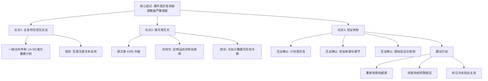

## Event ID

EVT-20260924-000560

## Selected Skills

- 总结文章.md
- 金字塔原理.md

---

## Event Analysis

### 标题
特朗普和平委员会加沙重建计划（源数据错配事件）

### 作者
748686 自生长知识系统 - Event Analysis Engine

### 标签
#地缘政治 #加沙重建 #特朗普和平委员会 #数据质量 #源文章错配 #未验证主张

### 一句话总结
尽管一级合并声称特朗普和平委员会公布了24.5亿美元加沙重建计划，但由于唯一关联的源文章为无关的体育新闻，导致该核心主张缺乏实证支持，事件真实性存疑。

### 文章摘要

本事件单元（EVT-20260924-000560）揭示了一个严重的**数据源与事件主题不匹配**的问题。虽然系统一级合并基于“特朗普和平委员会公布24.5亿美元加沙重建计划”这一主张进行了聚合，但经核查，提供的唯一源文章（ARTICLE #255）实际报道的是足球运动员埃里克森离开沃尔夫斯堡的体育消息。这种根本性的内容错位导致无法对事件主张进行多源印证，核心事实处于**高度不确定**状态。

### 详细大纲

**1. 核心结论（顶层）**
*   **事件状态**：高不确定性，核心主张未经源文章验证。
*   **关键发现**：源文章抓取或索引存在严重错误，导致政治/地缘事件与体育新闻错误关联。

**2. 主要论点与证据支撑（中层）**

*   **论点一：一级合并提出明确的主张，但缺乏实证支持**
    *   主张内容：特朗普和平委员会（Trump's Board of Peace）公布了一项价值24.5亿美元的计划以启动加沙重建。
    *   证据状态：该信息仅存在于系统内部的一级合并原因描述中，没有任何已获取的源文章文本予以证实。

*   **论点二：源文章与事件主题完全无关（内容错配）**
    *   源文章ID：ARTICLE #255。
    *   实际内容：足球运动员埃里克森（Eriksen）与沃尔夫斯堡俱乐部 mutual consent 解约。
    *   来源：news.google.com。
    *   状态：`source_status: fetched`, `content_status: partial`（Horizon日报未提供完整正文）。
    *   结论：该源文章无法用于验证加沙重建计划，二者无逻辑关联。

*   **论点三：跨源验证失败，无法确认具体细节**
    *   **金额真实性**：$2.45bn（24.5亿美元）无法通过独立新闻源核实。
    *   **机构角色**：“特朗普和平委员会”的具体职能及此次行动的背景无从查证。
    *   **实施细节**：计划的时间框架、参与方、资金构成等均为空白。

**3. 系统性风险与建议（底层/行动项）**

*   **潜在问题根因**：
    *   源文章抓取错误：关键词匹配逻辑异常，导致非相关结果被归类为同一事件。
    *   索引混乱：新闻聚合系统在将媒体流链接到事件ID时出现错位。
*   **后续行动建议**：
    1.  **重新检索**：针对“Trump Board of Peace Gaza reconstruction”重新搜索权威新闻源。
    2.  **系统排查**：审查源文章抓取引擎的逻辑，修复导致体育新闻误关联到地缘政治事件的Bug。
    3.  **数据标记**：在当前获得正确源文章前，将该事件的核心主张标记为“系统内声明（Unverified Internal Claim）”，而非已确证事实。

### 金字塔结构图示

