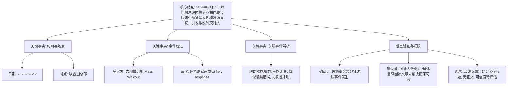

## Event ID

EVT-20260925-000089

## Selected Skills

- 总结文章.md

- 金字塔原理.md

---

## 事件分析：Netanyahu UN Speech Walkout

### 标题
以色列总理内塔尼亚胡在联合国演讲前遭遇大规模退场，引发外交风波

### 作者
748686 自生长知识系统 - Event Analysis Engine

### 标签
#国际政治 #外交冲突 #联合国 #以色列 #内塔尼亚胡 #新闻报道

### 一句话总结
2026年9月25日，以色列总理本雅明·内塔尼亚胡在联合国发表演讲前，遭遇代表们的大规模退场抗议，其随后以激烈的言辞予以回应，事件凸显了当时联合国外交环境的紧张局势。

### 内容摘要
2026年9月25日，在联合国举行的一场重要活动中，以色列总理本雅明·内塔尼亚胡（Benjamin Netanyahu）准备发表演讲时，现场发生了大规模的代表退场事件（Mass Walkout）。这一外交抗议行为激怒了内塔尼亚胡，导致其做出了“激烈”（fiery）的回应。

### 详细大纲

**一、 核心结论（顶层）**
*   **事件定性**：一起发生于联合国会场的外交抗议与对抗事件。
*   **核心事实**：2026年9月25日，内塔尼亚胡联大演讲前遭遇大规模退场，双方关系紧张。

**二、 关键事实要素（中层）**
*   **1. 时间与地点**
    *   时间：2026年9月25日。
    *   地点：联合国（United Nations）。
*   **2. 关键人物**
    *   本雅明·内塔尼亚胡（Benjamin Netanyahu）：以色列总理。
*   **3. 事件经过**
    *   **前奏**：在演讲开始前，发生大规模代表退场行为（Mass walkout）。
    *   **反应**：内塔尼亚胡对此表示强烈不满，进行了“激烈的回应”（fiery response）。
*   **4. 关联事件辨析**
    *   来源文章中提及的“伊朗双胞胎姐妹被判刑案”（ARTICLE #202）在主题上与内塔尼亚胡演讲退场事件无明显逻辑关联，疑似聚类错误或背景未明，目前无法确定两者是否存在因果联系。

**三、 信息验证与局限性（底层/证据层）**
*   **1. 已确认事实**
    *   跨集群链接（Cluster 1 与 Cluster 28/EVT-20260925-000136）相互印证，确认了“内塔尼亚胡联合国演讲”及“伴随抗议退场”这一事件主体的真实性。
*   **2. 信息缺失与未决项**
    *   **具体细节未知**：由于原始文章（ARTICLE #140 和 #202）状态为“未解决”且仅包含摘要占位符，无法获取退场人数、具体国籍、退出理由以及内塔尼亚胡回应的具体措辞。
    *   **来源相关性存疑**：关于伊朗案件的新闻被归入此事件簇，但缺乏文本支持以证明其关联性，需进一步调查。
    *   **数据空洞**：ARTICLE #140 标题提供了关键信息，但正文内容缺失，导致无法进行独立的全文明确性验证。
*   **3. 当前影响评估**
    *   该事件标志着联大会议期间外交气氛的显著升温，反映了围绕以色列及其领导人的强烈外交反对意见。

### 金字塔结构图解

### 信息来源
1.  **ARTICLE #140**: "[WATCH: Mass walkout before Netanyahu speech prompts fiery response from Israeli prime minister](#item-tech-news-140)" (状态：未解决，仅标题)
2.  **ARTICLE #202**: "[Family of Iranian twins sentenced to death and decades in jail ask UN for help](#item-tech-news-202)" (状态：未解决，主题疑似无关)
3.  **Cluster 28 (EVT-20260925-000136)**: 明确标识该事件为内塔尼亚胡联合国演讲事件。
