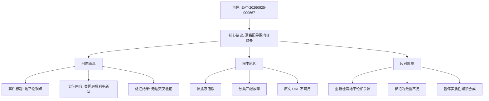

## Event ID

EVT-20260925-000667

## Selected Skills

- 总结文章.md
- 金字塔原理.md

## 标题：地平论观点事件信息缺失分析与源错配问题报告

## 作者：748686 自生长知识系统 Event Analysis Engine

## 标签：Event Analysis, 源数据质量, 地平论, 信息完整性, 错误分类

## 一句话总结

事件 EVT-20260925-000667 旨在讨论“地平论观点”，但由于源抓取错误，实际可用内容仅为美国房贷利率新闻，导致无法构建任何关于地平论的有效知识单元，揭示了数据流水线中的源-主题匹配故障。

## 总结文章内容

### 摘要

本事件（EVT-20260925-000667）的核心问题是**数据源与事件主题严重错位**。尽管事件路由将其标记为“新闻”并归类于“地球形状信念讨论”，但在实际的 Global Merge 和 AI 多来源综合阶段，系统仅获取到一篇关于“美国房贷利率突破7%”的财经新闻（Article #430）。由于缺乏真正关于地平论的源材料，且原文 URL 未找到，当前无法对地平论观点进行任何事实性陈述、交叉验证或影响分析。

### 大纲详细列举

1. **事件背景与现状**
    - **1.1 事件定义**：
        - 事件 ID：EVT-20260925-000667
        - 主题标签：地平论观点 / 地球形状信念讨论
        - 源数量：1 个源被检索并分配
    - **1.2 数据异常发现**：
        - 实际内容：Article #430 标题为《US mortgage rates breach 7% as affordability pressures mount》
        - 内容领域：美国房地产金融/宏观经济
        - 错位程度：与“地平论”无任何逻辑、语义或事实关联

2. **核心事实分析（基于现有材料）**
    - **2.1 主题内容缺失**：
        - 无地平论的支持证据、反对意见或历史背景资料
        - 无相关人物、组织或传播范围的数据
    - **2.2 源状态评估**：
        - 状态：Unresolved（未解决）
        - 内容状态：Horizon Summary Only（仅有摘要片段）
        - 原文可用性：不可用（原始 URL 未找到）
    - **2.3 归因分析**：
        - 潜在错误点：Router 分类错误或源抓取索引错乱
        - 系统性风险：此类错配会导致知识图谱中出现无意义的空壳节点

3. **验证与冲突检测**
    - **3.1 交叉源验证**：
        - 结果：无法执行
        - 原因：仅有一个源，且该源与主题无关，无法形成三角验证
    - **3.2 信息冲突识别**：
        - 显式冲突：无（因为没有关于地平论的陈述可供比较）
        - 隐含不一致：事件标题指向科学/伪科学议题，而内容指向金融市场，存在分类逻辑冲突

4. **影响与后果**
    - **4.1 知识单元完整性**：
        - 当前状态：无效/残缺
        - 无法产出关于地平论的观点总结、大纲或分析
    - **4.2 对系统可信度的影响**：
        - 若强行关联，将产生误导性知识
        - 必须标记为“源材料不足”，以维护数据严谨性

5. **未确定事项与建议**
    - **5.1 关键缺失信息**：
        - 地平论在当代社会的具体主张、代表人物及受众特征
        - 科学界与公众对此类信念的回应立场
    - **5.2 后续行动建议**：
        - **重新检索**：针对关键词“地平论”、“Flat Earth”、“地球形状信念”进行独立源抓取
        - **修复分类**：检查为何 Article #430 被错误关联至该事件 ID
        - **等待补充**：在当前阶段，仅记录“数据缺失”状态，不生成实质性结论

## 金字塔结构图解

**层级逻辑说明：**
- **顶端（核心结论）**：直接指出事件的核心问题——源与主题的错配导致了信息的完全缺失。
- **中间层（三大维度）**：
    - **问题表现**：描述具体的现象（标题与内容不符）。
    - **根本原因**：分析导致这一现象的技术或流程原因。
    - **应对策略**：提出解决当前困境的具体步骤。
- **底层（细节支撑）**：
    - 问题表现下的三个具体事实点（标题、内容、验证结果）。
    - 根本原因下的三个技术故障点（抓取、分类、可用性）。
    - 应对策略下的三个行动项（检索、标记、暂停）。

这一结构遵循了金字塔原理的**结论先行**和**MECE原则**（相互独立，完全穷尽），确保了对该异常事件的分析清晰、逻辑严密且覆盖全面。
