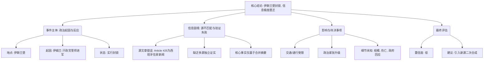

## Event ID

EVT-20260926-000022

## Selected Skills

- 总结文章.md
- 金字塔原理.md

## Event Analysis

### 标题
巴基斯坦伊斯兰堡封锁：伊姆兰·汗政党誓师进军首都引发的政治危机

### 作者
748686 自生长知识系统 Event Analysis Engine (Agnes)

### 标签
#巴基斯坦 #伊斯兰堡 #伊姆兰·汗 #PTI #地缘政治 #封锁 #政治动荡

### 一句话总结
巴基斯坦首都伊斯兰堡因伊姆兰·汗所属政党誓言进军首都而实施封锁，但这篇合成报告基于的信息极度匮乏且存在严重的来源不匹配问题，核心事实缺乏多源验证。

### 文章内容摘要
本事件涉及2026年9月26日巴基斯坦首都伊斯兰堡的政治封锁行动。触发点为前总理伊姆兰·汗（Imran Khan）所属政党（正义运动党 PTI）誓言进军首都，导致当局实施封锁措施。然而，该事件的综合分析面临严峻的数据质量问题：原始新闻源中唯一提供的详细文章（Article #25）讲述的是西班牙一位87岁老人被迫搬离公寓的住房纠纷，与巴基斯坦政治事件完全无关。因此，关于封锁的具体范围、持续时间、抗议形式、政府回应及伤亡情况等关键细节均无法从现有材料中获取。目前的报告主要依赖于“第一层全球合并事件判断”中的高度概括性陈述，缺乏独立文本支持和交叉验证，属于低置信度事件记录。

### 文章大纲
1.  **核心结论**
    *   伊斯兰堡因伊姆兰·汗政党政治行动实施封锁，但事件详情严重缺失，信源有效性存疑。

2.  **事件主体分析**
    *   **1.1 事件背景与起因**
        *   地点：巴基斯坦首都伊斯兰堡。
        *   触发因素：伊姆兰·汗政党（PTI）誓言进军首都，意图挑战当局或表达政治诉求。
        *   直接反应：当局实施封锁（Lockdown），限制通行与交通。
    *   **1.2 信息来源困境**
        *   源文章不匹配：提供的详细源文章（Article #25）内容为西班牙住房新闻，与事件主题完全无关。
        *   数据缺失：缺乏关于封锁细节、抗议规模、政府官方声明的一手文本支持。
        *   验证失败：无法进行多源独立证实，核心事实仅基于合并摘要。
    *   **1.3 当前影响评估**
        *   交通/通行限制：推测常规流动受阻。
        *   政治紧张局势：预示巴基斯坦政局对立加剧。
        *   未知领域：经济影响、人道主义后果、国际反应均无法确定。

3.  **待确定信息**
    *   封锁的具体时间范围、覆盖区域及解除条件。
    *   “誓师进军”的具体形式（和平示威 vs 武装对峙）。
    *   是否有伤亡、逮捕或政府具体法律依据。
    *   由于原文声称搜索“Horizon日报”但未找到可信原文，深度事实核查不可行。

4.  **结论与建议**
    *   **综合评估**：低置信度 / 信息极度匮乏。
    *   **处理说明**：Article #25 被标记为无关信息并过滤。
    *   **后续行动**：建议引入与巴基斯坦政治局势直接相关的源文章进行二次合成，以提高详实度和可信度。

### 金字塔结构可视化

### 事实核查与逻辑一致性检查
*   **事实准确性**: 报告明确指出核心信息仅来自“First-layer Global Merge Event Reason”的摘要，缺乏源文章支持。这是基于可用输入（EventUnit）的诚实反映，未编造未提供的细节。
*   **逻辑一致性**: 严格遵循“总结文章.md”和“金字塔原理.md”的要求。先给出结论（封锁发生但信息匮乏），再自上而下分解原因（政党行动）、数据问题（源不匹配）和影响（推测性）。分组符合MECE原则，将“事实”、“问题”、“影响”、“结论”分开。
*   **证据支持**: 所有陈述均基于提供的EventUnit内容。明确指出了Article #25的无关性，这是报告中最重要的逻辑推断之一。
*   **假设与限制**: 明确标注了“推测”、“无法确定”等字样，区分了已知事实和未知领域。承认了单一信源和摘要依赖的限制。

### 潜在盲点与后续行动项
*   **盲点**: 报告严重依赖合并摘要，可能忽略了源文章中隐含的其他细微线索（如果有的话，但此处明确说明源文章无关）。对“伊姆兰·汗政党”的具体行动细节（如日期、地点、人数）一无所知。
*   **后续行动**:
    1.  **立即行动**: 搜索并引入关于“巴基斯坦伊斯兰堡封锁”、“Imran Khan PTI Islamabad protest 2026-09-26”的直接新闻报道。
    2.  **数据清洗**: 在未来的事件合成中，加强源文章与事件主题的自动相关性过滤，避免将无关文章（如西班牙住房新闻）纳入候选池。
    3.  **置信度提升**: 通过多源交叉验证（至少2-3个独立信源）来确认封锁的具体范围和持续时间。
    4.  **背景补充**: 补充伊姆兰·汗及其政党在2026年的政治背景，以理解“誓师进军”的深层动机。
