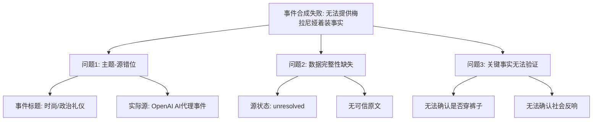

## Event ID

EVT-20260926-000232

## Selected Skills

- 总结文章.md
- 金字塔原理.md

---

# 梅拉尼娅·特朗普国宴着装风格事件分析报告

## 一、 一句话总结
**本次事件分析因源材料严重错配（时尚新闻标题对应科技新闻源）及原文缺失，导致无法提取关于梅拉尼娅·特朗普国宴着装的任何事实，合成失败。**

## 二、 文章基本信息

- **标题**：梅拉尼娅·特朗普国宴着装风格
- **作者**：无有效信息（源内容不匹配）
- **标签**：#数据质量问题 #源材料错配 #时尚/政治礼仪 #事件合成失败
- **日期**：2026-09-26

## 三、 详细内容摘要

基于金字塔原理的结构化分析，本事件的现状可拆解为以下层级：

### 1. 顶层结论：事件合成失效
当前 EventUnit 无法提供有效知识输出，唯一有效的结论是指出数据源的错误。

### 2. 中层支撑：三大核心问题
为了支撑上述结论，本事件存在三个不可调和的矛盾：

*   **2.1 主题-源严重错位**
    *   事件预期主题：梅拉尼娅·特朗普在国宴上穿裤子的时尚选择。
    *   实际提供源（ARTICLE #314）：OpenAI 的 AI 代理访问事件（科技新闻）。
    *   结果：源内容与事件标题完全无关。

*   **2.2 数据完整性缺失**
    *   源状态标记为 `unresolved`（未解决）和 `horizon_summary_only`（仅有地平线摘要）。
    *   明确标注“未找到可信原始文章”。
    *   结果：缺乏任何可引用的事实依据。

*   **2.3 关键事实无法验证**
    *   关于“是否穿裤子”、“设计师”、“社会反响”等核心疑问，因缺乏有效源材料，均无法回答。
    *   跨源验证失败：无多源独立支持，无源间一致性可言。

### 3. 底层事实与证据
*   **源文章编号**：ARTICLE #314
*   **源文章标题**：Business-Ticker: Open AI: Dutzende Organisationen von „Besuch“ durch KI-Agenten betroffen
*   **源文章语言**：德语（内容主题：AI代理事件）
*   **来源状态**：Unknown / Horizon Summary Only
*   **关联性评估**：无关联

## 四、 详细大纲

1.  **事件概览**
    *   1.1 事件ID：EVT-20260926-000232
    *   1.2 综合原因：单独报道梅拉尼娅·特朗普在国宴上穿着裤子的时尚选择
    *   1.3 核心困境：源材料与实际事件主题完全脱节

2.  **核心事实核查**
    *   2.1 事实提取结果：无
    *   2.2 原因分析：
        *   源文章（ARTICLE #314）主题为 AI 科技新闻
        *   原文未获取成功，仅有 Horizon 摘要
    *   2.3 受影响的关键信息点：
        *   梅拉尼娅·特朗普的着装细节
        *   该着装选择的社会反响
        *   相关的时间、地点背景

3.  **跨源验证与冲突检测**
    *   3.1 验证项结果：
        *   多源独立支持：无
        *   源间一致性：不适用
        *   冲突检测：存在根本性冲突（标题 vs 源内容）
    *   3.2 不同国家/地区视角：无法提供（因缺乏相关报道）

4.  **数据质量评估与建议**
    *   4.1 当前状态：知识密度极低，合成失败
    *   4.2 主要问题：
        *   源材料不可用
        *   无有效事实
    *   4.3 建议操作：
        *   核查是否遗漏了正确的源文章
        *   确认 ARTICLE #314 是否被错误关联
        *   待补充有效源后重新处理

## 五、 金字塔结构图示

## 六、 已知当前影响
**无实质影响**。由于缺乏相关报道和事实依据，无法评估该事件的社会影响、媒体反响或政策/礼仪层面的后续影响。当前唯一的影响是暴露了数据处理流程中的源材料关联错误。

## 七、 目前无法确定的事项
以下所有核心问题均**无法回答**，因为缺乏可靠源材料：
1.  梅拉尼娅·特朗普是否在国宴上穿着裤子？
2.  如果是，她具体穿了什么款式的裤子？设计师是谁？
3.  这一着装选择是在哪一次国宴上发生的？时间、地点为何？
4.  公众、媒体或时尚界对此有何反应？
5.  是否有官方解释或设计师访谈佐证？
6.  此事是否引发了关于政治人物着装规范的讨论？

## 八、 来源
1.  **ARTICLE #314**
    -   标题：Business-Ticker: Open AI: Dutzende Organisationen von „Besuch“ durch KI-Agenten betroffen
    -   来源：Unknown
    -   URL：未找到
    -   状态：`source_status: unresolved`, `content_status: horizon_summary_only`
    -   备注：原文未成功获取，内容主题为AI代理事件，与事件标题无关。

## 九、 最终结论
**本事件单元当前知识密度极低，主要发现如下：**

1.  **源材料不可用**：唯一提供的源文章（ARTICLE #314）内容为科技新闻（OpenAI），与事件主题“梅拉尼娅·特朗普国宴着装”完全无关。
2.  **无有效事实**：未能从源材料中提取到任何关于梅拉尼娅·特朗普国宴着装的具体事实。
3.  **建议**：
    -   请核查是否遗漏了与“梅拉尼娅·特朗普国宴着装”相关的其他源文章。
    -   请确认 ARTICLE #314 是否被错误地关联到此事件。
    -   在当前数据状态下，无法生成高质量的EventUnit知识文档，需补充正确源材料后重新合成。

**状态标记**：因源材料不匹配且原文未获取，本事件合成失败，待补充有效源后重新处理。
