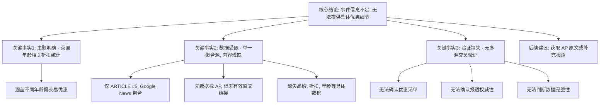

## Event ID

EVT-20260927-000222

## Selected Skills

- 总结文章.md
- 金字塔原理.md

## 标题：英国生日折扣与优惠统计事件分析

## 作者：Agnes (748686 自生长知识系统)

## 标签
#英国 #生日折扣 #消费者权益 #商业促销 #事件分析

## 一句话总结
该事件为针对英国市场的年龄相关折扣专题报道，但因仅存单一聚合源且内容残缺，目前无法获取具体的品牌、折扣力度及年龄门槛等实质性信息，处于“信息不足”状态。

## 总结文章内容

本事件（EVT-20260927-000222）聚焦于英国市场中与年龄相关的商业折扣和优惠统计。根据现有源材料分析，核心情况如下：

1.  **事件主题**：报道旨在梳理个人在不同年龄段（如18岁、60岁、65岁等）可享受的品牌折扣和交易优惠（Deals and discounts）。
2.  **数据来源局限**：当前唯一可用的源文章（ARTICLE #5）来自 Google News 聚合平台，原始信源标注为美联社（AP），但实际内容仅提供标题 *"Happy birthday! What deals and discounts does your age unlock?"* 和简短描述，缺乏完整正文。
3.  **信息缺失严重**：由于源文章内容状态为 "partial"，无法确认具体的优惠清单、适用品牌、折扣比例及年龄门槛。同时，因缺乏第二篇独立源文章进行交叉验证，无法判断信息的权威性和全面性。
4.  **结论**：该事件目前被判定为 **信息不足（Information Insufficient）**，无法提供实质性的统计事实或影响分析，建议后续补充 AP 原文或相关独立报道。

## 大纲

*   **一、 核心结论（顶层）**
    *   事件性质：英国市场年龄相关折扣专题报道。
    *   当前状态：信息不足，无法提供具体优惠细节。
    *   主要原因：单一聚合源，内容残缺，缺乏交叉验证。

*   **二、 关键事实与支持论据（中层）**
    *   **论据1：主题范围明确**
        *   涉及英国市场的生日折扣与优惠统计。
        *   涵盖不同年龄段可解锁的交易优惠。
    *   **论据2：数据来源单一且受限**
        *   仅收到1篇源文章（ARTICLE #5）。
        *   来源为 Google News 聚合，非直接原文访问。
        *   元数据标注 AP 信源，但无有效跳转链接。
    *   **论据3：内容完整性缺失**
        *   仅有标题和摘要描述。
        *   缺失具体品牌、折扣数值、年龄门槛等关键数据。
        *   无法进行多源事实交叉验证。

*   **三、 详细分析与影响（底层）**
    *   **信息冲突与断层**
        *   “引用源”（AP）与“可访问内容”（Google News 摘要）存在断层。
        *   原始 URL 指向聚合页面，非 AP 原文。
    *   **无法确定的事项**
        *   具体折扣清单（哪些品牌、多少折扣、什么年龄）。
        *   报道时效性与权威性（是否为 AP 独家首发）。
        *   数据完整性（是否涵盖英国所有主要优惠）。
        *   历史对比趋势（与往年数据对比）。
    *   **潜在影响**
        *   此类报道通常旨在帮助消费者了解年龄相关消费权益。
        *   可能引发对特定品牌生日优惠的关注和搜索，但当前影响范围未知。
    *   **后续建议**
        *   通过技能进一步获取 AP 原文。
        *   寻找补充报道以丰富事件内容。

## 金字塔结构图示

