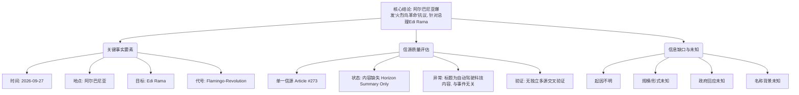

## Event ID

EVT-20260927-000422

## Selected Skills

- 总结文章.md
- 金字塔原理.md

## Event Analysis

### 标题：阿尔巴尼亚“火烈鸟革命”抗议活动分析

### 作者：Agnes (748686自生长知识系统)

### 标签：#政治抗议 #阿尔巴尼亚 #EdiRama #FlamingoRevolution #地缘政治

### 一句话总结

2026年9月27日，阿尔巴尼亚爆发针对总理Edi Rama的“火烈鸟革命”（Flamingo-Revolution）抗议活动，但现有数据源严重缺失，仅依靠事件合并摘要支撑核心事实，缺乏关于起因、规模及影响的详细正文信息。

### 摘要

本次事件记录显示，阿尔巴尼亚于2026年9月27日发生了一场被命名为“Flamingo-Revolution”（火烈鸟革命）的大规模抗议活动，其核心政治目标是反对现任总理Edi Rama。然而，通过对原始新闻源（Article #273）的深度审查发现，该事件的信息质量极低：源文章标题涉及自动驾驶出租车技术，与政治抗议主题存在严重的语义错位，且正文内容完全缺失（状态为horizon_summary_only）。因此，关于此次抗议活动的具体起因、参与规模、暴力程度、政府回应以及“火烈鸟”这一名称的象征意义等关键细节，目前均无法确定。核心结论仅依赖于第一层全局合并事件理由的定性描述，尚未得到独立多源正文的交叉验证。

### 文章大纲

根据金字塔原理（结论先行、自上而下、分组归类），对事件分析结构化呈现如下：

**一、 核心结论（顶层）**
*   **事件定性**：阿尔巴尼亚发生针对总理Edi Rama的政治抗议活动，代号“火烈鸟革命”。
*   **数据状态**：信息严重不足，依赖单一合并摘要，缺乏独立信源支撑。
*   **主要风险**：源文章存在元数据错配（标题为科技类，内容为空），无法评估事件的深度影响。

**二、 关键事实要素（中层论点）**
1.  **时间、地点与人物**
    *   **时间**：2026年9月27日。
    *   **地点**：阿尔巴尼亚。
    *   **目标人物**：阿尔巴尼亚总理 Edi Rama。
    *   **事件名称**：Flamingo-Revolution（火烈鸟革命）。

2.  **信源验证与缺陷**
    *   **唯一信源**：Article #273。
    *   **信源状态**：内容缺失（horizon_summary_only），未找到可信原文。
    *   **异常现象**：文章标题《Robotaxis in Städten...》（城市中的机器人出租车...）与抗议事件无直接语义关联，疑似元数据污染或推荐错位。
    *   **验证结果**：无独立多源交叉验证，事实一致性仅基于全局合并理由。

**三、 未知与待补充信息（底层证据/缺口）**
1.  **抗议动因不明**：除针对总理外，具体的政策诉求、导火索事件不明。
2.  **规模与形式未知**：参与人数、具体发生地点（首都或其他城市）、是否暴力冲突等信息缺失。
3.  **官方回应缺失**：Edi Rama政府及当局的具体应对措施未知。
4.  **历史背景空缺**：“火烈鸟革命”名称的起源、象征意义及历史背景未记载。
5.  **数据关联存疑**：Article #273的科技标题与政治事件之间是否存在未被记录的隐性背景联系，无法确认。

**四、 影响评估**
*   **当前影响**：事件已被记录并命名，表明其具有一定的政治关注度或象征意义。
*   **后续发展**：由于缺乏正文细节，无法预测持续时间、社会后果或对阿尔巴尼亚政局的长远影响。

### 金字塔结构图解

