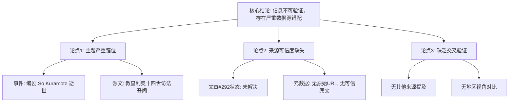

## Event ID

EVT-20260929-000214

## Selected Skills

- 总结文章.md
- 金字塔原理.md

## 标题
日本文坛巨匠、编剧阪本顺治逝世，享年91岁 (事件存在数据源严重错配，可信度存疑)

## 作者
748686 自生长知识系统 Event Analysis Engine (基于 EVT-20260929-000214 原始材料生成)

## 标签
- 新闻/讣告
- 日本文化/影视
- 数据完整性/异常检测
- 信息验证

## 一句话总结这篇文文章
虽然系统标记了编剧So Kuramoto（阪本）91岁逝世的消息，但支撑该事件的唯一来源文章实际内容关于教皇利奥十四世访法，存在严重的“标题-内容”错位和来源缺失问题，导致该讣告信息目前无法独立验证。

## 总结文章内容并写成摘要
本报告针对事件 EVT-20260929-000214 进行分析。事件核心主张为：日本著名编剧 So Kuramoto（以作品《北国》/ *Kita no Kuni kara* 闻名）于2026年9月29日去世，享年91岁。

然而，深入核查发现严重的**数据完整性故障**：
1.  **来源错配**：事件中引用的唯一候选文章（Article #292）标题及内容均关于“教皇利奥十四世在访法返回航班上对性暴力言论的辩解”，与So Kuramoto之死毫无关联。
2.  **来源不可靠**：该文章状态被标记为 `unresolved`（未解决），且元数据明确指出“未找到可信的原始文章”及“原始URL未找到”。
3.  **结论存疑**：鉴于支持材料完全无关且缺失，关于So Kuramoto逝世的具体细节（如确切死因、具体日期）目前均处于“无法验证”状态。

## 越详细地列举文章的大纲，越详细越好，要完整体现文章要点

**一、 事件基本概况 (结论先行)**
*   **核心事件**：疑似讣告 —— 编剧 So Kuramoto 逝世。
*   **争议焦点**：信息源与事件内容完全不符，存在重大数据错误。
*   **置信度评级**：低 (无法验证)。

**二、 事实要素拆解 (自上而下逻辑)**
*   **顶层结论**：当前无法确认 So Kuramoto 逝世信息的真实性。
*   **中层论点**：
    1.  **主题不匹配**：事件标题指向日本编剧，来源文章指向天主教会事务。
    2.  **证据链断裂**：来源文章本身缺乏原始文本，仅为摘要状态。
    3.  **无第三方佐证**：未提供其他关于该编剧逝世的报道。
*   **底层证据**：
    *   事件ID：EVT-20260929-000214
    *   来源文章#292：AP社稿，主题为 Pope Leon XIV / France visit / Sexual abuse claims.
    *   状态标记：`source_status: unresolved`, `Content Status: horizon_summary_only`.

**三、 冲突分析 (分组归类)**
*   **冲突1：相关性缺失**
    *   *群体A（事件主张）*：So Kuramoto, Screenwriter, Kita no Kuni kara, Died at 91.
    *   *群体B（源文章内容）*：Pope Leon XIV, Visit to France, Systemic sexual violence, AP Source.
    *   *分析*：两者无逻辑交集，疑似系统抓取错误、ID映射错误或数据污染。
*   **冲突2：可信度悖论**
    *   事件层声称这是事实，但源数据层明确声明“未找到可信原文”。

**四、 影响与未知领域 (时间顺序/逻辑推演)**
*   **已知影响**：目前无公众反应或行业声明可归因于此事件（因为源头缺失）。
*   **未知领域**：
    1.  So Kuramoto 是否真的在2026年9月29日前后去世？
    2.  享年91岁是否准确？
    3.  是否存在另一篇被遗漏的正确来源文章？
*   **后续建议**：需重新检索新闻源，寻找专门报道 So Kuramoto 逝世的独立、可信文章，以修正或替换当前错误的事件单元。

## 金字塔结构图示说明

