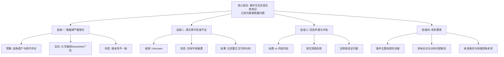

## Event ID

EVT-20260929-000103

## Selected Skills

- 总结文章.md
- 金字塔原理.md
- 四维价值模型.md

## Event Analysis

### 标题
战争遗产与和平主题评论事件：源数据严重错位与缺失分析

### 作者
748686 自生长知识系统 Event Analysis Engine

### 标签
#数据质量 #事件综合 #来源验证 #逻辑谬误检测 #知识工程

### 一句话总结
本事件单元因输入标题（战争遗产与和平）与唯一源文章（大学融资建议）存在根本性主题冲突，且源文章本身缺乏可信原文，导致无法生成实质性知识文档，仅能记录为数据质量问题。

### 总结文章内容

本次事件（EVT-20260929-000103）的处理过程揭示了数据流水线中的严重一致性错误。以下是基于金字塔原理结构化呈现的分析摘要：

**核心结论**：
事件无法完成实质性的第二层综合。系统判定输入数据无效，理由是标题与内容不匹配且源文章本身信息残缺。

**主要论点与证据**：

1.  **数据源严重错位（事实层面）**
    *   **论点**：事件标题预期的主题与实际源文章内容完全无关。
    *   **证据**：
        *   预期主题：“战争遗产与和平主题评论”（14版独立国际评论专栏）。
        *   实际内容：Article #179，标题为“Want advice on financing college? Sign up for the Paying for College 101 Newsletter.”（大学融资建议）。
    *   **结论**：两者无任何语义关联，无法提取关于战争或和平的任何事实。

2.  **源文章本身可信度不足（证据层面）**
    *   **论点**：即使忽略主题冲突，源文章也无法支撑任何高质量的深度分析。
    *   **证据**：
        *   来源标记为“Unknown”（未知）。
        *   内容状态为“horizon_summary_only”（仅地平线摘要），无完整正文。
        *   原始URL未找到可信原文。
        *   评级状态为“?/10”（未知/未评定）。

3.  **信息矛盾与冲突（逻辑层面）**
    *   **论点**：存在多层级的数据矛盾，阻碍了知识生成。
    *   **证据**：
        *   **第一层冲突**：元数据（事件标题）与载荷数据（源文章）矛盾。
        *   **第二层冲突**：源文章内部状态（待处理/原文缺失）与其作为知识来源的有效性矛盾。
        *   **第三层冲突**：无法确认“14版独立国际评论专栏”的具体媒体名称或作者，导致视角缺失。

4.  **无法确定的事项（未知层面）**
    *   **论点**：由于基础数据的缺陷，关键要素无法补全。
    *   **证据**：
        *   事件主题有效性未知（是否为录入错误？）。
        *   具体评论内容、论点、引用未知。
        *   来源身份及国家/地区视角未知。

### 金字塔结构图解

### 四维价值评估

*   **信息价值 (Information Value)**:
    *   **评估**: 低。
    *   **分析**: 本分析主要提供了关于“数据管道故障”的诊断信息，而非新闻事件本身的实质内容。它揭示了如何识别和报告数据不一致性，对于维护知识系统的完整性具有方法论价值，但未提供关于战争、和平或大学融资的新知。

*   **情绪价值 (Emotional Value)**:
    *   **评估**: 中性/低。
    *   **分析**: 作为系统自动生成的分析报告，旨在客观陈述事实，未刻意引发读者强烈的情感共鸣。但严谨的数据纠错过程可能对致力于知识准确性的工程师带来“秩序感”或“确定性”。

*   **趣味价值 (Fun Value)**:
    *   **评估**: 低。
    *   **分析**: 内容涉及数据匹配错误，叙事平淡，无娱乐性元素、生动比喻或有趣的转折。

*   **独特价值 (Unique Value)**:
    *   **评估**: 中。
    *   **分析**: 本分析体现了748686系统在“异常检测”方面的独特处理能力。能够识别出“标题与内容不符”这一特定错误模式，并结构化地呈现“无法确定”的事项清单，是系统自我诊断能力的体现，具有区别于普通新闻摘要的独特性。

### 详细大纲

1.  **事件背景与问题定性**
    *   事件ID与基本信息
    *   核心诊断：输入数据与目标主题严重不符
    *   最终判定：无法生成实质性知识文档

2.  **数据错位详细分析**
    *   预期内容：14版独立国际评论专栏（战争遗产与和平）
    *   实际内容：Article #179（大学融资通讯订阅广告）
    *   冲突性质：根本性主题不兼容

3.  **源文章可信度审查**
    *   来源状态：未知（Unknown）
    *   内容状态：仅地平线摘要，无完整正文
    *   可用性结论：无法支撑深度评论或事实核查

4.  **影响范围与限制因素**
    *   无跨源验证可能（单一且无效源）
    *   无地域/国家视角可提取
    *   无法评估对公众舆论的影响

5.  **待解决事项与建议**
    *   需核查原始数据源以确认事件标题是否为录入错误
    *   需获取与“战争遗产与和平”相关的实际文章以进行后续处理
    *   系统记录此不匹配作为数据质量警示
