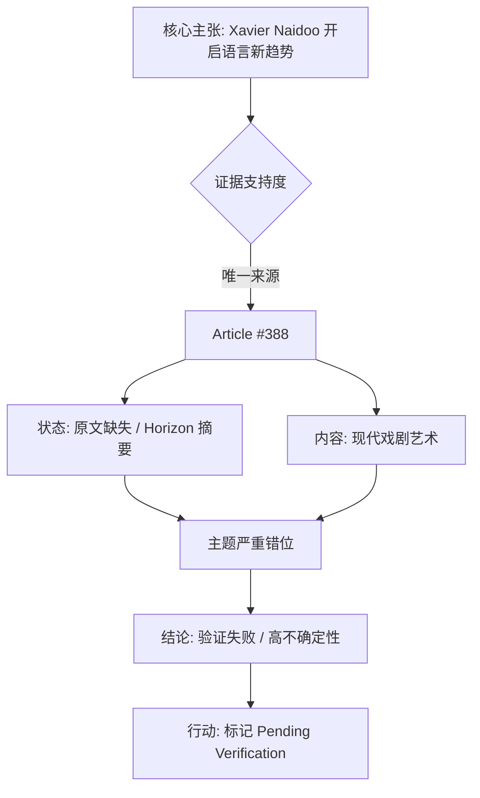

## Event ID

EVT-20260929-000276

## Selected Skills

- 总结文章.md

- 金字塔原理.md

---

## Event Analysis

### 标题
Xavier Naidoo 开启语言新趋势争议事件：源数据断裂与主题错位分析

### 作者
748686 自生长知识系统 Event Analysis Engine

### 标签
#事件分析 #数据验证 #XavierNaidoo #金字塔原理 #总结文章 #不确定性评估

### 一句话总结
由于单一且主题错位的源数据缺失原文，关于音乐家 Xavier Naidoo “开启新语言趋势”的事件目前处于高不确定性状态，无法确认其具体内容及真实性，需标记为待核实。

### 文章摘要

本事件分析报告针对 **EVT-20260929-000276** 进行深入评估。核心事实显示，系统接收到的合并理由声称德国著名歌手 **Xavier Naidoo** 被归功于开启了一种新的语言趋势（"Naidoo Language Quirk"）。然而，该事件存在严重的证据链断裂：唯一引用的源文章（Article #388）标题为德语“季节性事件：戏剧如今如何能引人入胜和令人惊叹！”，聚焦于**现代戏剧艺术**，与“语言趋势”或“Xavier Naidoo”无任何显性逻辑关联。此外，源文章状态为“未找到可信原文”且仅为 Horizon 摘要元数据，缺乏交叉验证来源。

基于此，本报告认为该事件当前不具备有效的事实支撑。主要风险在于数据抓取错误、元数据混淆或源文件关联失效。建议将该事件标记为 **Pending Verification（待进一步核实）**，暂停对其社会或文化影响的定性分析，直至获取能够验证“Naidoo 语言习惯”具体定义及其与源文章 #388 潜在联系的可信证据。

### 详细大纲

**一、 结论先行：事件核心定性**
*   **核心结论**：事件 EVT-20260929-000276 处于**高不确定性**状态，事实主张缺乏证据支撑。
*   **关键矛盾**：
    1.  **主张层面**：Xavier Naidoo 开启新语言趋势。
    2.  **证据层面**：唯一来源（Article #388）主题涉及“戏剧”，与主张完全脱节。
    3.  **数据层面**：原文缺失，仅存元数据，无法进行实质审查。

**二、 顶层架构：金字塔结构解析**
*   **塔尖（核心主张）**：
    *   Xavier Naidoo credited with starting new language trend.
    *   事件标签：Naidoo Language Quirk.
*   **中层（支撑论点与反向证据）**：
    *   **论点 A（正向主张）**：系统合并理由明确指向 Naidoo 的语言影响。
    *   **论点 B（反向证伪）**：
        *   源文章 #388 标题主题错位（戏剧 vs. 语言/音乐）。
        *   源状态为 `unresolved` 且原文不可达。
    *   **论点 C（验证失败）**：
        *   单一来源，无法跨源验证。
        *   无其他地域或语言视角的报道佐证。
*   **底层（事实细节与数据）**：
    *   **涉及人物**：Xavier Naidoo（德国流行/R&B 歌手）。
    *   **源数据详情**：
        *   Article #388：标题 *[Ereignis der Saison: So kann Theater heute mitreißen und erstaunen!]*。
        *   评分：?/10（未知）。
        *   来源状态：Unknown / Horizon summary only。
    *   **时间戳**：2026-09-29。

**三、 分组归类：问题诊断（MECE 原则）**
根据 **相互独立，完全穷尽（MECE）** 原则，将当前无法确定的事项分为以下三类：

1.  **内容定义类缺失**：
    *   “新语言趋势”的具体语言学定义、示例或表现形式未提供。
    *   Naidoo 的“语言习惯”（Quirk）具体指何种语言现象不明。
2.  **数据关联类错误**：
    *   源文章 #388（关于戏剧）与事件主体（关于 Naidoo 语言趋势）之间缺乏逻辑连接。
    *   疑似存在数据抓取错误、元数据标签错误或文章 ID 关联混乱。
3.  **真实性验证类空白**：
    *   缺乏第二个独立来源进行交叉验证。
    *   无法判断该主张是真实的公共事件还是孤立报道（甚至误报）。

**四、 逻辑关系明确：原因与后果推导**
*   **演绎逻辑（现状推导）**：
    *   大前提：若一个事件拥有可信、相关且可验证的源数据，则可判定其事实性。
    *   小前提：本事件（EVT-20260929-000276）的唯一源数据缺失原文且主题错位，不满足上述前提。
    *   结论：本事件目前无法被判定为已验证的事实，应视为待定状态。
*   **归纳逻辑（风险综合）**：
    *   从 Article #388 的元数据异常（标题不符、原文缺失）、无第二来源、主题断裂三个侧面，归纳出系统数据质量或关联逻辑存在隐患。
*   **时间顺序（处理建议流程）**：
    1.  **当前**：标记为 Pending Verification，停止传播未验证结论。
    2.  **后续**：尝试修复源文章 #388 的关联，或寻找关于 Xavier Naidoo 语言趋势的其他独立信源。
    3.  **最终**：若找到可信多源报道，则重新评估并更新事件结论；若确认数据错误，则修正或剔除事件。

**五、 应用技巧：可视化呈现**

**六、 常见陷阱与避免方法**
*   **陷阱：信息过载与噪声**
    *   *表现*：源文章标题提及“戏剧”，可能干扰对“语言趋势”的判断。
    *   *避免*：严格筛选与信息相关性，认识到该源文章在当前语境下属于噪声而非信号。
*   **陷阱：结论模糊**
    *   *表现*：合并理由称“credited with”（被归功于），暗示既定事实，但证据不足。
    *   *避免*：明确区分“媒体报道的主张”与“经核实的事实”。当前仅为前者，且来源可疑。
*   **陷阱：层级混乱**
    *   *表现*：将元数据层面的状态（`source_status: unresolved`）误读为有效信息。
    *   *避免*：在金字塔底层严格标注数据的有效性等级，此处应标注为“无效/待验证”，而非“已知事实”。

### 当前结论
基于金字塔原理的结构化分析与文章内容总结，**EVT-20260929-000276** 当前为**无效或待验证事件**。源数据与事件主题存在根本性冲突，且缺乏原文支撑。系统应立即挂起对该事件的进一步自动化扩展，等待人工或更高质量数据源的介入以澄清 Naidoo 与所谓“语言趋势”的真实关系。
