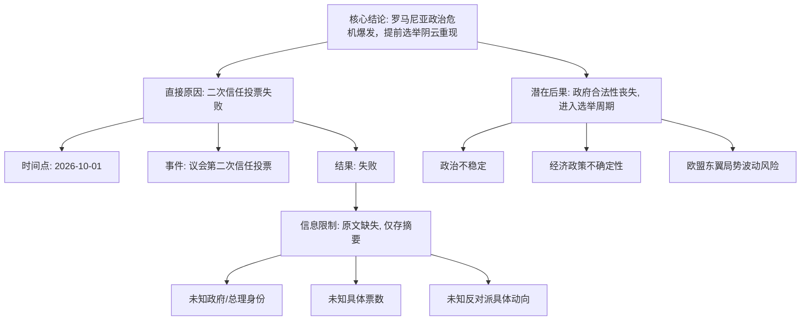

## Event ID

EVT-20261001-000213

## Selected Skills

- 总结文章.md
- 金字塔原理.md
- 四维价值模型.md

---

## Event Analysis

### 标题
罗马尼亚议会二次信任投票失败引发政治危机

### 作者
事件分析引擎（基于 Horizon 摘要及单篇源文整合）

### 标签
#罗马尼亚政治 #信任投票 #政治危机 #提前选举 #欧盟东翼 #议会民主

### 一句话总结
2026年10月1日，罗马尼亚议会针对政府发起的第二次信任投票失败，直接导致“提前选举”的政治阴云重现，国家陷入严重的宪政与执政危机。

### 内容摘要
本次事件的核心在于罗马尼亚政府未能获得议会的信任支持。这是继首次投票失败后的第二次尝试，然而结果依然以失败告终。这一结果不仅意味着当前政府的执政合法性受到根本性质疑，更引发了外界对罗马尼亚可能重启提前选举周期的强烈担忧。由于官方消息源（Article #305）的原始全文缺失，仅能依据摘要确认事件的基本事实：即政治僵局已形成，且危机等级较高。

### 详细大纲

**I. 核心结论（顶层）**
*   **事件定性**：罗马尼亚爆发政治危机，政府陷入执政瘫痪风险。
*   **关键后果**：提前选举的可能性显著上升，政治不确定性加剧。

**II. 关键论点一：投票结果确认（归纳逻辑）**
*   **时间锚点**：2026年10月1日。
*   **事件性质**：议会信任投票（Vote de confiance）。
*   **层级认定**：这是**第二次**信任投票。
*   **最终结果**：投票失败。
    *   *解读*：政府未能在议会获得足够支持票数，表明执政联盟或内阁在立法机构中缺乏稳固的多数派基础。

**III. 关键论点二：政治后果分析（演绎逻辑）**
*   **前提**：在罗马尼亚政治体制下，连续或多次信任投票失败通常触发宪法危机或迫使政府重组/辞职。
*   **现象**：媒体及政治观察家开始“agit le spectre”（煽动/唤醒提前选举的幽灵）。
*   **推论**：
    1.  政府可能被迫提交辞呈。
    2.  议会解散，启动提前选举程序。
    3.  国家进入不稳定的过渡期，政策制定可能停滞。

**IV. 信息局限与待验证细节（底层证据缺失）**
*   **缺失要素1**：具体涉及的政府名称及总理身份（摘要未提及）。
*   **缺失要素2**：具体的投票计票数据（赞成/反对/弃权票数），无法判断失败的分歧程度。
*   **缺失要素3**：主要反对党的立场及具体施压手段。
*   **缺失要素4**：宪法层面的具体后续流程（是否自动解散议会，或需总统裁决）。
*   **数据源状态**：原始信源（Article #305）为法语摘要，原文URL未找到，内容状态为`horizon_summary_only`，属于`unresolved`级别，缺乏一手原文验证。

### 金字塔结构图解

### 四维价值评估

**1. 信息价值（干货）**
*   **新增知识**：确认了罗马尼亚在2026年10月1日发生了具体的宪政危机事件——二次信任投票失败。这是一个明确的地缘政治节点信息。
*   **数据缺口**：缺乏具体的票数、政党名称和宪法条款引用，限制了信息的深度实用价值。对于关注罗马尼亚政治的研究者而言，这是一个需要进一步追踪的“信号”，而非完整的“数据”。

**2. 情绪价值（共鸣）**
*   **共鸣点**：对于关注民主制度稳定性或罗马尼亚国内局势的读者，此事件引发了对“政治动荡”和“不确定性”的焦虑感。“提前选举的幽灵”这一表述具有很强的画面感和危机感。
*   **情感基调**：紧张、担忧。

**3. 趣味价值（娱乐）**
*   **叙事性**：事件本身具有典型的政治剧张力——“失败-再尝试-再次失败-危机”，符合政治惊悚的叙事节奏。
*   **局限**：由于缺乏具体人物和细节，故事性较弱，更像是一则简报而非深度报道。

**4. 独特价值（签名）**
*   **稀缺性**：原文缺失是主要的“负向独特性”。在常规新闻流中，能够识别出“原文未找到但摘要已触发危机预警”这一状态本身，体现了知识系统对信息完整性的严格把控和透明度，这是系统层面的独特价值，而非内容本身的独特视角。

---

### 综合研判

本事件确认了罗马尼亚当局在2026年10月1日面临的重大政治挫折。二次信任投票的失败是一个强烈的政治信号，表明行政分支与立法分支之间的裂痕已难以通过常规议会程序弥合，国家极有可能走向提前选举。然而，受限于单一未解密的法语源文，当前分析仅停留在宏观层面。建议后续持续追踪罗马尼亚主要政党动态及总统府声明，以补全投票细节与政治博弈的具体图谱。
