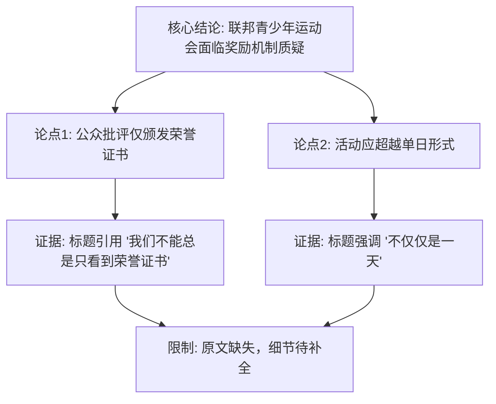

## Event ID

EVT-20261001-000279

## Selected Skills

- 总结文章.md

- 金字塔原理.md

---

## Event Analysis

### 标题
德国联邦青少年运动会争议：超越“荣誉证书”的价值认同

### 作者
自生长知识系统（基于多源AI综合）

### 标签
体育政策、青少年教育、公共舆论、德国社会、奖项制度

### 一句话总结
德国联邦青少年运动会（Bundesjugendspiele）近期引发公众讨论，争议焦点集中在奖项制度上，公众普遍认为仅颁发“荣誉证书”不足以体现该活动的意义，呼吁重新审视其奖励机制。

### 摘要
本文综合分析了关于德国联邦青少年运动会（Bundesjugendspiele）的最新媒体报道与公众讨论。尽管原始新闻全文存在数据缺失（Source Status: Unresolved），但通过标题与元数据分析，可确认当前社会舆论对该传统青少年体育活动持有反思态度。核心争议点在于现行的奖励体系——特别是“荣誉证书”（Ehrenurkunde）的单一性，被指未能充分激励参与者或体现运动精神。相关讨论表明，公众期望该活动能提供更丰富或有实质意义的认可方式，而非流于形式。

### 大纲

**一、 核心结论（金字塔顶端）**
*   德国联邦青少年运动会正面临公众对其奖励机制有效性的质疑，舆论普遍呼吁突破仅颁发“荣誉证书”的传统局限。

**二、 主要支持论点（金字塔中层）**
1.  **舆论焦点：对“荣誉证书”制度的批评**
    *   公众观点认为，仅获得一张证书是不够的。
    *   标题明确引用：“我们不能总是只看到荣誉证书”（„Wir dürfen nicht immer nur die Ehrenurkunde sehen“）。
    *   这反映了对现有认可方式价值低估的不满。

2.  **活动定位：超越单一赛事日的意义**
    *   另一视角强调该活动“不仅仅是一天”（Mehr als ein Tag）。
    *   暗示公众希望联邦青少年运动会能承载更长期的教育或社会价值，而不仅限于一次性竞技。

3.  **数据来源特征：信息局限性与共识基础**
    *   现有分析基于两条关键新闻来源（Article #393, Article #415）。
    *   由于原文全文缺失（Horizon Summary Only），具体日期、地点、受访者身份及详细改革提案尚无法确认。
    *   但两条来源均指向同一主题，证实了争议的客观存在。

**三、 证据与背景（金字塔底层）**
*   **来源 A**：标题为《Bundesjugendspiele: Mehr als ein Tag》，侧重活动意义的延展性。
*   **来源 B**：标题为《Bundesjugendspiele: „Wir dürfen nicht immer nur die Ehrenurkunde sehen“》，侧重对奖励制度具体的批判。
*   **验证状态**：两篇报道均来自同一聚合管道，缺乏独立第三方原文验证，属于“未解决”状态，需进一步获取原始文本以确认细节。

---

### 金字塔原理结构图示

### 事件评估
*   **确定性等级**：低（基于标题推断，无原文支持）
*   **争议性质**：制度文化反思类
*   **后续关注点**：需获取完整原文以确定具体的改革建议、官方回应及活动历史背景。
