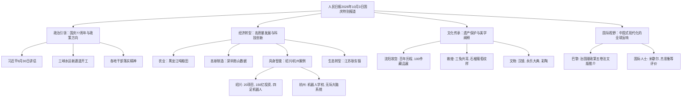

## Event ID

EVT-20261003-000308

## Selected Skills

- 总结文章.md

- 金字塔原理.md

- 四维价值模型.md

## 标题：人民日报2026年10月3日国庆特别报道综合事件分析

## 作者：748686 自生长知识系统 Event Analysis Engine

## 标签
#国庆77周年 #中国式现代化 #具身智能 #非物质文化遗产 #生态文明 #国际传播 #沈阳故宫 #敦煌美学

## 一句话总结
2026年10月3日，人民日报推出国庆特别报道，涵盖政治纪念、经济转型、科技创新、文化遗产保护及国际传播等多维度内容，集中展现新中国成立77周年以来的发展成就与未来方向。

## 文章内容摘要
该事件源自主导性新闻机构《人民日报》2026年10月3日（国庆节）的完整版面内容（01-08版），共涉及30篇原始文章。核心内容包括：庆祝新中国成立77周年、建党105周年及长征胜利90周年的政治纪念活动；“十五五”规划开局年的政策落实与经济高质量发展案例；江苏耿车镇从污染重镇到生态宜居示范镇的绿色转型经验；杭州、绍兴等地具身智能与机器人产业的最新进展；沈阳故宫博物院建院100周年及敦煌莫高窟纹样美学研究；以及《习近平谈治国理政》第五卷法文版在巴黎推介引发的国际社会对中国式现代化的积极反响。报道通过多领域、多层级的叙事结构，呈现了国家在政治、经济、文化、科技及外交层面的综合发展图景。

## 详细大纲

### 一、政治纪念与宏观政策导向（顶层结论）
1. **国庆77周年核心言论**
   - 9月30日习近平在庆祝建国77周年招待会上的致辞要点。
   - 强调对新中国成就的自豪及对中国式现代化前景的信心。
   - 回顾党领导人民77年的奋斗历程。
2. **重要时间节点纪念**
   - 2026年为建党105周年及红军长征胜利90周年。
   - 各地干部响应号召，践行讲话精神。
3. **“十五五”规划开局**
   - 三峡水运新通道在“十五五”开局之年正式动工（9月30日完成初始开挖爆破）。
   - 各地聚焦科技自立自强与民生改善。

### 二、经济发展与科技创新（关键论点层）
1. **农业与粮食安全**
   - 黑龙江七台河市宝清县种粮大户单庆东实现“吨粮田”种植（玉米13,000亩，大豆7,000亩）。
2. **高新技术产业**
   - **深圳南山区**：H1 2026高技术制造业和先进制造业占规上工业增加值比重分别达59.5%和54.9%。
   - **浙江绍兴上虞区**：引入20个具身智能产业项目，总投资超150亿元。卧龙电气、智鼎机器人等企业落地。四足机器人在润土新材料液氯车间应用，降低90%人员暴露风险。
   - **杭州“机器人学校”**：浙江大学机器人学院成立，首批30名“机器人学员”受训。系统“无际大脑”增加逻辑推理层。朱世强教授领衔。
   - **技能人才**：中国选手在第48届世界技能大赛中获得历史最佳成绩。
3. **绿色转型典型案例**
   - **江苏宿迁耿车镇**：
     - **过去**：2015年前后从事低端废旧塑料回收，年产值80亿元，从业近10万人，但造成严重水气污染，恶性肿瘤死亡率高于周边。
     - **整治**：2015年12月启动整改，66天内关闭行业。
     - **现在**：2025年空气质量优良天数302天（增加119天），PM2.5下降55.2%，劣V类水体消除。GDP超48亿元，人均可支配收入4.2万元。
     - **新产业**：转产家具电商、花卉苗木、塑料深加工等。刘圩村获评江苏省宜居宜业和美乡村。

### 三、文化遗产与美学价值（支持论点层）
1. **沈阳故宫博物院百年历程**
   - 1926年创立（东北第一座公立博物馆），2004年列入世界遗产，2017年获评国家一级博物馆。
   - 2026年举办“集古录奇——沈阳故宫博物院建院百年一百件藏品展”，部分流散文物回归。
   - **数据**：2025年接待游客585万人次，2026年上半年270万人次（同比增长21.2%），暑期增加夜场。
   - **学术成果**：出版《清朝前史》五卷本（257万字）、《沈阳故宫大辞典》等。
2. **敦煌莫高窟纹样美学**
   - **三兔共耳纹**：隋代第407窟，2025年第四届文明对话大会文化标识。
   - **石榴葡萄纹**：初唐第209窟，象征民族团结如石榴籽。
   - **四出花卉纹**：北凉第275窟至元代演变。
3. **其他文化遗产**
   - **铜雀三台**：河北临漳县VR体验及《邺都长歌》实景演出。
   - **琵琶亭**：九江长江国家文化公园，白居易《琵琶行》相关遗迹。
   - **文物颂华章**：
     - 长沙出土汉代“中国大宁 子孙益昌”铭文鎏金青铜镜（现藏国家博物馆）。
     - 《永乐大典》存世约400卷，中国国家图书馆藏224卷。
     - 彩陶花瓣纹、逨盘、丝路织锦等文物背后的华夏文明基因。

### 四、国际传播与中国式现代化话语（国际反响层）
1. **法国巴黎推介活动**
   - 《习近平谈治国理政》第五卷法文版发行及“中国式现代化”研讨会。
   - **邓励大使观点**：第五卷是读懂中国式现代化的关键钥匙。
   - **弗朗西斯·米歇尔（坦桑尼亚）**：著文指出中国现代化为全球南方提供宝贵启示（减贫8亿人、战略规划连续性、独立自主发展）。
   - **杰思衡（联合国驻华协调员）**：肯定中国五年规划能力，希望加强AI治理合作。
2. **多元国际参与者**
   - 法国丝路出版社社长索尼娅·布雷勒、法中友协秘书长林碧溪、前环境部长布里格·拉隆德等出席。

### 五、跨源验证与事实核查
- **习近平9月30日讲话**：来源 #435, #441 确认。
- **国庆77周年、建党105周年、长征胜利90周年**：来源 #435, #436, #441, #444 确认。
- **三峡水运新通道开工**：来源 #435, #441 确认。
- **世界技能大赛中国最佳成绩**：来源 #435, #441 确认。
- **沈阳故宫建院百年及参观数据**：来源 #449（单一来源，但细节详尽）。
- **耿车镇转型数据**：来源 #446, #447（单一来源，数据具体）。
- **具身智能产业投资数据**：来源 #437（单一来源）。

---
## 金字塔结构可视化

---
## 四维价值模型分析

### 1. 信息价值
- **新数据/新事实**：提供了2026年国庆期间具体的经济社会发展数据（如深圳南山高技术制造业占比、耿车镇GDP及收入、沈阳故宫游客量、绍兴具身智能投资额等）。
- **新视角**：通过“机器人学校”和“具身智能”产业布局，展示了中国在人工智能前沿领域的具体实践；通过耿车镇案例，提供了生态治理与经济转型并行的实证样本。
- **知识增量**：详细解读了敦煌莫高窟三种代表性纹样的历史渊源与当代政治隐喻，以及沈阳故宫百年文物回流与修复的技术细节。

### 2. 情绪价值
- **自豪感与认同感**：通过庆祝新中国成立77周年、建党105周年及长征胜利90周年，激发读者的国家认同感和历史自豪感。
- **激励与信心**：报道中提到“吨粮田”奇迹、世界技能大赛佳绩、三峡工程新进展等，传递出积极向上的奋斗精神和对未来的信心。
- **文化共鸣**：敦煌纹样、汉代青铜镜、《永乐大典》等内容唤起读者对中华传统文化的热爱与敬畏。

### 3. 趣味价值
- **生动叙事**：耿车镇从“脏乱差”到“绿水青山”的戏剧性转变故事，具有强烈的对比效果和可读性。
- **新奇体验**：介绍杭州“机器人学校”这一新颖概念，以及四足机器人在危险车间替代人工工作的场景，充满科技感与趣味性。
- **文化彩蛋**：敦煌“三兔共耳”纹样的几何美学及其在现代设计中的应用，增加了内容的趣味性和探索欲。

### 4. 独特价值
- **独家来源**：内容直接源自《人民日报》国庆特别报道，具有权威性和一手资料价值。
- **综合整合**：将30篇分散的文章（政治、经济、文化、国际）整合为一个连贯的事件分析，提供了单一文章无法覆盖的全景视角。
- **深度解析**：不仅罗列事实，还通过“金字塔原理”和“四维价值模型”进行结构化分析和价值评估，体现了深度加工后的知识附加值。
