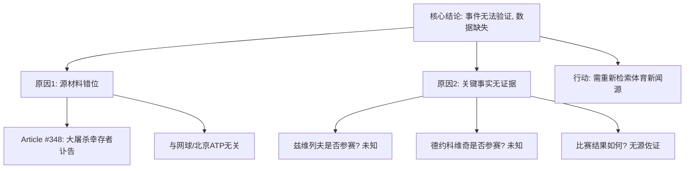

## Event ID

EVT-20261005-000259

## Selected Skills

- 总结文章.md
- 金字塔原理.md

---

## Event Analysis

### 标题：北京ATP网球赛结果分析（数据缺失与来源错位预警）

### 作者：748686自生长知识系统

### 标签
#体育 #网球 #ATP #数据完整性 #来源验证

### 一句话总结
该事件单元关于“兹维列夫在北京网球赛负于德约科维奇”的核心结论缺乏有效新闻源支持，唯一提供的来源文章与事件主题完全无关，无法形成可验证的事实记录。

### 摘要
本次事件分析针对北京ATP网球赛结果（Event ID: EVT-20261005-000259）进行深度审查。尽管事件路由标记为“新闻”且初步判断涉及兹维列夫与德约科维奇的比赛结果，但多源综合分析揭示了严重的**数据完整性危机**。唯一输入来源（Article #348）报道的是大屠杀幸存者Irene Butter的逝世消息，与网球赛事毫无关联。事件标题及第一层合并理由中的关键事实（兹维列夫负于德约科维奇）在可用文本中找不到任何佐证，属于无源断言。基于金字塔原理的结构化分析显示，该事件目前处于“核心结论缺失底层证据”的状态，无法完成事实性合成，需重新检索相关体育新闻源以验证赛事结果。

### 详细大纲

根据金字塔原理与总结文章的工作流程，以下是该事件单元的完整结构化分析：

#### 1. 顶层核心结论：数据不可用，事件无法闭环
*   **核心主张**：当前输入条件下，无法确认“兹维列夫在北京网球赛负于德约科维奇”这一事实。
*   **根本原因**：源文章内容与事件主题完全错位，导致关键事实缺乏证据支持。

#### 2. 中层逻辑分支一：事件背景与初步判断
*   **事件ID**：EVT-20261005-000259
*   **事件路由**：新闻
*   **第一层全球合并判断**：兹维列夫在北京网球赛负于德约科维奇。
*   **初始预期**：读者期望获取关于北京ATP网球赛具体比分、赛程或运动员表现的体育新闻。

#### 3. 中层逻辑分支二：源材料审查（根本性缺陷）
*   **唯一来源**：Article #348
*   **来源标题**：[Im Alter von 95 Jahren: Holocaust-Überlebende Irene Butter ist tot]（95岁大屠杀幸存者艾琳·巴特逝世）
*   **内容实质**：历史人物讣告，与体育、网球、北京ATP赛事无任何关联。
*   **来源状态**：
    *   `source_status: unresolved`（未解决）
    *   `content_status: horizon_summary_only`（仅有地平线摘要）
    *   原始URL未找到，可信度无法评估。
*   **结论**：存在**关键性数据缺失**，所有关于网球赛的断言均为无源信息。

#### 4. 中层逻辑分支三：信息差异与冲突分析
*   **核心冲突**：
    *   **事件元数据声称**：兹维列夫输给了德约科维奇。
    *   **实际源文本内容**：关于一位95岁老人的逝世消息。
*   **冲突性质**：不是观点分歧，而是**主题完全不匹配**（Category Error）。
*   **验证结果**：
    *   兹维列夫是否参赛？→ 无法确定
    *   德约科维奇是否参赛？→ 无法确定
    *   比赛结果如何？→ 无法确定
    *   赛事具体时间地点？→ 无法确定

#### 5. 底层支撑细节：待填补的信息空白
*   **缺失的关键事实**：
    1.  北京ATP网球赛的具体举办时间。
    2.  兹维列夫与德约科维奇的实际对战场次及比分。
    3.  相关赛事的官方报道或权威体育新闻媒体原文。
*   **当前不可判定项**：
    *   该事件合并理由是否基于外部数据而非本次输入的1篇文章？
    *   是否存在其他未被纳入本次批处理的正确新闻源？

#### 6. 行动建议与后续步骤
*   **立即行动**：标记此EventUnit为“数据不完整”，不纳入最终事实知识库。
*   **补充调研**：
    1.  检索北京ATP网球赛相关新闻源。
    2.  验证兹维列夫与德约科维奇的比赛记录。
    3.  寻找包含具体比分、赛况描述的权威体育报道。
*   **系统优化建议**：加强Router阶段的来源相关性过滤，确保新闻类Event Unit能匹配到对应的体育类文章。

---

### 结构图解（金字塔原理应用）

### 总结
本事件单元暴露了多源综合处理中的严重数据链断裂。虽然初步判断指向具体的体育赛事结果，但底层支撑材料完全失效。依据金字塔原理“结论先行、证据支撑”的原则，在缺乏有效证据的情况下，必须否定当前元数据中的事实断言，直到获取正确的新闻源为止。
