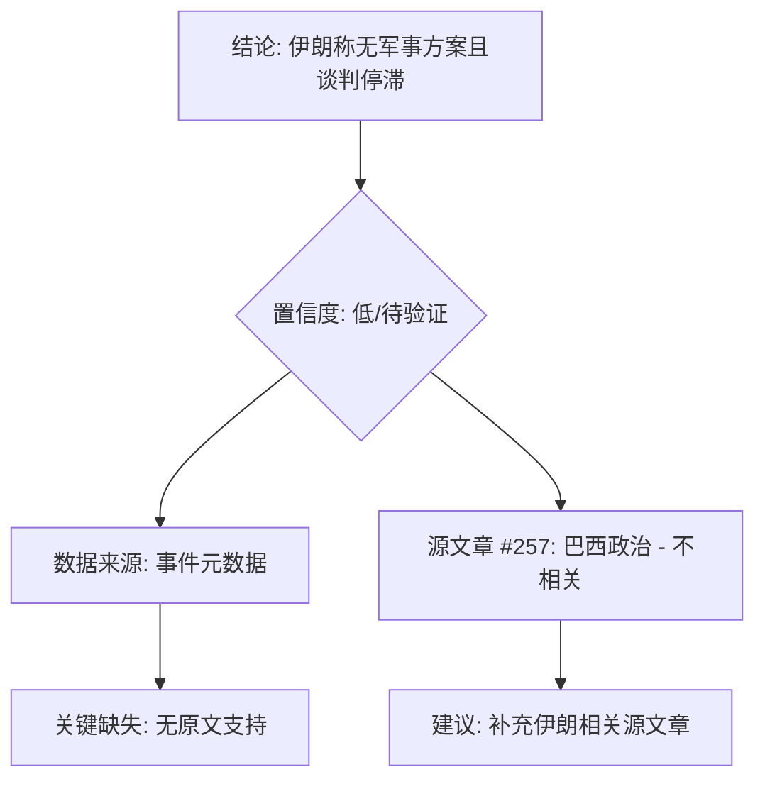

## Event ID

EVT-20261005-000460

## Selected Skills

- 总结文章.md
- 金字塔原理.md

# 伊朗称无军事解决方案且和平谈判停滞：事件深度分析

## 标题
伊朗官方表态：对伊问题无军事解决方案，美伊和平谈判停滞

## 作者
748686 自生长知识系统 Event Analysis Engine

## 标签
国际外交、地缘政治、美伊关系、和平谈判、中东局势、信息验证

## 一句话总结这篇文章
本事件记录了伊朗方面宣称对伊问题不存在“军事解决方案”且美伊和平谈判处于“停滞”状态的官方立场，但由于唯一提供的源文章（Article #257）内容为巴西国内政治且非完整信息，该核心事实缺乏原始新闻支撑，属于低置信度的待验证元数据声明。

## 总结文章内容并写成摘要

### 背景与核心声明
事件聚焦于伊朗在美伊关系紧张背景下的外交立场表态。根据事件合成元数据，伊朗官方提出了两个关键主张：
1.  **无军事解决方案**：伊朗宣称针对当前冲突或问题，无法通过军事手段解决。
2.  **谈判停滞**：伊朗指出美伊之间的和平谈判进程目前处于停滞状态。

### 数据完整性评估
在对事件源进行深度整合时发现严重的数据断裂：
*   **源文章错位**：本次事件分析所依赖的唯一源文章（Article #257），其标题为“Brazil: Lula and Bolsonaro tied in polls”（巴西：卢拉和博尔索纳罗在民调中持平）。
*   **内容无关性**：该源文章内容涉及巴西国内政治选举形势，与伊朗、美国或中东地缘政治毫无关联。
*   **内容缺失**：该源文章状态标记为 `partial`，未提供完整正文。

因此，事件的核心事实陈述并非源于实际新闻报道，而是源于合成层的元数据标签。

### 影响与不确定性
由于缺乏有效的源文本支持，无法评估该表态对地区能源市场、国际关系格局或后续谈判进程的具体影响。同时，无法确认伊朗发表该言论的具体语境（如是否针对特定军事演习或制裁动态）、谈判停滞的具体原因以及美国或其他国家的相关回应。

## 文章大纲

*   **一、事件概览**
    *   事件ID与日期标识
    *   核心议题界定：伊朗对美伊冲突解决途径的官方立场及谈判现状
*   **二、核心事实陈述**
    *   伊朗官方立场：宣称不存在“军事解决方案”
    *   谈判现状：美伊“和平谈判”处于“停滞”状态
    *   数据局限性说明：基于元数据而非可验证全文
*   **三、交叉来源验证分析**
    *   验证状态：无法验证 / 数据不足
    *   源文章#257分析：
        *   内容相关性：不相关（巴西政治）
        *   完整性：部分缺失
    *   关键发现：缺乏内容相关的源文章支持核心陈述
*   **四、视角与信息差异分析**
    *   国家/地区视角：无法提取（因缺乏有效源内容）
    *   信息差异：不存在可比较的差异，因基础证据缺失
*   **五、影响评估与未知事项**
    *   已知当前影响：无法确定
    *   目前无法确定的事项：
        1.  信息来源真实性（是否有匹配的报道？）
        2.  具体语境（针对何种事件表态？）
        3.  谈判停滞的细节与原因
        4.  各方（美国及地区国家）反应
        5.  后续发展（升级或缓和）
*   **六、来源列表**
    *   Article #257详情（状态、标题、URL、备注）
*   **七、事件结论与建议**
    *   结论：数据严重不足，结论存疑，视为待验证元数据
    *   建议：检索补充相关源文章，标记为低置信度

---

## 金字塔结构分析

根据金字塔原理，本事件的结构呈现为**问题/现状层缺失支撑**的异常形态。通常的金字塔应由“结论-论点-证据”构成，但本事件因源数据错误，导致底层证据缺失。以下是基于可用信息重构的逻辑层级：

### 1. 顶层结论（Core Conclusion）
**事件核心主张：伊朗宣称无军事解决途径，美伊谈判停滞。**
*   *注：此结论仅作为元数据存在，缺乏原始新闻源文章的实证支持，置信度极低。*

### 2. 中层论点（Key Arguments）
为支持上述结论，理论上需要以下论据，但目前均无法满足：

*   **论点A：伊朗官方明确表达“无军事解决方案”立场**
    *   *所需证据：* 伊朗外交部发言人声明原文、官方媒体通稿。
    *   *当前状态：* **缺失**。仅有事件标题描述，无源文本。
*   **论点B：美伊和平谈判当前处于停滞状态**
    *   *所需证据：* 外交渠道消息、谈判代表声明、国际媒体报道。
    *   *当前状态：* **缺失**。无相关报道支持。
*   **论点C：该表态具有地缘政治背景与影响**
    *   *所需证据：* 背景分析（如近期军事演习、制裁动态）、地区反应。
    *   *当前状态：* **缺失**。无法分析影响。

### 3. 底层证据（Supporting Evidence）
*   **可用证据：**
    *   事件元数据标签（Type: 国际外交, Merge Reason: 伊朗表态）。
    *   Article #257（**无效证据**：内容为巴西政治，主题不相关）。
*   **缺失证据：**
    *   任何关于伊朗、美国、中东谈判的直接新闻报道。

### 4. 逻辑关系说明
*   **归纳关系失效**：由于缺乏多个相关源文章的归纳支撑，无法形成可靠的归纳逻辑。
*   **演绎关系断裂**：前提（源文章支持）为假，导致结论（伊朗立场事实）不可信。

### 5. 视觉呈现建议（结构化复盘）
若以标准金字塔图示，本事件结构如下：

### 6. 应用技巧反思
*   **信息过载筛选**：本次案例反向证明了筛选机制的重要性。Article #257 被错误关联到伊朗主题事件，说明在“Global Merge”阶段需要进行更严格的内容相关性校验。
*   **结论先行**：在事件结论中已明确指出“数据严重不足，结论存疑”，符合金字塔原理中“结论先行”以设定框架的要求。
*   **避免陷阱**：
    *   *信息过载*：无。
    *   *结构不清*：已清晰区分事实、验证、结论。
    *   *层级混乱*：明确将“元数据声明”与“源文章证据”分层。
    *   *结论模糊*：结论明确指向“待验证”和“低置信度”。

### 7. 最终建议
遵循金字塔原理的“自上而下”构建需求，当前事件缺乏底层支撑。建议立即执行以下操作以完善知识图谱：
1.  **检索补充**：查找“Iran no military solution stalled peace talks”相关原始新闻。
2.  **标记管理**：在知识系统中将该事件标记为 `low_confidence` 或 `unverified`。
3.  **机制优化**：优化 Router 的合并逻辑，确保源文章内容与事件主题的高度相关性，避免无关文章（如巴西政治）被错误纳入。
