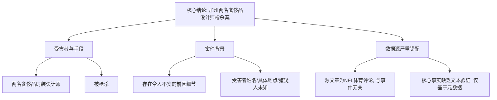

## Event ID

EVT-20261006-000034

## Selected Skills

- 总结文章.md
- 金字塔原理.md

---

## 标题
加州两名奢侈品时装设计师枪杀案

## 作者
748686 自生长知识系统 Event Analysis Engine

## 标签
刑事案件, 谋杀案, 时尚界, 加州, 美国新闻

## 一句话总结
2026年10月6日，美国加州发生两起奢侈品时装设计师被枪杀事件，案件背景存在令人不安的 prior details（前因细节），但因唯一提供的来源文章与事件无关，目前无法进行交叉验证。

## 总结文章内容
本事件报告涉及一起发生在2026年10月6日的恶性刑事案件。核心事实为：在美国加利福尼亚州，两名从事奢侈品时尚设计的设计师被发现死于枪击。报道指出，案件发生前存在“令人不安的前因细节”（troubling lead-up details），暗示事件可能并非突发，而是有某种预兆或背景故事。然而，关键问题在于数据源的严重错配：系统唯一获取并检索到的新闻源（Article #66）是一篇关于体育评论员Bomani Jones评论NFL球员Josh Allen和Lamar Jackson的文章，完全未提及任何关于时装设计师或谋杀案的内容。因此，本分析基于事件元数据中的描述生成，但其事实真实性缺乏文本来源的支持，属于未经验证的事件记录。

## 详细大纲

### 1. 事件基本信息 (Pyramid Top - 结论先行)
*   **事件名称**：Luxury Fashion Designers Murdered in California
*   **事件ID**：EVT-20261006-000034
*   **发生时间**：2026年10月6日
*   **发生地点**：美国加利福尼亚州
*   **核心性质**：针对高知名度人群（奢侈品时装设计师）的暴力犯罪/谋杀案

### 2. 受害者与作案手段 (Pyramid Level 1 - 主要论点)
*   **受害者身份**：
    *   人数：两名
    *   职业：奢侈品时装设计师 (Luxury fashion designers)
    *   身份特征：行业高层，具有高社会知名度
*   **死亡原因**：
    *   方式：枪击 (Shot dead)
    *   发现状态：被发现身亡

### 3. 案件背景与细节 (Pyramid Level 1 - 主要论点)
*   **前因细节**：
    *   描述：存在“令人不安的前因细节” (Troubling lead-up details)
    *   含义：暗示案件发生前可能有威胁、冲突或异常行为轨迹，非随机犯罪
*   **未知信息**：
    *   受害者具体姓名未披露
    *   具体城市或场所未指定
    *   嫌疑人身份及逮捕状态未知
    *   动机尚不明确

### 4. 数据源分析与事实核查 (Pyramid Level 2 - 证据与支撑)
*   **来源相关性断裂**：
    *   **事件元数据**声称涉及设计师谋杀案
    *   **唯一提供的源文章** (Article #66) 内容关于美式橄榄球评论 (Bomani Jones, Josh Allen, Lamar Jackson)
    *   **结论**：源文章与事件标题存在巨大错位，无事实重叠
*   **交叉验证结果**：
    *   由于源文章不相关，无法对“两名设计师被枪杀”这一核心事实进行文本层面的交叉验证
    *   核心事实仅来源于事件元数据描述，可信度存疑

### 5. 待确认事项 (Bottom Level - 待补充信息)
*   需核实事件真实性：检查是否为误报或数据污染
*   需补充关联新闻源：寻找真正关于加州时装设计师枪击案的报道
*   需明确具体地点：确定是哪座城市或区域
*   需披露官方信息：等待警方关于嫌疑人或动机的通报

---

## 金字塔结构概览

