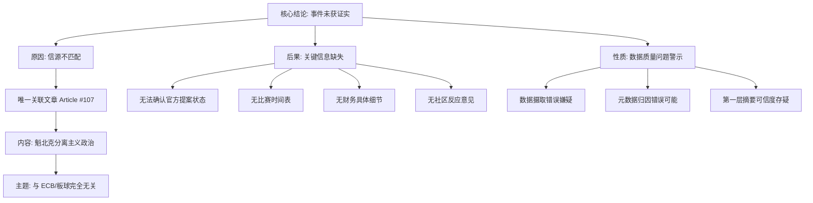

## Event ID

EVT-20261006-000068

## Selected Skills

- 总结文章.md
- 金字塔原理.md
- 四维价值模型.md

## Event Analysis

### 1. 标题：ECB女子板球测试赛资金支持提案事件分析

### 2. 作者：748686 自生长知识系统 Event Analysis Engine

### 3. 标签
板球、ECB、女性体育、体育管理、数据验证、信源可靠性

### 4. 一句话总结这篇文章
该事件记录了一起关于英格兰和威尔士板球板（ECB）考虑为女子测试赛提供资金的数据溯源异常案例，其唯一关联信源（Article #107）内容与主题完全无关，导致事件事实处于未经证实状态。

### 5. 摘要

**核心结论**
ECB考虑为女子测试赛提供资金的提议，在当前数据集中**缺乏有效的信源佐证**。唯一的关联文章（Article #107）内容关于魁北克政治，与板球主题完全无关，表明存在数据摄取错误或元数据归因错误。因此，该事件目前仅作为“未验证声明”存在，无法确认其事实性、时间表或财务细节。

**支持论点一：信源严重不匹配（核心问题）**
*   **现象**：EventUnit 的第一层合并描述声称 ECB 正在考虑资金支持。
*   **证据缺失**：关联的唯一来源 Article #107 标题为《魁北克 poised to elect separatists to power for first time in more than a decade》。
*   **内容偏差**：该文章讨论的是加拿大魁北克省的分离主义政治前景，**完全不涉及**英格兰和威尔士板球板（ECB）或女子测试板球。
*   **结论**：缺乏任何独立的、相关的文本证据来支持“ECB考虑资助”这一核心事实。

**支持论点二：事件状态的不确定性（衍生后果）**
由于信源不匹配，以下关键信息均无法确定：
1.  **官方性**：ECB是否正式宣布了这一提案？（可能基于外部知识而非提供的数据）
2.  **时间线**：潜在的女子测试赛是否有具体日期？
3.  **财务细节**：资金数额是多少？
4.  **社区反响**：球员、粉丝或利益相关者是否有反对或支持意见？

**支持论点三：数据质量警示（系统层面）**
*   此案例揭示了多来源综合过程中的**数据摄取错误**风险。
*   Event ID `EVT-20261006-000068` 与 Article #107 的映射关系是无效的。
*   在无法验证第一层合并摘要真实性的情况下，任何基于此的后续分析都建立在不可靠的基础上。

### 6. 金字塔结构图解

### 7. 四维价值模型评估

| 价值维度 | 评分/评估 | 详细分析 |
| :--- | :--- | :--- |
| **信息价值** | **中** | 提供了关于板球行政发展的潜在动态（ECB女子测试赛），但核心价值在于揭示了数据处理中的信源匹配错误案例，具有方法论上的警示意义。 |
| **情绪价值** | **低** | 内容偏向技术性和事实核查，缺乏强烈的情感共鸣点。对于关注性别平等和体育发展的读者可能引发轻微的兴趣或关切，但整体情绪调动能力弱。 |
| **趣味价值** | **低** | 叙事方式为结构化分析报告，无娱乐性元素、生动比喻或意外转折。属于严谨的事实核查报告，阅读体验较为枯燥。 |
| **独特价值** | **中** | 展现了自生长知识系统在**异常检测**方面的能力。通过识别并明确指出“文章与主题不匹配”这一数据错误，提供了单一信源验证失败的典型案例，这对于理解知识系统的局限性和数据质量重要性具有独特视角。 |

### 8. 综合结论

基于当前可用的单一且**不相关**的信源（Article #107），**无法证实**“ECB考虑为女子测试赛提供资金”这一事件的真实性。该事件应被标记为**未验证状态**，并作为数据质量问题的典型案例进行记录，建议重新检索与“ECB women's cricket test funding”相关的有效信源以进行后续分析。
