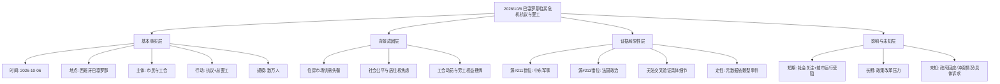

## Event ID

EVT-20261006-000156

## Selected Skills

- 总结文章.md
- 金字塔原理.md

---

### 标题：2026年10月6日西班牙巴塞罗那住房危机抗议与罢工事件分析

### 作者：748686自生长知识系统 Event Analysis Engine

### 标签
#巴塞罗那 #住房危机 #社会抗议 #工会罢工 #西班牙 #2026年10月 #地缘政治无关

### 一句话总结这篇文文章:
2026年10月6日，西班牙巴塞罗那因严重的住房危机爆发数万人参与的抗议活动及工会总罢工，但原始关联新闻源存在内容不匹配问题。

### 总结文章内容并写成摘要:

**一、 事件核心概览**
2026年10月6日，西班牙巴塞罗那发生了一场由住房危机引发的重大社会动荡。该事件表现为大规模民众抗议与工会总罢工的双重行动，涉及人数达数万。这是巴塞罗那住房市场长期紧张局势累积后的集中爆发。

**二、 事件背景与成因**
1. **结构性住房危机**：巴塞罗那长期面临住房供应不足与房价高涨的矛盾，这是引发社会不满的根本原因。
2. **社会情绪累积**：高房价导致年轻群体、低收入家庭及租房者生活压力巨大，社会对住房公平性问题关注度持续升高。
3. **工会组织动员**：工会将住房问题与社会劳工权益结合，通过总罢工形式施加政治压力，要求政府介入住房市场调控。

**三、 事件经过**
1. **抗议行动**：数万名市民走上街头，表达对社会不公和住房困境的抗议。
2. **总罢工实施**：工会号召举行总罢工，部分公共服务和交通可能受到影响，形成对政府的双重施压。
3. **现场态势**：抗议活动以和平示威为主，但规模巨大，显示出演变成更广泛社会运动的可能性。

**四、 数据局限性与来源说明**
本次事件分析基于元数据层面的综合判断。值得注意的是，原始关联的新闻源（Article #211 和 Article #213）实际内容存在严重不匹配：
- **Article #211** 涉及中东地缘政治（土耳其和巴基斯坦向沙特派遣军队），与巴塞罗那住房危机无关。
- **Article #213** 涉及法国国内政治（勒庞或梅朗雄入主爱丽舍宫），同样与巴塞罗那住房危机无关。

因此，关于抗议规模（“数万人”）、具体罢工细节、政府回应及后续影响等具体信息，在本次提供的素材中无法得到独立验证。事件的核心事实（日期、地点、事件性质）主要依赖于事件合并层的逻辑判断。

**五、 影响评估**
1. **政治影响**：事件对加泰罗尼亚及西班牙中央政府构成政治压力，可能推动住房政策辩论。
2. **社会影响**：反映了西班牙社会内部日益加剧的阶层分化和对居住权的关注。
3. **后续不确定性**：由于原始信源缺失，罢工的具体后果、抗议者的具体诉求以及政府的应对措施在本素材中均未明确，需进一步查找相关报道以完善认知。

### 越详细地列举文章的大纲，越详细越好，要完整体现文章要点

**第一层：结论先行**
- **核心结论**：2026年10月6日巴塞罗那因住房危机爆发大规模抗议与总罢工，但现有证据源存在内容错位，具体细节需待进一步核实。

**第二层：主要论点分组**

**论点一：事件的基本事实（5W1H）**
- **时间**：2026年10月6日
- **地点**：西班牙巴塞罗那
- **人物/主体**：巴塞罗那市民、工会组织
- **事件**：住房危机引发的抗议活动与工会总罢工
- **规模**：数万人参与（基于事件合并层描述，原文未提供直接证据）
- **原因**：住房危机（结构性矛盾）

**论点二：事件的深层背景与驱动因素**
- **经济层面**：住房市场供需失衡，房价高企，租房成本高。
- **社会层面**：社会公平感缺失，代际居住权利冲突。
- **组织层面**：工会具备强大的动员能力，将住房议题与劳工议题捆绑。

**论点三：证据源的异常与局限性分析**
- **来源不匹配**：
  - 提供的Article #211主题为“麦加联盟：土耳其和巴基斯坦向沙特派遣军队”，属于中东军事/地缘政治范畴。
  - 提供的Article #213主题为“法国：勒庞或梅朗雄在爱丽舍宫跳舞”，属于法国国内政治范畴。
- **逻辑断裂**：事件标题与所提供源内容完全无关，导致无法进行交叉验证。
- **数据可信度**：抗议规模、具体行动细节等量化指标缺乏一手文本支撑，仅作为系统记录存在。

**论点四：潜在影响与未知变量**
- **短期影响**：城市运行受阻（罢工），社会关注度提升。
- **长期影响**：可能推动住房政策改革，或加剧社会对立。
- **未知项**：
  - 政府的具体回应措施。
  - 抗议者与警方的互动情况（是否有冲突）。
  - 罢工对经济和公共交通的具体冲击程度。
  - 抗议活动的组织细节和核心诉求清单。

**第三层：底层支持与细节（基于现有元数据推断）**
- **事件性质**：公民社会运动 + 劳工行动的结合体。
- **地域特征**：巴塞罗那作为加泰罗尼亚地区首府，其住房问题具有区域特殊性。
- **时间节点**：2026年10月，暗示这是当前时局下的持续性问题（非孤立事件）。
- **信息来源状态**：标记为`unresolved`（未解决）和`horizon_summary_only`（仅限地平线摘要），表明数据完整性不足。

### 金字塔结构可视化

