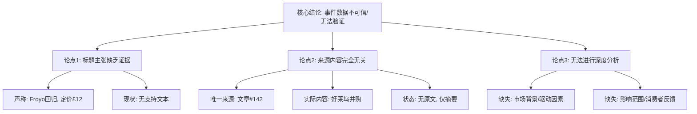

## Event ID

EVT-20261007-000103

## Selected Skills

- 总结文章.md
- 金字塔原理.md

## Event Analysis

### 标题：
Frozen yogurt comeback at premium pricing (Source-Verdict Report)

### 作者：
Event Analysis Engine (748686 Self-Growing Knowledge System)

### 标签：
#新闻 #食品消费趋势 #事件分析 #数据质量审计 #Pylo/FCO

### 一句话总结：
该事件声称冻酸奶以12英镑的高端价格回归，但唯一提供的原始来源与主题完全无关且内容缺失，导致该声明无法通过来源验证，属于基于元数据的未证实断言。

### 文章内容摘要：
**核心结论（顶层）：**
事件 **EVT-20261007-000103** 存在严重的数据完整性问题。虽然事件标题指出“冻酸奶以12英镑高端价格回归”，但系统仅提供了1篇来源文章，且该文章与事件主题无关，因此无法生成实质性的交叉验证分析。

**支持性论点（中层）：**

1.  **事件主张与实际数据脱节**
    *   事件标题明确陈述：冻酸奶（froyo）回归，定价为高端的12英镑（£12）。
    *   隐含背景：这可能指向英国市场（货币符号£），暗示消费者对高端冷冻甜点的需求变化。
    *   问题：这一主张完全缺乏文本证据支持，仅存在于事件元数据中。

2.  **来源内容严重不匹配**
    *   唯一提供的来源是文章 #142，标题为《Paramount takes over Warner Bros in $110bn Hollywood merger》（派拉蒙以1100亿美元收购华纳兄弟）。
    *   内容状态：`source_status: unresolved`（未解决），`content_status: horizon_summary_only`（仅有地平线摘要，无正文）。
    *   相关性评估：好莱坞并购新闻与冻酸奶市场趋势无任何逻辑或事实关联。

3.  **验证机制失效**
    *   **交叉验证**：由于缺乏相关来源，无法进行多源事实核对。
    *   **因果推断**：无法确定推动12英镑定价的经济因素、品牌主体或市场驱动力。
    *   **影响评估**：无法判断该事件对市场渗透率、消费者反应或竞争对手的具体影响。

**底层证据（详细大纲）：**

*   **事实核查记录**：
    *   事实点A（价格）：12英镑定价 —— **未验证**（来源缺失）
    *   事实点B（产品）：冻酸奶回归 —— **未验证**（来源缺失）
    *   事实点C（地理）：英国市场（推断自£符号） —— **未验证**（来源未提及）
*   **来源审计记录**：
    *   来源 #142 内容：关于Paramount和Warner Bros的并购摘要。
    *   来源状态：原始文本未找到，仅存摘要。
    *   结论：该来源对于本事件而言属于“噪声数据”或“错误匹配”。

### 金字塔结构图示：

### 逻辑关系说明：
本分析采用**归纳逻辑**。首先观察到“事件标题”与“提供的唯一来源”之间存在巨大的语义鸿沟；其次确认该来源不仅无关，且本身质量低下（无原文）；最后归纳出“该事件目前无法进行实质性分析，仅能作为数据质量警示案例存在”的结论。遵循MECE原则，将分析分解为内容主张、来源审查和影响评估三个独立维度。
