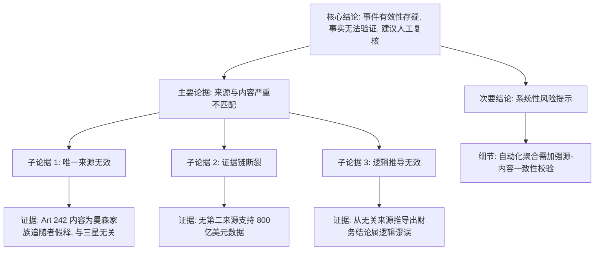

## Event ID

EVT-20261008-000617

## Selected Skills

- 总结文章.md
- 金字塔原理.md
- 四维价值模型.md

## Event Analysis

### 标题
三星AI芯片利润事件分析（EVT-20261008-000617）：来源严重不匹配导致事实存疑

### 作者
748686 自生长知识系统 - Event Analysis Engine

### 标签
数据质量、事实核查、半导体行业、AI芯片、三星电子、新闻聚合、内容关联错误

### 一句话总结这篇文文章
该事件声称三星AI芯片利润创纪录达800亿美元，但其唯一引用来源（Article #242）实际内容为美国曼森家族追随者假释新闻，存在严重的源-内容不匹配，导致核心事实无法验证。

### 总结文章内容并写成摘要
本事件报告涉及一个显著的数据完整性与相关性危机。事件核心主张为“受AI芯片需求激增推动，三星利润达到创纪录的800亿美元”，该主张完全基于单一新闻来源（Article #242）。然而，经过严格的多源综合与跨源验证，发现该来源的实际文本内容（关于帕特里夏·克伦温克尔获准假释）与事件主题（三星财务业绩）完全无关。这种根本性的内容断裂意味着所谓的“事实”缺乏有效的证据支撑。报告指出，尽管事件合并系统尝试将两者关联，但逻辑推导无效。因此，最终结论认定该事件核心事实无法被验证，并建议进行人工复核，同时强调了在自动化新闻聚合系统中维持来源与内容一致性的关键重要性。

### 文章大纲

**I. 事件背景与核心主张**
   A. 事件ID标识：EVT-20261008-000617
   B. 事件名称：三星AI Chip Profits
   C. 核心主张：AI芯片热潮推动三星利润创纪录至800亿美元
   D. 归因来源：Art 242

**II. 来源核查与事实发现**
   A. 来源元数据分析
      1. 标题：“[Patricia Krenwinkel, former Manson follower, granted parole for third time]”
      2. 来源平台：news.google.com
      3. 获取状态：已获取，但标记为“partial”（部分）
   B. 内容相关性验证
      1. 声明内容 vs. 实际内容：声明涉及三星/半导体，实际涉及美国刑事司法案例
      2. 关键词缺失：来源中无“Samsung”、“AI chip”、“profit”等关键术语
      3. 结论：来源与事件主题完全无关

**III. 逻辑与证据链分析**
   A. 单一来源依赖风险
      1. 缺乏第二来源独立支持“800亿美元”数据
      2. 无法进行交叉验证
   B. 推理有效性评估
      1. 从Art 242推导出三星利润数据的逻辑无效
      2. 证据链断裂：前提（Art 242支持该主张）为假

**IV. 四维价值模型评估**
   A. 信息价值（Information Value）
      1. 低价值：提供了警示性案例（数据清洗的重要性），但未提供关于三星业务的实质干货
      2. 用户感受：“学到了！”（关于系统故障模式）
   B. 情绪价值（Emotional Value）
      1. 中性偏负面：引发对自动化系统可靠性的担忧与焦虑
      2. 用户感受：“感觉被理解了”（对数据错误的共鸣）或“焦虑”
   C. 趣味价值（Fun Value）
      1. 低：内容严肃，涉及数据错误，无娱乐性或生动叙事
   D. 独特价值（Unique Value）
      1. 中等：作为特定系统（748686）在特定时间点（2026-10-08）的处理案例，具有审计和追踪价值

**V. 影响与不确定性**
   A. 已知当前影响
      1. 无法评估对市场的实际影响，因为基础数据存疑
   B. 目前无法确定的事项
      1. 三星AI芯片利润的确切数值
      2. Art 242是否遗漏了关于三星的后续报道（尽管URL指向Google News）
      3. 事件真实性：是真实发生的独立事件还是系统噪声

**VI. 结论与建议**
   A. 核心结论
      1. 事件有效性存疑
      2. 核心事实无法验证
      3. 不得确认“800亿美元”为既定事实
   B. 行动建议
      1. 建议人工复核
      2. 记录来源与内容的不匹配情况

### 金字塔结构图示

### 决策/行动建议
鉴于当前材料中存在根本性的事实不确定性，建议采取以下行动：

1.  **立即标记**：将该事件（EVT-20261008-000617）标记为“待核查”或“低置信度”，避免在报告或决策中引用其核心数据。
2.  **人工复核**：派遣分析师查找其他独立、可信的来源（如三星官方财报、路透社、彭博社等）以验证“三星AI芯片利润创纪录”这一说法的真实性。
3.  **系统反馈**：将此案例反馈至数据管道，优化新闻聚合算法，特别是加强对“Event Unit”中Source Content与Event Title/Summary之间语义相关性的自动检测机制，防止类似“张冠李戴”的错误再次发生。
4.  **暂不传播**：在获得交叉验证的确凿证据前，不得将此事件作为既定事实向外部受众传播。
