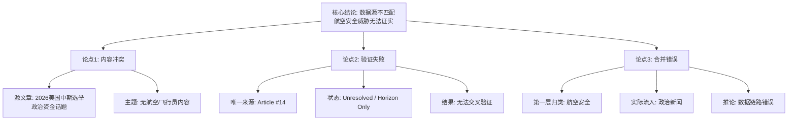

## Event ID

EVT-20261009-000014

## Selected Skills

- 总结文章.md
- 金字塔原理.md
- 四维价值模型.md

---

# 文章摘要：Rogue Pilots Aviation Security Threat

**标题**：Rogue Pilots Aviation Security Threat (EVT-20261009-000014) —— 数据源不匹配的事件分析报告
**作者**：748686 自生长知识系统 (Event Analysis Engine)
**标签**：航空安全, 数据完整性, 事件分析, 来源验证

**一句话总结**：
本次事件分析揭示了一个严重的**数据与主题失配（Data-Topic Mismatch）**问题，即标题标记为“鲁莽飞行员航空安全威胁”的事件单元，其关联的唯一源文章实际内容为“2026年美国中期选举商业对特朗普派候选人的资助”，导致核心事实无法建立。

**内容摘要**：

本事件单元（EVT-20261009-000014）在初始合并阶段被归类为“航空安全相关报道”，但在第二层多来源综合阶段暴露出根本性的数据缺陷。以下是基于金字塔原理（结论先行、分层论证）的结构化分析：

**1. 核心结论：数据断联，威胁无法证实**
由于唯一提供的源文章（Article #14）与事件标题完全无关，无法从当前数据集中提取任何关于“鲁莽飞行员”或“航空安全威胁”的有效事实。该事件目前处于“信息不足”状态。

**2. 主要论点与证据（分组归类）**

*   **论点一：源文章内容与事件主题存在根本性冲突**
    *   **证据**：Article #14 的标题为《Midterms 2026 : « Le Big Business vient massivement au secours des candidats trumpistes »》（2026年中期选举：大企业大规模救援特朗普候选人）。
    *   **内容实质**：涉及美国政治资金、中期选举及商业支持，不包含任何航空、飞行员或安全威胁相关信息。
    *   **结论**：这是政治新闻而非航空安全新闻。

*   **论点二：单源缺失导致交叉验证失败**
    *   **证据**：来源数量仅为1篇，且状态标记为 `source_status: unresolved` 和 `content_status: horizon_summary_only`。
    *   **影响**：无法进行“多源确认”（Multiple Source Confirmation），也无法形成“共识”。
    *   **结论**：缺乏验证基础，无法判断航空威胁的真实性或具体形态。

*   **论点三：事件合并逻辑存在潜在错误**
    *   **证据**：第一层合并判定依据为“航空安全相关报道”，但实际流入的内容却是政治新闻。
    *   **推测**：
        1.  Article #14 可能在 ingestion（摄入）阶段被错误标记；
        2.  或者事件标题为通用类别，而不相关的文章被错误路由至此。
    *   **结论**：数据链路中存在未解决的错误，需要重新校对源文本。

**3. 细节支撑：当前无法确定的关键信息**
由于上述数据缺口，以下关键信息在当前源材料中均不可用：
*   **威胁性质**：是劫机、内部破坏还是未经授权飞行？
*   **地理范围**：是全球性问题还是局部地区？
*   **具体事件**：无日期、地点或涉及飞行员的名字。
*   **官方回应**：无政府或航空管理局的响应记录。

**4. 总结与行动建议**
当前 EventUnit 的有效性为零。建议立即执行以下操作以修复数据：
1.  **重新检索**：搜索与“Rogue Pilots”、“Aviation Security Threat”相关的真实源文章。
2.  **核查关联**：确认 Article #14 是否被错误地关联到 EVT-20261009-000014，或是否存在其他未被发现的航空安全类文章。
3.  **等待补全**：在没有相关航空安全源文章之前，该事件的“已知当前影响”和“具体威胁细节”应保持“无法确定”状态。

---

## 金字塔结构可视化

---

## 四维价值模型评估

针对此次 Event Analysis 本身的价值评估：

*   **信息价值 (Information Value)**:
    *   **高**。尽管源文章无效，但分析过程揭示了数据管道中的关键故障（数据与主题不匹配）。这对于维护知识系统的准确性具有重要参考价值，明确了“EVT-20261009-000014”当前不可用。
    *   *用户感受*：“发现了数据录入错误”、“明确了信息缺口”。

*   **情绪价值 (Emotional Value)**:
    *   **中性/低**。这是一份技术性分析报告，旨在纠正事实错误，不涉及强烈的情感共鸣、激励或安慰。
    *   *用户感受*：“专业”、“冷静”、“需要关注数据质量”。

*   **趣味价值 (Fun Value)**:
    *   **低**。内容为事实核查与逻辑分析，无娱乐性叙事、比喻或“梗”。
    *   *用户感受*：“枯燥”、“严谨”、“必要但不有趣”。

*   **独特价值 (Unique Value)**:
    *   **中等**。通过特定的“多来源综合”和“第一层/第二层合并判断”流程，识别出了单一数据点背后的系统性错位。这种对“无效关联”的识别能力是知识系统在特定时刻的独特产出，体现了系统对数据一致性的监控价值。
    *   *用户感受*：“系统发现了人工可能忽略的错配”、“体现了自生长系统的纠错机制”。
