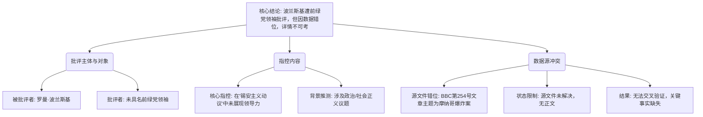

## Event ID

EVT-20261009-000205

## Selected Skills

- 总结文章.md

- 金字塔原理.md

---

# 罗曼·波兰斯基遭前绿党领袖批评 Zionism 动议事件分析

**作者：** Agnes (Event Analysis Engine)
**标签：** 政治争议, 电影导演, 绿色政党, 锡安主义, 舆论批评
**一句话总结：** 前绿党领袖批评电影导演罗曼·波兰斯基在涉及“锡安主义（Zionism）”的动议中未能展现领导力，但详细信息因源数据与事件主题不匹配而严重受限。

## 文章摘要

本次事件涉及电影导演罗曼·波兰斯基（Roman Polanski）遭受的政治与道德批评。批评者为一位未具名的前绿党领袖，指控波兰斯基在处理一项与“锡安主义”相关的动议时，缺乏应有的政治或道德领导力。然而，该事件分析面临严重的结构性数据障碍：唯一提供的原始新闻来源（BBC Article #254）标题为关于摩纳哥炸弹袭击嫌疑人的报道，且内容状态为“未解决”，与事件核心主题（波兰斯基与锡安主义）存在显著的主题错位。因此，本分析基于事件元数据（Event Title and Merge Reason）构建框架，但关键事实细节无法从源文本中直接验证。

## 大纲

1.  **核心结论：批评的成立与局限**
    *   罗曼·波兰斯基因在“锡安主义动议”中的表现被前绿党领袖公开批评。
    *   指控核心为“未能展现领导力”。
    *   由于源文章（BBC关于摩纳哥爆炸案）与事件主题不符，具体批评细节、动议内容及波兰斯基的回应均无法核实。

2.  **顶层要素：事件主体与性质**
    *   **主体：** 罗曼·波兰斯基（著名电影导演，长期处于争议中心）。
    *   **批评方：** 某前绿党领袖（具体国籍、姓名未指明，推测可能为欧洲语境下的绿党，如德国或法国绿党）。
    *   **事件性质：** 文化名人与政治立场/社会责任之间的冲突；公众人物政治表现的舆论审判。
    *   **争议焦点：** “锡安主义动议”（Zionism motion）的具体内容及波兰斯基对此的立场缺失。

3.  **中层论点：批评的构成与证据链断裂**
    *   **论点一：批评的来源与权威性**
        *   批评来自政治领域（前绿党领袖），暗示该动议具有政治或社会运动属性。
        *   绿党通常关注人权、和平与国际正义，因此该批评可能涉及以色列-巴勒斯坦议题或反犹主义争议背景下的立场问题。
    *   **论点二：波兰斯基的“领导力缺失”指控**
        *   “未能展现领导力”是一个模糊的道德评价，暗示公众或活动人士期望波兰斯基就特定政治议题公开表态或采取行动，但他选择了沉默或回避。
        *   考虑到波兰斯基的个人历史（绑架案、流亡者身份），此类批评往往与其公众形象的政治化解读有关。
    *   **论点三：数据源的结构性冲突**
        *   **关键信息缺口：** 唯一引用的源文件（BBC Article #254）内容为“摩纳哥百万富翁炸弹袭击嫌疑人打破沉默”，与“波兰斯基”、“锡安主义”完全无关。
        *   **状态标记：** 该源文件状态为 `source_status: unresolved` 和 `content_status: horizon_summary_only`，表明原始文本不可用，仅存摘要或元数据。
        *   **推论：** 事件合并过程可能存在数据匹配错误，或者该事件仅依赖于元数据层面的关联，缺乏实质性的新闻正文支持。

4.  **底层支撑：细节与未知变量**
    *   **具体动议内容：** “Zionism motion”的具体文本、发起时间、地点及背景完全未知。
    *   **批评者身份：** 前绿党领袖的姓名、所属国家及具体批评言论未被记录。
    *   **波兰斯基回应：** 无证据表明波兰斯基对此批评做出了任何公开回应。
    *   **舆论影响：** 目前仅知存在批评，尚无证据表明该批评引发了大规模的社会运动、法律后果或波兰斯基职业生涯的显著变化。
    *   **BBC文章关联性：** 无法确定BBC关于摩纳哥爆炸案的报道是否与波兰斯基事件存在隐含联系（如赞助人、地点关联等），或纯粹为数据抓取错误。

## 金字塔结构图

## 分析与洞察

**1. 结论先行：事件本质是数据缺失下的低置信度报告**
本事件的核心事实——即“波兰斯基因锡安主义动议被前绿党领袖批评”——仅存在于事件元数据中。由于支撑该事件的实际新闻源（BBC关于摩纳哥爆炸案）与事件主题完全脱节，且该源文件本身状态为“未解决”，我们无法确认批评的具体语境、动机及后果。这不仅仅是一个新闻摘要，更是一个数据质量问题的案例：事件ID与源文章的不匹配导致分析只能停留在标题层面。

**2. 逻辑分层：从人物关系到数据断层**
*   **第一层（人物关系）：** 事件构建了“导演 vs 政治家”的对立框架。波兰斯基作为具有强烈政治色彩的历史人物，其一言一行常被置于放大镜下。前绿党领袖的批评反映了左翼政治力量对文化名人社会责任的高期待。
*   **第二层（争议焦点）：** “锡安主义动议”是一个高度敏感的政治术语。将其与波兰斯基联系起来，可能隐含了复杂的反犹主义争议、以色列政策批评或人权话语权的争夺。然而，由于缺乏正文，我们无法判断这是具体的立法动议、社会团体决议还是媒体辩论。
*   **第三层（数据困境）：** 最大的变量是数据源。如果BBC文章确实是误配，那么该事件可能缺乏可靠的中文或英文一手报道支持；如果存在未展示的隐藏关联（如波兰斯基与该BBC报道中的某个人物有关联），则当前信息不足以揭示这一链条。`content_status: horizon_summary_only` 明确提示了内容的匮乏。

**3. 影响评估：有限的当前影响，潜在的信息风险**
*   **当前影响：** 仅限于舆论层面的轻微批评，无已知的大规模社会反弹或法律后果。
*   **信息风险：** 由于缺乏可验证的源文本，任何关于此事件的进一步传播都可能基于未经证实的元数据，存在误导风险。对于知识系统而言，该事件当前属于“孤立节点”，缺乏与其他可靠新闻事件的链接强度。

**4. 建议后续行动**
*   **源数据清理：** 需核查Event ID EVT-20261009-000205与Article #254（BBC摩纳哥爆炸案）的关联是否为系统抓取错误。若为错误，应断开链接或重新分配源。
*   **补充搜索：** 若事件真实存在，需独立搜索“Roman Polanski Green party leader Zionism motion criticism”以获取不依赖该错误BBC源的真实报道。
*   **置信度标记：** 在最终知识图谱中，该事件节点应标记为“低置信度”或“待验证”，以避免将元数据层面的推断当作既定事实传播。
