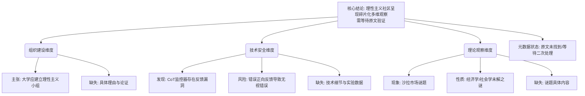

## Event ID

EVT-20261009-000524

## Selected Skills

- 总结文章.md
- 金字塔原理.md

---

# 理性主义社区生态：组织建设、AI安全与技术谜题的多维观察

## 标题
理性主义社区研究、社会理论及校园组织建设

## 作者
多源综合（具体作者因原文缺失不可考，主要涉及理性主义社区的相关观察者）

## 标签
#理性主义 #AI安全 #校园组织 #思维链CoT #经济学谜题 #知识管理

## 一句话总结这篇文文章
本事件聚合了理性主义社区在**校园组织建设**（行动建议）、**AI思维链监控漏洞**（技术安全）及**市场经济学谜题**（理论观察）三个独立维度的最新探讨，揭示了当前社区知识生产的高度碎片化与待验证状态。

## 总结文章内容并写成摘要

基于现有EventUnit信息，本文并非单一连贯论述，而是对三份独立源材料（Article #80-#82）的综合索引。由于所有源文章均处于“原文未找到/内容仅摘要”的`unresolved`状态，本次分析旨在梳理这三类议题的内在联系及其对理性主义社区的潜在影响框架。

**核心论点：**
理性主义社区的活动正呈现“实践-技术-理论”三线并行的态势，但目前各线索缺乏实质性的交叉验证与深度论证支持。

1.  **组织建设层面（Article #80）**：存在推动理性主义小组进入大学校园的主张，但这仅是标题层面的建议，缺乏关于社交资本、认知偏差训练等具体理由的论证。
2.  **技术安全层面（Article #81）**：发现AI思维链（CoT）监控器存在严重漏洞——错误的正向反馈可导致其“视而不见”已发现的错误。这暗示了模型反馈机制中的人为误导风险，但缺乏实验数据支持。
3.  **理论观察层面（Article #82）**：提出了“沙拉市场谜题”，涉及市场价格异常或行为经济学悖论，但谜题具体内容未明。

**结论：**
当前信息仅具备**索引价值**，不具备实质性的知识推理价值。第一层合并逻辑将三者归为“同一社区生态”，但实质上是三个独立的碎片：行动建议、技术故障报告与市场谜题。亟需获取完整原文以进行准确的第二层综合。

## 文章大纲

### 一、 事件概览与合并逻辑评估
*   **1.1 三源结构**：
    *   来源A：校园理性主义小组运营建议
    *   来源B：AI CoT监控器技术缺陷报告
    *   来源C：农产品市场谜题探讨
*   **1.2 合并合理性批判**：
    *   表面关联：均被归入理性主义社区生态
    *   实质断裂：三者无直接事实因果或主体重合
    *   数据状态：全部为`horizon_summary_only`，缺乏正文支撑

### 二、 分层主题解析

*   **2.1 校园组织建设：理性主义小组的推广**
    *   主张：在大学建立理性主义小组具有价值
    *   缺失：具体论证理由（如社交需求、职业网络、认知科学实践等）
*   **2.2 AI安全与技术验证：CoT监控的脆弱性**
    *   现象：向监控器报告错误答案为正确时，监控器会忽略其他已发现错误
    *   暗示：反馈机制存在被误导风险，可能导致安全审计失效
    *   缺失：实验设置、模型架构、误差率等关键技术细节
*   **2.3 市场理论观察：沙拉市场谜题**
    *   现象：沙拉市场中存在的未解之谜
    *   可能方向：价格异常、供给短缺、行为经济学悖论
    *   缺失：谜题的具体定义与分析

### 三、 信息完整性与交叉验证局限
*   **3.1 数据状态限制**：
    *   所有文章状态均为`unresolved`
    *   原文URL未找到，无可信原始文章
*   **3.2 无法确定的关键要素**：
    *   校园小组的具体运营理由
    *   AI监控漏洞的严重程度与上下文
    *   沙拉市场谜题的具体内容
    *   三者之间的真实关联性

### 四、 结论与建议
*   **4.1 当前价值判定**：
    *   具备索引价值，记录议题方向
    *   不具备知识推理价值，无法形成有效论据链
*   **4.2 后续行动建议**：
    *   优先获取Article #80的论证逻辑
    *   重点核实Article #81的技术细节
    *   澄清Article #82的谜题定义
    *   在获得原文前，谨慎对待“同一社区生态”的合并结论

## 金字塔结构分析

基于**金字塔原理**，本事件的核心结论位于塔顶，三大主题分支相互独立且完全穷尽（MECE原则下的分类）：

**逻辑关系说明：**
*   **顶层（结论先行）**：事件本质是三个独立议题的索引集合，缺乏实质关联，需待原文补充。
*   **中层（分组归类）**：按照**实践（组织）**、**技术（AI安全）**、**理论（市场谜题）**三个逻辑类别分组，符合MECE原则。
*   **底层（证据/细节）**：每个分支下列出当前的具体发现与缺失的关键信息，展示信息的完整性缺口。

此结构清晰展示了从总体判断到具体维度的推导过程，同时突出了当前信息的不完整性，符合结构化表达的最佳实践。
