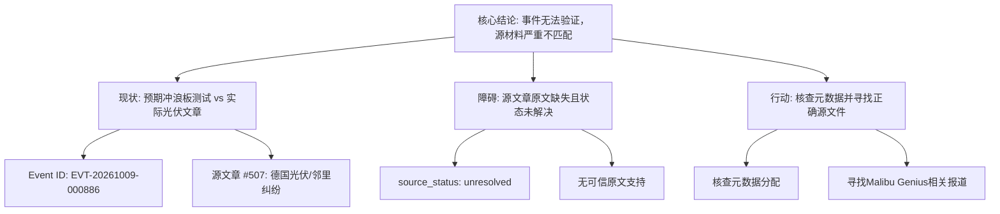

## Event ID

EVT-20261009-000886

## Selected Skills

- 总结文章.md
- 金字塔原理.md

## Event Analysis

### 标题
Malibu Genius冲浪板测试评价：源材料不匹配导致事件无法验证

### 作者
748686自生长知识系统 (Event Analysis Engine)

### 标签
数据完整性、源文件验证、内容匹配错误、EVT-20261009-000886

### 一句话总结
尽管事件元数据指向“Malibu Genius冲浪板测试”，但唯一提供的源文章《Photovoltaik-boom: Solarneid am Gartenzaun》涉及德国光伏市场纠纷且原文缺失，导致无法提取任何有效事实，事件结论为数据源错配。

### 总结文章内容并写成摘要
2026年10月9日，系统接收事件ID为EVT-20261009-000886的输入，主题标注为“Malibu Genius冲浪板测试评价”。然而，经过对提供的唯一源文章（Article #507）进行严格审查，发现存在严重的源材料不匹配问题。该源文章标题为《Photovoltaik-boom: Solarneid am Gartenzaun》（光伏繁荣：篱笆边的太阳能嫉妒），内容涉及德国光伏市场及邻里纠纷，与冲浪板测试毫无关联。此外，该源文章处于“source_status: unresolved”状态，原文未能获取，仅仅提供Horizon摘要，不具备作为可信事实来源的资格。因此，本次分析无法生成有效的知识文档，指出必须核查元数据分配错误并寻找正确的源文件。

### 文章大纲

**一、 核心结论（金字塔顶端）**
*   **结论先行**：当前事件无法生成有效知识文档。
*   **根本原因**：源材料与事件实体严重不匹配，且源文章本身缺乏可信原文支持。

**二、 现状分析（中层逻辑：问题分解）**
1.  **事件背景**
    *   时间：2026年10月9日
    *   事件ID：EVT-20261009-000886
    *   预期主题：Malibu Genius型号冲浪板的性能测试反馈
2.  **源材料核查**
    *   来源数量：1篇（Article #507）
    *   实际主题：德国光伏市场及邻里纠纷（德语标题：Photovoltaik-boom: Solarneid am Gartenzaun）
    *   状态评估：`source_status: unresolved`（未解决），`content_status: horizon_summary_only`（仅有摘要，无原文）
3.  **交叉验证结果**
    *   关键词缺失：源文章中未出现“Malibu Genius”、“冲浪板”、“测试”或“评价”等关键词。
    *   主题冲突：光伏能源主题与冲浪板测试主题完全不符。
    *   事实提取：由于来源不匹配且内容缺失，无法确认任何关于冲浪板的技术参数、性能数据或用户评价。

**三、 根因诊断（底层逻辑：具体证据）**
*   **数据录入错误可能性**：元数据与源文件分配可能存在错位。
*   **源文件混淆可能性**：Article #507 可能被误贴至该事件。
*   **合规性约束**：基于“不得编造事实”的原则，严禁将推测当作事实输出。

**四、 行动建议（结论延伸）**
1.  **核查元数据**：确认 Event ID EVT-20261009-000886 是否存在源文件分配错误。
2.  **重新获取源材料**：寻找真正涉及“Malibu Genius”冲浪板测试的原始报道或文章。
3.  **修正源列表**：若 Article #507 为误贴，请更新源列表以包含正确的冲浪板相关内容。

---

### 金字塔结构图示

### 关键洞察

1.  **数据完整性断裂**：该事件揭示了知识系统中“元数据”与“实际源内容”脱节的风险。当Router固定选择“总结文章”和“金字塔原理”时，这些Skill假设源材料是有效且相关的。一旦源材料本身是错误分配或不可信（unresolved），结构化分析只能得出“无法得出结论”的结果，这本身也是一种重要的质量预警信号。
2.  **严格的事实边界**：依据“不得编造事实”的契约，即使标题声称是冲浪板测试，Engine也拒绝基于无关的光伏文章进行猜测。这强调了在自生长知识系统中，源验证（Source Verification）是内容生成（Content Generation）的前置硬约束。
3.  **MECE原则下的分类缺失**：在尝试分析冲浪板测试时，由于缺乏底层证据（技术参数、用户反馈等），任何关于“外部因素”、“内部因素”或“战略因素”的归类都无法构建，导致金字塔结构只能建立在“数据缺失”这一事实之上，而非产品信息之上。
