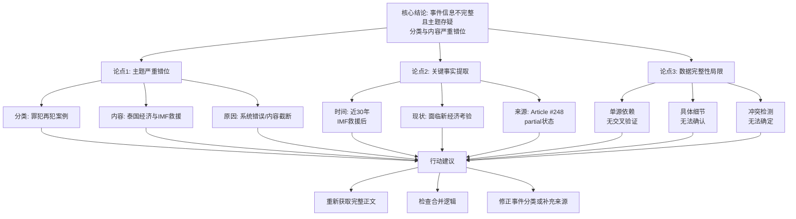

## Event ID

EVT-20261010-000490

## Selected Skills

- 总结文章.md
- 金字塔原理.md

## Event Analysis

### 标题
泰国经济面临新考验：IMF救援近30年后的现状分析与信息完整性审查

### 作者
748686 自生长知识系统 Event Analysis Engine

### 标签
泰国经济、IMF（国际货币基金组织）、亚洲金融危机、新闻分析、数据完整性、信息冲突检测

### 一句话总结
本事件单位虽被标记为“罪犯再犯案例”，但实际源文聚焦于泰国在IMF救援近30年后面临的新经济考验；由于源文章内容缺失且存在主题错位，该事件目前处于信息不完整状态，无法验证其原始分类的准确性。

### 摘要

**一、 核心结论**
本次事件分析揭示了一个显著的数据异常现象：事件ID `EVT-20261010-000490` 的第一层合并理由指向“早期释放计划罪犯再犯案例”，但其唯一来源文章（Article #248）的实际内容却完全围绕“泰国经济与IMF救援历史背景下的新考验”展开。鉴于源文章内容状态为“部分（partial）”且缺乏完整正文，当前无法确认是否存在未显示的隐藏内容或系统分类错误。核心事实在于泰国经济正处于一个新的关键节点，距离1990年代中期IMF救援已近30年。

**二、 支持论点**

1.  **主题严重错位（分类vs内容）**
    *   **分类标签**：Event Unit 标题定义为 "Prisoner Reoffending Case"（罪犯再犯案例），第一层 Global Merge 理由同样指向此主题。
    *   **实际内容**：Article #248 的标题为 "Nearly 30 years after IMF rescue, Thailand faces new economic test"，内容涉及宏观经济、国际救援历史及当前经济压力。
    *   **逻辑推导**：两者无任何语义交集。这种错位可能源于：
        *   第一层合并非基于Article #248的可见元数据或标签。
        *   Article #248 的完整正文未成功加载（content_status: partial），导致实际可见内容与预期不符。
        *   系统拼接或路由错误。

2.  **关键事实提取（基于可用内容）**
    *   **时间背景**：文章提及“近30年”（nearly 30 years），暗示泰国经历过一次国际货币基金组织（IMF）的经济救援，该事件大约发生在1990年代中期（对应1997年亚洲金融危机）。
    *   **当前状况**：泰国目前正面临新的经济考验或测试（new economic test）。
    *   **信息来源状态**：
        *   来源平台：news.google.com
        *   状态：source_status=fetched（已获取），content_status=partial（部分）。
        *   正文仅显示为“Google News”聚合摘要，无详细报道内容。

3.  **数据完整性与验证局限性**
    *   **单源依赖**：本次输入仅包含一篇文章（Article #248），不存在多个独立来源进行交叉验证。
    *   **事实确认缺失**：无法确认“泰国面临新经济考验”的具体细节、性质（如债务危机、货币贬值、政策调整等）及影响范围。
    *   **冲突检测结论**：由于无法访问Article #248的完整正文，无法确定第一层合并理由是否准确反映文章的完整信息。目前仅能确认文章标题和简短描述与罪犯再犯无关。

**三、 详细大纲与行动建议**

*   **1. 事件现状诊断**
    *   1.1 当前事件单位主要反映的是一个**信息不完整且主题存疑**的新闻片段。
    *   1.2 无法形成可靠的事实陈述，因为核心主题（罪犯再犯）在现有材料中完全缺失。

*   **2. 技术归因分析**
    *   2.1 **系统层面**：检查第一层合并逻辑，确认是否因来源标签错误或内容截断导致主题错位。
    *   2.2 **数据层面**：Article #248 的原文正文仅显示“Google News”，Horizon 日报摘要未提供完整正文，导致内容状态为 partial。

*   **3. 后续行动建议**
    *   3.1 **重新获取数据**：重新获取 Article #248 的完整正文，以确认是否存在关于罪犯再犯的隐藏内容或分段报道。
    *   3.2 **修正事件合并**：若 Article #248 确与经济相关，则需寻找其他独立来源以构建关于“罪犯再犯”的事件单位，或撤销/修正当前事件合并，将本事件调整为“泰国经济”相关主题。
    *   3.3 **补充验证**：寻找关于“泰国新经济考验”的其他独立报道，以确认“new economic test”的具体指代（政策、危机或经济指标）。

### 金字塔结构图示

